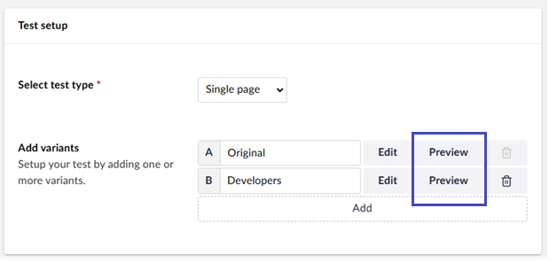
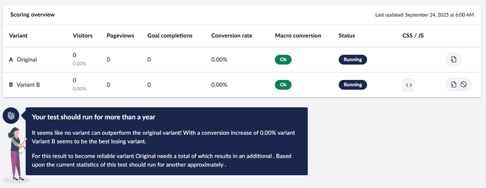

# Previewing an A/B Test

There are different ways to preview your A/B Test variants.

## During the setup of your new A/B Test

When setting up a new A/B Test, you can open the preview of a variant by selecting **Preview** next to it in the overview of variants:

## During a running test

You can preview all the A/B test variants while a test is running. Go to the specific test, and you will have an overview of the current results. You can also preview each variant by clicking the "preview"-button.

