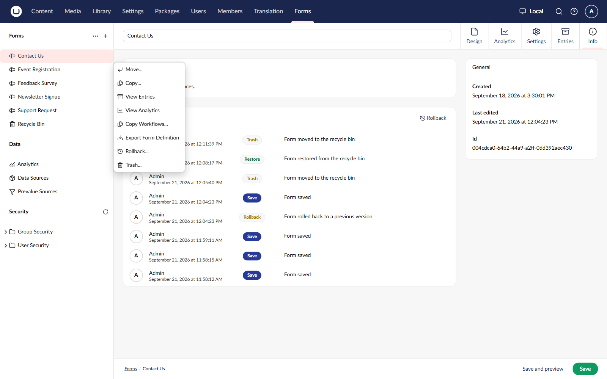
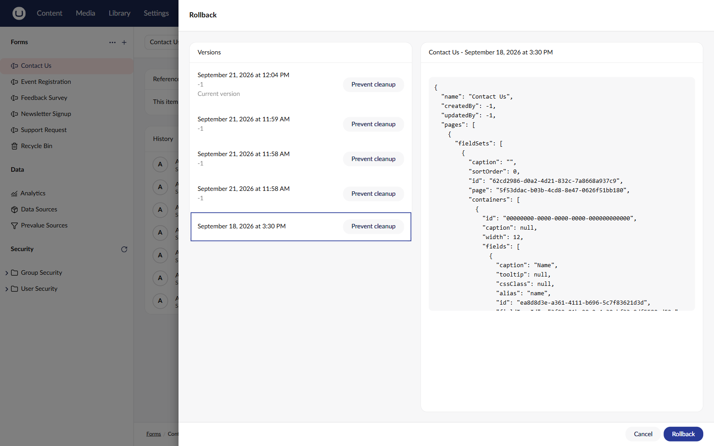

# Rollback to a Previous Version

Umbraco Forms stores a version of a form each time the form is saved. The workflows attached to the form are stored with it. You can return the form to any stored version.

## Roll a form back

1. Go to the **Forms** section.
2. Select the form you want to roll back.
3.  Open the **Actions** menu and select **Rollback**.

    

The Rollback window opens. The stored versions are listed with the newest first. The version the form currently uses is marked **Current version**.

4. Select a version to see what it holds.
5. Select **Rollback**.

The form now matches the version you selected. The rollback is stored as a version of its own, so you can undo it the same way.


The panel on the right shows the selected version as the raw form definition, in JSON. It is not a field-by-field comparison with the current version.


The version list loads a page of versions at a time. Select **Load more** to fetch the next page.

## Name clashes

A form takes its name from the version you roll back to. If another form in the same folder already uses that name, Umbraco Forms adds a suffix to keep the names unique.

## Keep a version

Each version in the list has a **Prevent cleanup** button. A version kept this way is never removed by version cleanup.

1. Open the Rollback window for the form.
2. Select **Prevent cleanup** next to the version you want to keep.

Select the button again to let the version be cleaned up.

## Version cleanup

Every version of a form is kept until you set up cleanup. Cleanup is opt-in, so upgrading Umbraco Forms never removes the history of a form on its own.

The most recent version of a form is always kept, as is any version set to prevent cleanup.

For details, see the [FormVersionCleanup](../../developer/configuration/README.md#formversioncleanup) section of the Configuration article.
