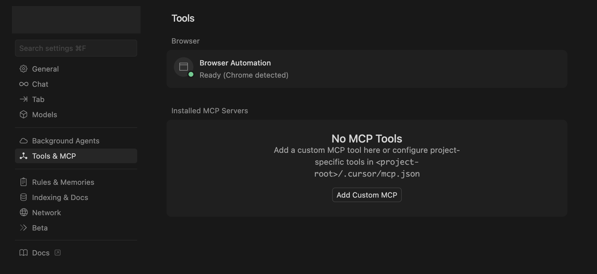
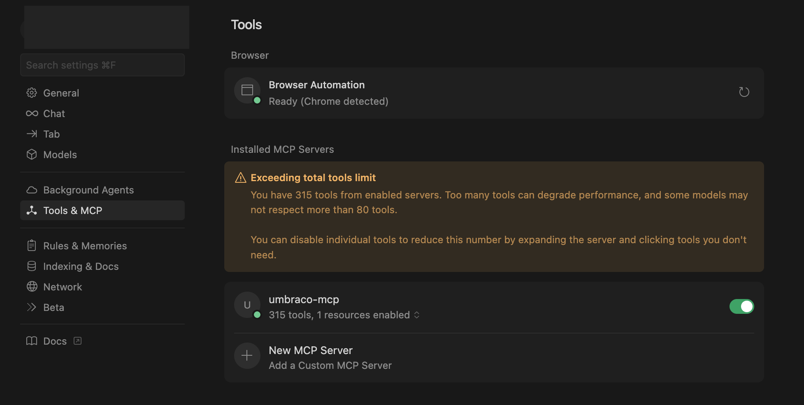

# Cursor

[Cursor](https://cursor.com/) is an AI-powered code editor built as a fork of Visual Studio Code. It enhances the familiar Visual Studio Code experience with conversational AI features that help you write, refactor, and understand code more efficiently.


The examples below use the Developer MCP package (`@umbraco-cms/mcp-dev`). Replace the package name if you are using a different Umbraco MCP server.



**Match the package version to your Umbraco site.** The examples on this page use `@latest`, which installs the newest release of the MCP Server. This may be a later major version than the one your site runs.

If your site is on the current Long-Term Support (LTS) release, Umbraco 17, use the `@lts-17` tag instead, for example `@umbraco-cms/mcp-dev@lts-17`. A version mismatch causes the first tool request to fail.

See [Version Compatibility](../cms-developer-mcp/README.md#version-compatibility) for the full list of tags.


## Getting started

1. Go to **Cursor Settings** -> **Tools & MCP** -> **Add Custom MCP**.



2. Add the following code to the config file.

```json
{
  "mcpServers": {
    "umbraco-mcp": {
      "command": "npx", 
      "args": ["@umbraco-cms/mcp-dev@latest"],
      "env": {
        "NODE_TLS_REJECT_UNAUTHORIZED": "0",
        "UMBRACO_CLIENT_ID": "umbraco-back-office-mcp",
        "UMBRACO_CLIENT_SECRET": "1234567890",
        "UMBRACO_BASE_URL": "https://localhost:12345",
        "UMBRACO_INCLUDE_TOOL_COLLECTIONS": "document,media,document-type,data-type"
      }
    }
  }
}
```

Replace the `UMBRACO_CLIENT_ID`, `UMBRACO_CLIENT_SECRET`, and `UMBRACO_BASE_URL` values with your local connection details.



* The warning above indicates that the number of tools exceeds the limit is expected behaviour.
* [Choose which tools or tool collections](../cms-developer-mcp/available-tools.md) you want to enable for your first task.


Selecting only the tools you need helps keep your setup efficient and conversations with your AI assistant more focused.

