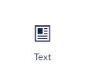

# Widgets

## What is Widgets 
Widgets Allows you to have easy access to a lot of different features, by selecting them from a menu.
there is a total of nine-teen widgets in the menu.
This is designed in such a way that there is a ticket for all your needs.

In the following the article there will be an explanation to each of these widgets.

### The Hero Widget 

The Hero Widget allow you to create a hero element on you page, this includes features such as a heading, a rich text editor, a background image and option to add buttons.
You will also have the settings for your ***Hero Widget*** here, letting you have a nice overview of how you can customize the widget to your liking.

Everything that you create in ***Hero Widget*** will appear in a banner element on the top part of your page. 
This widget is ideal for content on the start page.

 

### The Text Widget

The Text Widget lets you create a text field on the page, containing a Rich text editor and a sidebar widget(can be more than one) these sidebar widgets are as follows: a text area, links, button.

### The Image Widget

This Widget allows you to add an image on the site, select the size of it, Caption it an select the background and text color.

### The Text and Images Widget

This Widget Gives you the same features as the ***Images widget*** with a few extra features, such as a Rich text editor.

### The Gallery Widget

The Gallery Widget allowes you to display multiple images in a gallery view, meaning that the images will be alligned in rows. 
This also contians the feature to click on images to zoom in on the images(this feature can also be disabled).

### The Slider Widget

The Slider Widget allows you to pick multiple images and then make them into a slideshow, you will have the ability to choose how fast the transition between images is.

### The Tabs Widget

This allows you to create multiple widgets within one widget this means you could have for example: a ***Text Widget***, an ***Image Widget*** and a ***Forms Widget*** all collected in one.

### The Latest Form Feed Widget

