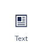
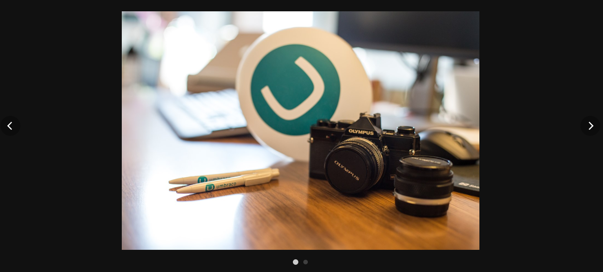
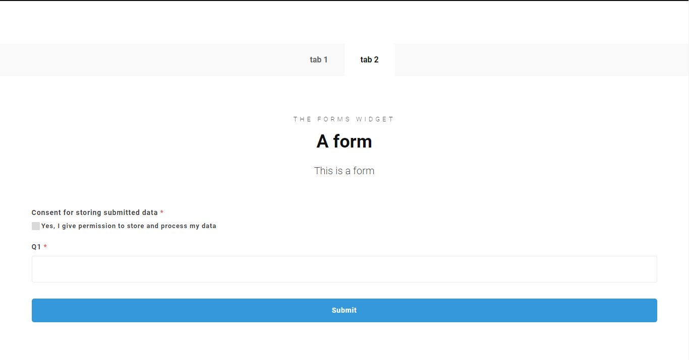

# Widgets

## What is Widgets 

Widgets allows you to have easy access to a lot of different features, by selecting them from a menu. There is a total of nine-teen widgets in the menu. This is designed in such a way that there is a widget for all your needs.

In the following article there will be an explanation to each of these widgets.

### The Hero Widget 

The Hero Widget allows you to create a hero element on your page, this includes features such as a heading, a rich text editor, a background image and the option to add buttons.

You will have a lot of settings for your ***Hero Widget***, letting you customize the widget to your liking. This widget is ideal for content on the start page.

Below you can see an example of how a ***Hero Widget*** might look. This contains the ***Pre Header***, ***Heading***, ***Text*** and different types of ***Buttons***

### The Text Widget

The Text Widget lets you create a text field on the page, containing a Rich text editor and the option for a sidebar Widget(can be more than one) these sidebar Widgets can be the following: a text area, links, a button.

This is useful if you only need a text box outside of the Widgets, most of the other Widgets come with the ***Text Widget*** included

::: Note
The Text Widget is the standard width per default, this cannot be changed.
To compare the width see for example ***Image Widget*** and set this to standard width.
:::

### The Image Widget

This Widget allows you to add an image to your site, select the size of the image, Caption The image and select the background and text color.

This is like the ***Text Widget*** good if you want an image outside of any of the other Widgets that contain the ability to add images.

### The Text and Images Widget

This Widget allows you to create a collage of images and text.
You can have ***six*** images in total, You can add a ***Pre Heading*** and a ***Heading*** to it.

The example below uses, a ***Pre Heading***, a ***Heading***, a ***Text*** and three ***Images***.

### The Gallery Widget

The Gallery Widget allows you to display multiple images in a gallery view, meaning that the images will be aligned in rows. 

This also contains the feature to click on images to zoom in on the images. This feature can be disabled.

You will be able to change the setup of your gallery. This could be the size of the images or the background color of the whole container. 
Below you can see how the gallery would look with image width at 20%, and a blue background color.

You can click the image to zoom in, where you can browse through the images in the gallery by using the arrows next to the images or use the arrow keys on the keyboard.

### The Slider Widget

The Slider Widget allows you to pick 1 or more widgets to display in a slideshow. 

You will have a set of different configuration option in order to customize the slider to fit your needs:

- Choose how fast the transition between widgets is. Note that 1000 is equal to 1 second.

- Decide whether you want the slider to have arrows on the edges which takes you through the slides. 

- Enable dots in the buttom to show what slide you are currently on. 

- Make the slider pause when you hover over it. 

- Choose to have the slider ***Wrap Around*** to make it loop between the widgets indefinitely.  

- Make the transition between slides more seamless by using ***Fade Animation***.

Below is an example of how a slider could look. It contains an ***Image Widget***, uses ***Show Next/prev arrows*** and ***Show Page Dots***. It has a black ***Background Color*** picked in the ***Image Widget***.   

::: Note 
For the best experience with the Slider Widget, we recommend adding multiple ***Image Widgets*** containing one image each.
:::

### The Tabs Widget

The Tabs Widget allows you to create tabs like the ones you find in your browser. Each tab can contain any widgets you desire.
You can even add multiple widgets within one ***Tabs Widget***. This means you could have the ***Text Widget*** and the ***Image Widget*** on one tab and a ***Forms Widget*** on another tab.

Below is two examples of how tabs can be set up.

