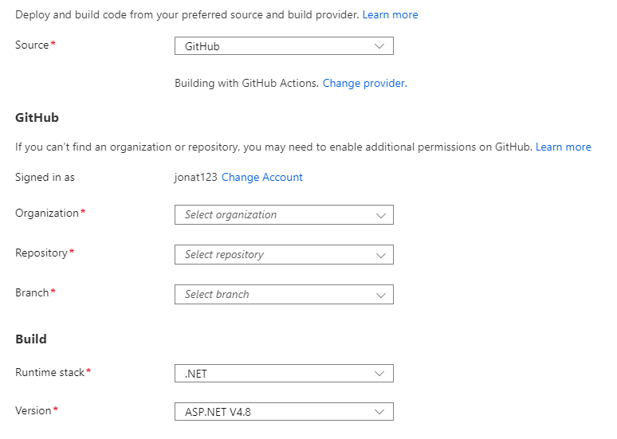

# Setting up CI/CD build server with Github actions

:::note
In this example we will show how you can set up a CI/CD build server using Github Actions in Azure Web Apps.

We will not cover how you can set up the site itself as this is beyond this documentation.
:::

To set up the build server in Azure Web Apps, we need to go to the Azure portal and find the empty website that we have set up and want to connect to.

1. Go to the Deployment Center.


In the Deployment Center we can set up the CI/CD build server. In this example we are going to set up our build server by using Github Actions. You can set up the build server however you want as long as it supports executing powershell scripts.

2. Go to the Settings tab.
3. Choose which source and build provider to use.
    * In this case we want to choose Github.



4. Choose the Organization which you created our Github repository under.
5. Choose the repository that was set up earlier in this guide.
6. Select which branch that we want the build server to build into.

We can also see which runtime stack and version we are running. In this example we are running .NET and ASP.NET Version 4.8.

Once the information has been added we can go ahead and preview the file. We will get a YAML file that will be used for the build server:


7. Save the workflow.

The website and the Github repository are now connected.

If we go back to the Github repository we can see that a new folder have been created called Workflows:


Inside the folder, we find that a new YAML file has been created with the default settings that was added in the Azure Portal. In this case, this file will need to be configured so it fits into your set up.

8. Pull down the new file and folder, so you can work with the YAML file on your local machine.
9. Configure it to work with our Umbraco Deploy installation.

When it have been configured it will look something like this:

```yaml
name: Build and deploy ASP app to Azure Web App - Jonathan-deploy-live

on:
  push:
    branches:
      - main
  workflow_dispatch:

jobs:
  build-and-deploy:
    runs-on: 'windows-latest'
    
    env:
      deployBaseUrl: https://helloworld.azurewebsites.net
      umbracoDeployReason:  DeployingMySite
  
    steps:
    - uses: actions/checkout@master

    - name: Setup MSBuild path
      uses: microsoft/setup-msbuild@v1.0.2

    - name: Setup NuGet
      uses: NuGet/setup-nuget@v1.0.5

    - name: Restore NuGet packages
      run: nuget restore
      working-directory: 'Deploy-testing'

    - name: Publish to folder - two parent folders up back at root of our repo
      working-directory: 'Deploy-testing'
      run: msbuild /nologo /verbosity:m /t:Build /t:pipelinePreDeployCopyAllFilesToOneFolder /p:_PackageTempDir="..\..\published\"
      
    - name: Copy License File
      shell: powershell
      run: xcopy /S /Q /Y /F ".\Deploy-testing\Deploy-testing\bin\umbracoDeploy.lic" ".\published\bin\"
      
    - name: Deploy to Azure Web App
      uses: azure/webapps-deploy@v2
      with:
        app-name: 'Jonathan-deploy'
        slot-name: 'production'
        publish-profile: ${{ secrets.AzureAppService_PublishProfile_04d3dd3154c64469aad82d1986996781 }}
        package: published
        
    - name:  Run Deploy Powershell - triggers deployment on remote env
      working-directory: 'Deploy-testing\Deploy-testing'
      shell: powershell
      run: .\TriggerDeploy.ps1 -InformationAction:Continue -Action TriggerWithStatus -ApiKey ${{ secrets.deployApiKey }} -BaseUrl  ${{ env.deployBaseUrl }} -Reason  ${{ env.umbracoDeployReason }} -Verbose       
```

:::note
This is an example of how you can set up the CI/CD pipeline for Umbraco Deploy. However there are many ways that this can be done and it is possible to set it up in a way that works for you and your preferred workflow.
:::

Before the build can work, we will need to set up the API key that we generated earlier to work with the build server in Github Actions.

1. Open your Github repository.
2. Navigate to Settings.
3. Go to the Secrets tab.
4. Select "New repository secret".
5. Call the new secret **"DEPLOYAPIKEY"**.
6. Add the API key from the `appSetting` for Umbraco Deploy in the `web.config`.
7. Save the secret.

We can now go ahead and commit the configured YAML file and push up all the files to the repository.

Go to Github where you will now be able to see that the CI/CD build has started running:


The build server that has been set up will go through the steps in the YAML file and once it is done we can see that the deployment have gone through succesfully:


You can now start creating content on the local machine. Once you create something like a Document Type, the changes are getting picked up in Git.

When you're done making changes, you can commit them and deploy them to Github which again, will run the build server you have set up and then extract the changes into the website in Azure.

This will only deploy the schema data for our local site to your website, to transfer content and media you will need to do so from the backoffice on your local project using the [queue for transfer feature](../../deployment-workflow/Content-Transfer).