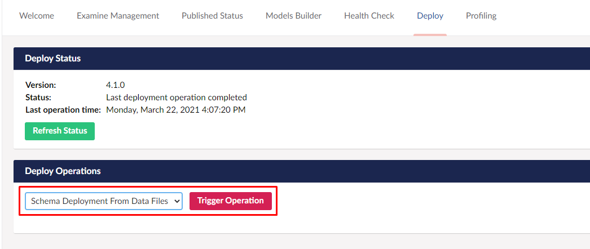

# Installing Umbraco Deploy on an existing project

In this article, we will cover the steps in order for you to install Umbraco deploy on your already existing website with content

We will cover how to install Umbraco deploy and set up Umbraco deploy on your website and how you can generate the UDA files based on your production websites database.

## Prerequisites

* Visual studio 2017 v15.9.6 or later

* Umbraco Deploy license

* Copy of your production site's database

* Copy of views, css and scripts folder from production

* CI/CD or Build Server that supports executing Powershell

## Installation steps

1. [Create copy of database and download views, CSS and scripts files from your production site](#install-umbraco-deploy-on-existing-site)
2. [Set up Git repository and new Umbraco project](#set-up-git-repository-and-umbraco-project)
3. [Install Umbraco Deploy via NuGet](#installing-and-setting-up-umbraco-deploy)
4. [Configure CI/CD build server](#set-up-cicd-build-server)

## Install Umbraco Deploy on Existing site

To install Umbraco Deploy on an already existing site there are some additional steps that needs to be taken to make sure that Umbraco Deploy can run with your website.

On an existing Umbraco website, there is already a set of Document Types, Templates and Data Types with ID's in the database. In order for Umbraco Deploy to work with your website, you will need to make sure that these IDs are in sync between the different environments that you want to add to your setup.

1. Make a copy of the database on the production site.
2. Download your `/Views` folder as well as the folders holding your css files and scripts.

When the production database, folder and files have been copied down, it's time to set up a git repository and a new Umbraco project.

### Set up Git repository and Umbraco project

The next step to get Umbraco Deploy up and running is to set up a repository and install Umbraco into it using [Visual Studio](https://our.umbraco.com/documentation/Getting-Started/Setup/Install/install-umbraco-with-nuget).

1. Set up a repository with a .gitignore file using the Visual Studio template.
2. Clone down the repository to your local machine.
3. Create a new Visual Studio project in the repository folder.
4. Install Umbraco CMS through NuGet - `Install-Package UmbracoCms`.
5. use the copy of your production Database when setting up the database for the emppty project.
6. Add the `/Views` folder as well as the folders holding your css files and scripts.
7. Commit the files so they are ready to be pushed up once you have set up the build server.
8. Run the project.

After the Umbraco files have been committed add the following lines to the .gitignore so that they will not be picked up by Git when we are deploying.

```none
**/App_Data/*
!**/App_Data/packages
**/media/*

# Umbraco deploy specific
**/data/deploy*
```

### Installing and setting up Umbraco Deploy

When Umbraco has been installed in a repository, we can go ahead and install Umbraco Deploy in the project.

To install Umbraco deploy in Visual Studio, you can either go to the NuGet Package Manager and search for ```UmbracoDeploy.OnPrem``` or run ```Install-Package UmbracoDeploy.OnPrem``` via the Package Manager.

:::note
To be able to use Umbraco Forms with Umbraco Deploy, you need to install the  ```UmbracoDeploy.Forms``` package as well.

Umbraco Deploy supports Forms version 8.5 and up.
:::

Once the installation has finished you might notice a new file in your `/config` folder called `UmbracoDeploy.config`. This files tells the deployment engine where to deploy to. It knows which environment you’re currently on (for example local or staging) and it will choose the next environment in the list to deploy to.

When Umbraco Deploy has been installed, to be able to use it in the project you will need to add the following `appSetting` to the `web.config` of the project:

```xml
<add key="Umbraco.Deploy.ApiKey" value="YourAPIKeyHere" /> 
```

The `Umbraco.Deploy.ApiKey` value needs to be replaced with your own Deploy API key.

The following code snippet can be used to generate a random key, using a tool like LinqPad.

```C#

public string GetRandomKey(int bytelength)
{
   byte[] buff = new byte[bytelength];
   RNGCryptoServiceProvider rng = new RNGCryptoServiceProvider();
   rng.GetBytes(buff);
   StringBuilder sb = new StringBuilder(bytelength * 2);
   for (int i = 0; i < buff.Length; i++)
       sb.Append(string.Format("{0:X2}", buff[i]));
   return sb.ToString();
}

```

This same Deploy API key must be used on each environment for the same website.

:::note
We strongly recommend to generate different keys for different websites.
:::

Once the `appSetting` and API key have been added, it is now time to configure the environments in the `UmbracoDeploy.config` file.

The config file will look like this:

```xml

<?xml version="1.0" encoding="utf-8"?>
<environments xmlns="urn:umbracodeploy-environments">
  <environment type="development" 
    name="Development" 
    id="00000000-0000-0000-0000-000000000000">
      http://development/
  </environment>
  <environment type="staging"
    name="Staging" 
    id="00000000-0000-0000-0000-000000000000">
      http://staging/
   </environment>
  <environment type="live" 
    name="Live" 
    id="00000000-0000-0000-0000-000000000000">
      http://live/
  </environment>
</environments>


```

You will need to generate a unique GUID for each environment. This can be done in Visual Studio:

1. Open "Tools".
2. Select "Create GUID".
3. Use the Registry Format.
4. Copy the GUID into the `id` value.
5. Generate a "New GUID" for each environment you will be adding to your setup.

The `type` value is for informational purposes in the backoffice but in most cases will be the same (lowercased) value of the Name.

The URLs for each environment needs to be accessible by the other environments over **HTTPS**.

:::note
You're free to update the `name` attribute to make it clearer in the interface where you're deploying to. So, if you want to name “Development” something like “The everything-goes area” then you can do that and it will be shown when deploying to that environment.
:::

Once the installation is done, navigate to the backoffice and find the Deploy Dashboard in the Settings section:


Run the  **```Schema Deployment From Data Files```** operation which will trigger the UDA schema to be generated based of your database from production:



Once the deployment operation has finished,  take a look in either your git client or in the `/data/revision` folder. You can now see that it has generated the UDA-files based on the schema in your database:


Umbraco Deploy has now been installed on the project, go ahead and commit the files to the repository.

**Do not push the files up yet** as a CI/CD build server will first need to be set up and connected to our a repository.

#### Include your Umbraco Deploy license file

Before moving on to setting up the build server, make sure that your license is included in your project.

The file needs to be placed in the `/bin` folder and commit it to the repository.

### Set up CI/CD build server

Once Umbraco Deploy has been installed and the meta data has been generated, a CI/CD build server needs to be set up.
The build server will extract the changes that has been pushed to the repository into your production website that has been connected with Umbraco Deploy.

This is something that can be done in many different ways depending on where your website is hosted and your setup.

Umbraco Deploy will work out of the box with any CI/CD or build server that supports executing Powershell (which will be all build servers that support .NET) like Azure DevOps or Github Actions.

For an example on how this can be done see the [guide for how Umbraco Deploy can be installed for a new site](../New-site/#Setting-up-CI-CD-build-server-with-Github-actions) where Github Actions is used as the build server.

Once the build server has been set up you can start creating content and sync it between your environments. Make sure to follow the proper [deployment workflow](../../Deployments).

This will only deploy the meta data. To transfer content and media you will need to do it from the backoffice of your project using the [queue for transfer feature](../../deployment-workflow/content-transfer).
