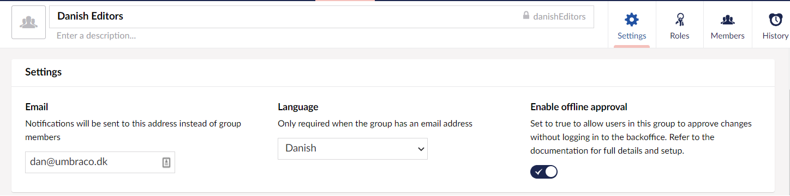
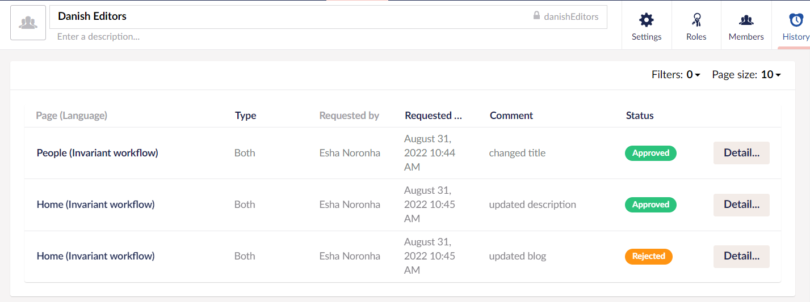

# Approval Groups

The **Approval groups** view in the **Workflow** section lists the Name of the active groups, Group members, their Permissions, and a quick link to Email the group.

To add an approval group, follow these steps:

1. Go to the **Workflow** section.
2. Click on **Approval groups**.
3. Click **Create Group**.
4. Enter a **Name** for the Approval Group. For example: Danish Editors.
5. Enter a **Description** to remind you why the group exists.
6. Enter the group's **Email** address in the Settings section to which the notifications will be sent.
7. Select the **Language** from the drop-down list.
8. **Enable offline approval** to allow users in this group to approve changes without logging in to the backoffice.
9. Click **Save Group**.

:::note
You can create a total of 5 groups on unlicensed installations. The paid license removes this restriction.
:::

You can search for a specific group using the Search bar. Select a group from the list to edit its Settings, Roles, Members, and view the group's History.

## Settings

The **Settings** tab consists of the following fields:

- **Email:** Workflow notifications are sent to a generic inbox (a group's email address) rather than the individual group members.
- **Language:** Select a language variant for the email.
- **Enable Offline approval:** Allow the users of this group to approve changes without logging in to the Backoffice. For more information, see the [Offline approval](#offline-approval) section.

### Offline Approval

You can optionally provide Groups permission to action workflow tasks without logging in to Umbraco. This feature requires a paid license. By enabling Offline Approval, on the **Edit group** view, all email notifications sent to members of the group will include a personalized link to a preview page.

The preview page exposes the current saved page with the options to approve or reject the change. It is not possible to edit the content from the offline approval view.

This feature is useful where the approval group membership is a single user who does not use Umbraco. For example, a manager may want to approve media releases before publishing but does not otherwise need access to Umbraco.

Offline approval requires a user to exist in the Backoffice and be assigned to a workflow group. They do not need to know how to use Umbraco or even know their login credentials.

## Roles

The **Roles** tab provides an overview of the current workflow roles for the Group:

- **Node-based approvals**: This workflow applies only to the specified node.
- **Document-type approvals**: This workflow applies to all the nodes of a given document type.

You can set these **Roles** in the Workflow **Settings** section. For more information, see the [Workflow Settings](../Workflow-Settings/index.md) article.

## Members

The **Members** tab manages the membership for the given user group. Add members to approval groups to determine which member will be responsible for approving content changes. Group Members can be explicitly added to the group or can inherit group membership from an existing Umbraco group. Ideally, group members are set explicitly to ensure changes made to Umbraco groups do not cause unexpected changes to workflow permissions.

To add a Group member, follow these steps:

1. Go to the **Workflow** section.
2. Click on **Approval groups**.
3. Select a group from the list to edit its Members.
4. Go to the **Members** tab.
5. Click **Add** in the **Group members** section.
6. Select the **Users** you want to add to the approval group.

   
7. Click **Save Group**.

To inherit an existing Umbraco group membership, follow these steps:

1. Go to the **Workflow** section.
2. Click on **Approval groups**.
3. Select a group from the list to edit its Members.
4. Go to the **Members** tab.
5. Click **Add** in the **Inherited group membership** section.
6. Select the **User groups** you want to add to the approval group.

   
7. Click **Save Group**.

## History

The History tab provides an overview of the workflow activity for the current group. It displays a table containing the Page name with the Language variant, Type of workflow roles (Node-based approvals or Document-type approvals), workflow requested by, the date the workflow was requested, comment, and status of the workflow.

You can also **Filter** the records based on the Node, Requested by, Created date, Completed date, Page Language, Workflow Type, and Workflow Status. Additionally, you can adjust the total number of records displayed on a page.

The **Detail** button at the end of the record displays an overlay with content similar to the Active workflow sub-section.

