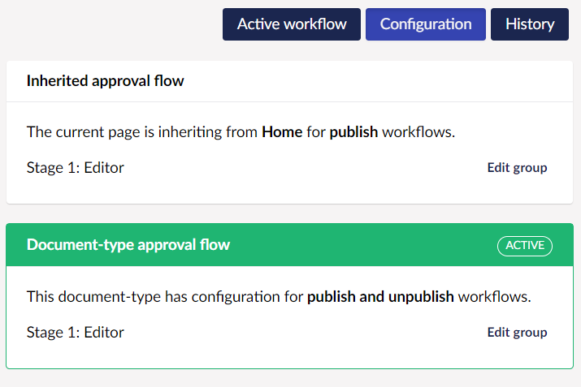
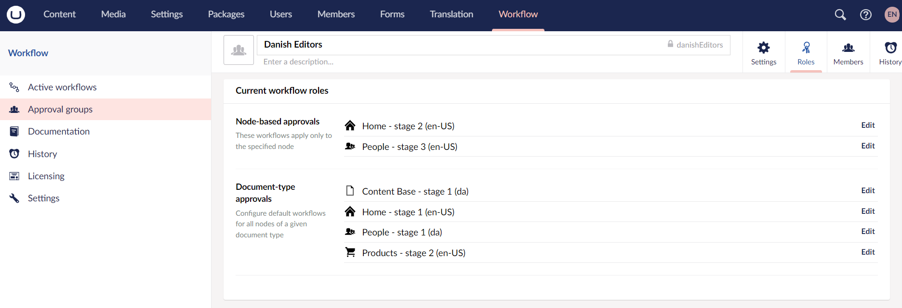
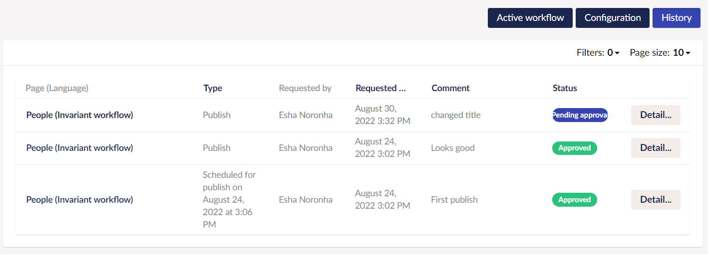

# Workflow Content App

Umbraco Plumber adds a [Content App](../../../Extending/Content-Apps/index.md) to all content nodes in the **Content** section where a workflow is enabled. The Workflow content app includes three sub-sections:

- [Active workflow](#active-workflow)
- [Configuration](#configuration)
- [History](#history)

## Active Workflow

The Active workflow sub-section provides an interface for managing workflows for the current content node. When you initiate a workflow on the current node, the **Active workflow** sub-section requires information such as:

- Change Description.
- [Optional] Scheduled date to publish the changes requested in the node.

When the current node is pending workflow approval, the **Active workflow** sub-section displays detailed information such as:

- Option to approve, reject, or cancel pending workflow tasks.
- View change description and track differences across pending and completed workflows.
- View the group responsible for approving the pending workflow.
- View pending language variant(s) workflow.
- View the workflow activity (eg. pending approval/task approvals/rejects) for the current workflow process.

You can access Active Workflows from two places - the **Content** section and the **Workflow** section (depending on your user permission). Workflow Administrators (those users with access to the Workflow section) can access workflows assigned to a different group. In the **Workflow History**, these are noted as being performed by the admin.

In multi-lingual sites, variant content can be submitted in one of these workflows:

- Only the current variant.
- All variants for publishing in a single workflow process using the workflow applied to the default variant.
- Each variant into a separate workflow.

For example, you can have the German version of your content approved by groups of German speakers and the English version by the English speaker's group.

## Configuration

The Configuration sub-section provides an interface for configuring the content approval flow for the current node and displays any inherited or Document type approval flows applied to the current content node.

### Content Approval Flow

You can add different groups for different stages of content approval flow. Content Approval flow groups can be reordered via drag and drop. You can also apply the approval flow either for publish and unpublish workflow or only publish workflow.

### Approval Flow Types

Approval Flows are available in three types: Content approval flow, Inherited approval flow, and Document type approval flow.

A given content node may have all three approval flow types applied but only one will be applied as per the following order of priority:

- **Content approval flow:** set directly on a content node via the **Configuration** section in the **Workflow** tab . This type will take priority over all others.
- **Document type approval flow:** set in the **Settings** section. This approval flow will apply to all content nodes of the selected Document Type unless the node has a Content approval flow set. This feature requires a license.
- **Inherited approval flow:** if a node has no Content approval flow set, nor a flow applied to its Document Type, Umbraco Plumber will traverse the content tree until it finds a node with a Content approval flow and will use this flow for the current change.

Current responsibilities for Approval Groups can be reviewed in the **Roles** tab of the **Approval Groups** section for **Node-based approvals** and **Document type approvals** only. For more information see the [Roles](../Approval-Groups/index.md#roles) section in the [Approval Groups](../Approval-Groups/index.md) article.

Document type approval flows can also include conditional stages i.e., only include **Translators** in the workflow when the **Description** property has changed. For more information on settings conditions in Document type approval flows, see the [Document type approval flows](../Workflow-Settings/index.md#document-type-approval-flows) section in the [Workflow Settings](../Workflow-Settings/index.md) article.

:::note
Configuration cannot be modified when a content node is in a workflow process.
:::

## History

The History sub-section provides a chronological audit trail of workflow activity for the current node. It displays a table containing the following information:

- Page name with the Language variant.
- Type of Publish.
- Who the workflow is requested by.
- The date the workflow was requested.
- Comments.
- Status of the workflow.

You can also **Filter** the records based on the information listed above. Additionally, you can adjust the total number of records displayed on a page.

The **Detail** button at the end of the record displays an overlay with content similar to the Active workflow sub-section.

