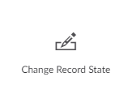
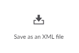
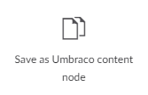
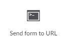

# Workflow Types

There are several built-in workflow types that can be used to extend the functionality of your Form.

- [Change Record State](#change-record-state)
- [Post as XML](#post-as-xml)
- [Save as an XML file](#save-as-an-xml-file)
- [Save as Umbraco Content Node](#save-as-umbraco-content-node)
- [Send Email](#send-email)
- [Send Email with Template (Razor)](#send-email-with-template-razor)
- [Send Form to URL](#send-form-to-url)
- [Send XSLT Transformed Email](#send-xslt-transformed-email)
- [Slack](#slack)

## **Change Record State**



Used to automatically **Approve Record** or **Delete Record** once it is submitted. Configure words that you want to match and select whether these words should trigger an approval or deletion of the record.

## **Post as XML**


Used to post the Form as an XML to a specified URL. The following configuration can be set:

- Workflow Name
- URL (required)
- Method
- XsltFile - used to transform the XML
- Headers - map the needed files
- User
- Password

## **Save as an XML file**



Saves the result of the Form as an XML file by using XSLT. The following configuration can be set:

- Workflow Name
- Path (required) - where to save the XML file
- File extension (required)
- XsltFile - used to transform the XML

## **Save as Umbraco Content Node**



Saves a submitted Form as a new content node. You need to choose a Document type and match the fields in the Form with the properties on the selected Document Type.

You can also choose to set a static value to fill in the properties:


In the example above, a Document Type called **Blogpost** is selected for creating the new Content node.

The value from the **Name** field will be added as the **Node Name** property in the new Content node and the value from the **Email** field will be used as the **Content** property.

The following configuration can be set:

- Workflow Name
- Publish - choose whether to publish the node on submission
- Where to save - choose a section in the content tree where this new node should be added

## **Send Email**


Sends the result of the Form to the specified email address. The following configuration can be set:

- Workflow Name
- Message (required)
- Attachment - specify whether file uploads should be attached to the email
- Recipient Email (required)
- CC Email
- BCC Email
- SenderEmail - also configurable in `appsettings.json` under `Umbraco:CMS:Global:Smtp`. For more information, see the [Global Settings](../../../../../Reference/V9-Config/GlobalSettings/index.md) article.

```json
    "Umbraco": {
         "CMS": {
            "Global": {
                "Smtp": {
                    "From": "person@umbraco.dk"
                        }
                    }
                }
            }
```

- Reply To Email
- Subject of the email (required)

## **Send Email with Template (Razor)**


Uses a template to send the results of the Form to a specified email address.

You can create your own custom Razor templates to be used to send out emails upon Forms submission. Read more about how to create these templates in the [Email Templates](../../../Developer/Email-Templates) article.

The following configuration can be set:

- Workflow Name
- Email Template (required) - specify which template you want to use
- Attachment - specify whether file uploads should be attached to the email
- Recipient Email (required)
- CC Email
- BCC Email
- SenderEmail - also configurable in `appsettings.json` under `Umbraco:CMS:Global:Smtp`. For more information, see the [Global Settings](../../../../../Reference/V9-Config/GlobalSettings/index.md) article.

```json

    "Umbraco": {
         "CMS": {
            "Global": {
                "Smtp": {
                    "From": "person@umbraco.dk"
                        }
                    }
                }
            }
```

- Reply To Email
- Subject of the email (required)

## **Send Form to URL**



Sends the Form to a URL either as a HTTP POST or GET. The following configuration can be set:

- Workflow Name
- URL (required)
- Method (required) - POST, GET, PUT or DELETE
* Standard Fields - optionally include and map standard form information such as name and page URL
* Fields - map the needed fields
- User
- Password

## **Send XSLT Transformed Email**


Sends the result of the Form to an email address with full control over the email contents by providing an xslt file. The following configuration can be set:

- Workflow Name
- XSLT File - specify which file should be used to transform the content
- Recipient Email (required)
- CC Email
- BCC Email
- SenderEmail - also configurable in `appsettings.json` under `Umbraco:CMS:Global:Smtp`. For more information, see the [Global Settings](../../../../../Reference/V9-Config/GlobalSettings/index.md) article.

```json

    "Umbraco": {
         "CMS": {
            "Global": {
                "Smtp": {
                    "From": "person@umbraco.dk"
                        }
                    }
                }
            }
```

- Reply To Email
- Subject of the email (required)

## **Slack**


Allows to post the Form data to a specific channel on Slack. The following configuration can be set:

- Workflow Name
- Webhook URL (required)

---

Prev: [Attaching Workflows](../index.md) &emsp; &emsp; &emsp; &emsp; &emsp; &emsp; &emsp; &emsp; Next: [Viewing and Exporting Entries](../../Viewing-and-Exporting-Entries/index.md)
