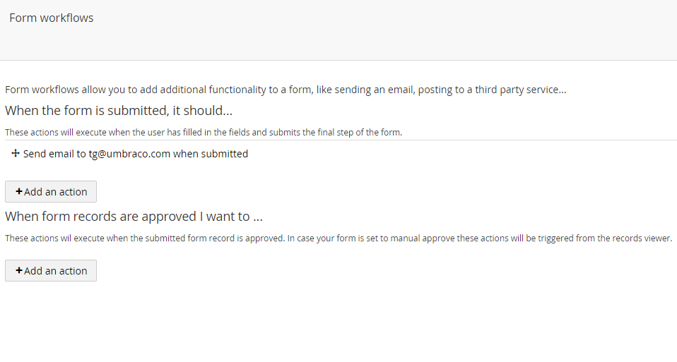

#Attaching workflows
Submitting a form will result in the record data being stored in the database, if you wish to attach extra functionality to your form you can do so by assigning 1 or multiple workflows (like sending an email).

##Adding a workflow

###Navigate to the workflow page for your form
You can either hit the workflow button on the form actions

or select the workflows node under your form in the tree

###Select the state to add a new workflow

Once the page is loaded you should see an overview of the different basic record states

- Submitted
- Approved

Typicaly workflows will be added on the submitted state, to start adding hit the 'add an action' button

A new modal window should open

###Select the type

A new workflow can be of different types (an overview can be found [below](#Overviewofthedefaultworkflowtypes)). So first select the type

###Fill in type specific settings
Once the type has been selected you should see some additional settings (these depend on the type)

Fill in the settings and hit add

###Overview
You should now be back on the workflow page and get an overview of the attached workflows

##Overview of the default workflow types
There are a couple of default workflow types that can be used to extend the functionality of your form, here is an overview:
###Perform filtering
Delete a record if it contains certain values
###Post as Xml
Posts the form as xml to a url
###Post form to url
Posts the form to a url, either as POST or GET
###Save as file
Saves the result of the form as a file

###Save as Umbraco document
Saves the form values as an Umbraco document node with a specific type
###Send email
Send the result of the form to an email address

###Send xslt transformed email
Send the result of the form to an email address (full control over the email contents by supplying an xslt file)
