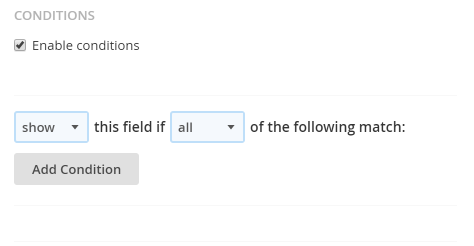
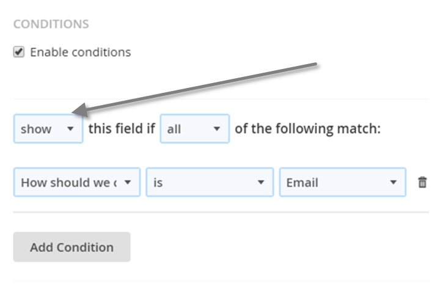
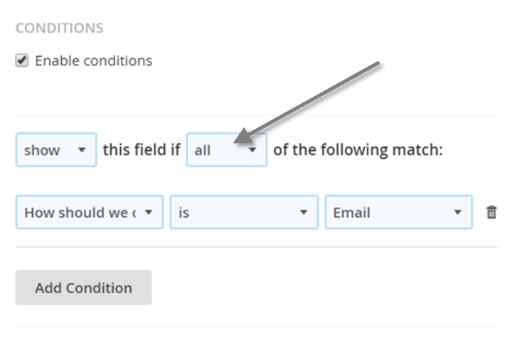
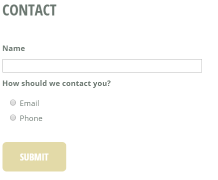
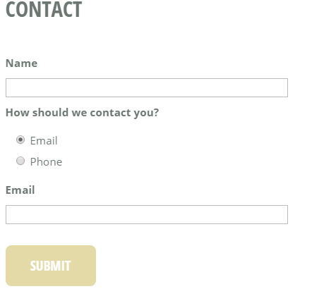

# Setting up conditional logic on fields

Some times you might have a field in your form, that you only want to show if the user has entered a specific value in another field: *Only showing a field if the value of another field is ...*. You can achieve this by setting up **conditional logic**.

## Example

Take a look at the following as an example

In this case it would make sense to **only show the email/phone field when that corresponds with the option chosen in the 'How should we contact you?' field**.

The achieve that, we need to enabling conditions for the **Email** and **Phone** fields. This can be done in the additional settings.

Enabling conditions will give you more options:

### Action type

First thing that needs to be chosen is the action type this can be either show or hide

- Show: the field will be hidden unless the rules match
- Hide: the field will be hidden if the rules match

### Logic type

Then you'll need to specify if all rules need to match. This setting is only important if you have multple rules.

- All: all of the rules must match
- Any: any of the rules may match

## Adding a new condition

When adding a new condition you'll need to select the field where you want to evaluate the value and then you can also select an operator.

In this example I only want to show the email field if the value of the 'how should we contact you' field is 'Email'

## Result

If I setup a similar rule for the phone field I get the following result

By default the email and phone field are hidden but when I select the corresponding option from the 'how should we contact you' field it get's shown

