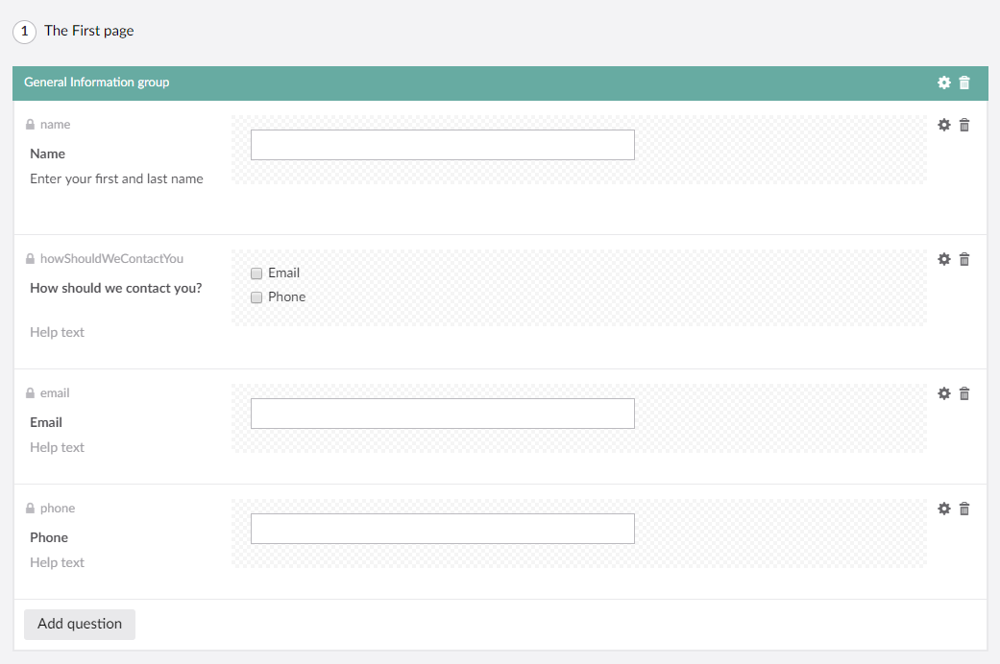

# Setting up conditional logic on fields

Some times you might have a field in your form, that you only want to show if the user has entered a specific value in another field: 

*Only show this field if the value of that field is x*

You can achieve this by setting up **conditional logic**.

## Example

Take a look at the following as an example

In this case it would make sense to **only show the email/phone field when that corresponds with the option chosen in the 'How should we contact you?' field**.

To achieve that, we need to enable conditions for the **Email** and **Phone** fields. This can be done in the additional settings.

Enabling conditions will give you more options:

### Action and Logic types

First thing that needs to be chosen is the **action type**:

- Show: the field will be hidden unless the rules match
- Hide: the field will be hidden if the rules match

Next up, you'll need to specify the **logic type**. This setting is only important if you have multiple rules.

- All: All of the rules must match
- Any: Any of the rules may match

## Adding a new condition

When adding a new condition you'll need to select the field where you want to evaluate the value and then you can also select an operator.

In this example we only want to show the *Email* field if the value of the *How should we contact you* field is `Email`. In the same way we only want to show the *Phone* field, if the value of the *How should we contact you* field is `Phone`.

You will also be able to see the conditions added to each file, from the forms designer:

## Result

When both conditions have been set as shown above, this is how it will look on the frontend:

As we in this little tutorial have chosen to use a `checkbox`, it's possible to choose both 'Email' and 'Phone' in the 'How should we contact you' field. In that case, both fields will be shown.
