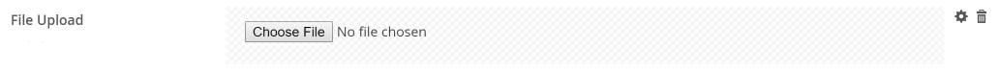
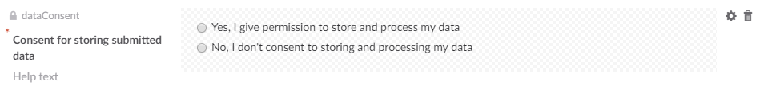
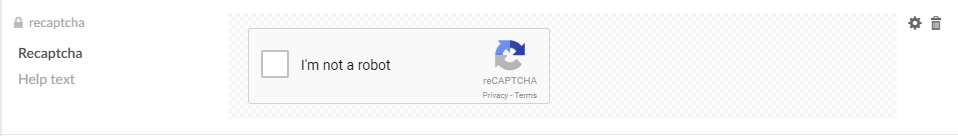

# Overview of the default fieldtypes

Umbraco Forms comes with a bunch of default fieldtypes (also known as **answer types**) you can choose from when adding new fields to your forms. Here is a detailed overview.

## Short Answer
Simple textbox allows up to 250 characters.

## Long Answer
Bigger textfield that allows multiline text and more than 250 characters.

## [Date](Date)
Will display a picker that allows to user to select a date.

## Checkbox
Displays a single checkbox that can be checked or not.

## File upload
Allows user to select and upload a local file.

## Password
Password field (input isn't visible when typing).

## Multiple Choice
Will display a list of items (a checkbox for each item) where the user can select multiple options.

## Data Consent

A field for the purpose of asking for data consent. **Note**: This field is automatically added to all new forms created with Forms 6+.

## Dropdown
Will display a list of items (in a drop down box) where the user can select a single option.

## Single Choice
Displays a list of items (a radio button for each item), where the user can select a single option.

## Title and Description
Outputs a title and description that are set as prevalues.

## [Recaptcha](Recaptcha)
The field displays a simple checkbox for the user to check in order for the form to be validated

:::tip
As ReCaptcha v1 is shut down, we **strongly** recommend that you use the ReCaptcha2 field type.
:::

## Hidden
Hidden field, won't be visible to the user.

