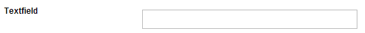
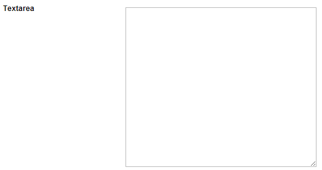
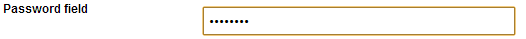
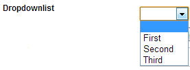
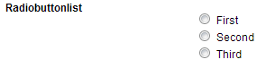
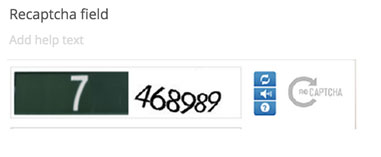

#Overview of the default fieldtypes
Umbraco Forms comes with a bunch of default fieldtypes you can choose from when adding new fields to your forms. Here is a detailed overview.

##Textfield
Simple textbox allows up to 250 characters

##Textarea
Bigger textfield that allows multiline text and more than 250 characters

##Datepicker
Will display a picker that allows to user to select a date

##Checkbox
Displays a single checkbox that can be checked or not

##File upload
Allows user to select and upload a local file

##Password field
Password field (input isn't visible when typing)

##Checkboxlist
Will display a list of items (a checkbox for each item) where the user can select multiple options

##Dropdownlist
Will display a list of items (in a drop down box) where the user can select a single option

##Radiobuttonlist
Displays a list of items (a radio button for each item), where the user can select a single option

##Text
Outputs a bit of text (no input controls)

##Recaptcha field
Displays a recaptcha field (words seen in distorted text images), where the user must input the right word in order for the form to be validated. Don't forget to make the field mandatory.

##Hidden field
Hidden field, won't be visible to the user
