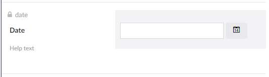
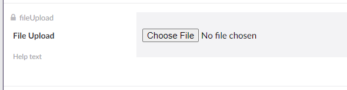
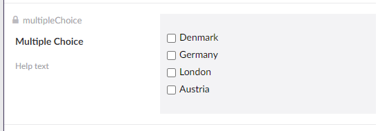

# Overview of the Field Types

Umbraco Forms comes with a bunch of default Field Types (also known as **Answer Types**) you can choose from when adding new fields to your Forms.

By default, the following Field Types are available:

- **Short Answer**:
    A textbox allows up to 250 characters.

    

- **Long Answer**:
    A bigger text field that allows multiline text and more than 250 characters.

    

- [Date](Date):
    Displays a picker that allows the user to select a date.

    

- **Checkbox**:
    Displays a single checkbox that can be checked or not.

    

- [File Upload](FileUpload):
    Allows user to select and upload a local file.

    

- **Password**:
    Allows to type a password. The input is not visible when typing.

    

- **Multiple Choice**:
    Displays a list of items with a checkbox for each item where the user can select multiple options.

    

- **Data Consent**:
    A field for the purpose of asking for data consent.

    :::note
    By default, this field is added to all new forms created with Forms version 6+.
    :::

    

- **Dropdown**:
    Displays a list of items in a drop down box where the user can select a single option.

    

- **Single Choice**:
    Displays a list of items with a radio button for each item where the user can select a single option.

    

- **Title and Description**:
    Displays a title and description that are set as default values.

    

- **Hidden**:
    A hidden field allows developers to include data that cannot be seen or modified by users when a Form is submitted.

    

- [Recaptcha V2](Recaptcha2):
    The field displays a single checkbox for the user to select in order to validate the Form.

    

- [Recaptcha V3 with Score](Recaptcha3):
    Available in Umbraco Forms from v8.7.0. This field returns a score for each request without user interaction. The score is based on user interactions with the site and enables you to take an appropriate action for your site based on the score.

    

---

Prev: [Form settings](../Form-Settings/index.md) &emsp; &emsp; &emsp; &emsp; &emsp; &emsp; &emsp; &emsp; Next: [Setting-up Conditional Logic on Fields](../Conditional-Logic/index.md)
