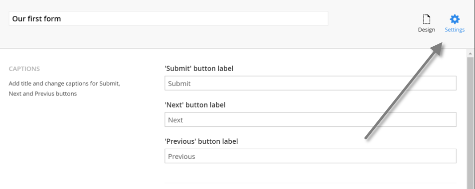
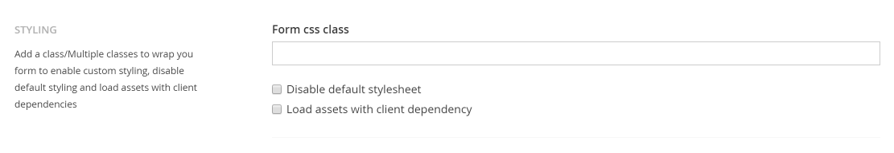
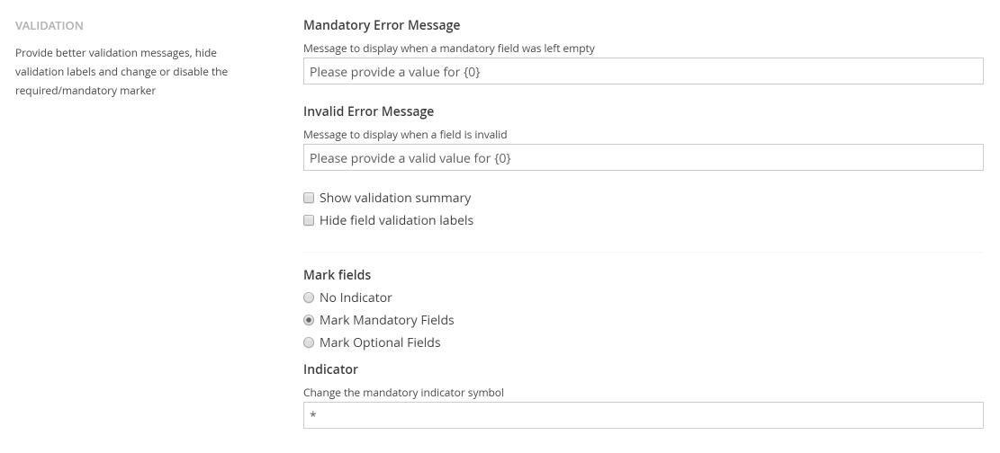

# Form settings
Besides the form design you can also setup some settings to customize how your form will behave.

## Captions
Displayed on the buttons that move an end user between multiple pages and submission of a Form.

## Styling
Add a class/Multiple classes to wrap you form to enable custom styling, disable default styling and load assets with client dependencies.

### Disable default stylesheet
More site design orientated (so probably for the developer) but enabling this option will prevent a default stylesheet being added to the pages where the form is placed.

## Validation
What should be displayed when a field is mandatory and a value isn't supplied or the value isn't valid.

### Mandatory error message
The error message that will be displayed for a field if a field is mandatory but a value isn't provided. This setting can be overwritten on a field level. {0} will be replaced with the field caption.

### Invalid error message
The error message that will be displayed for a field if a field isn't valid (a regular expression has been setup but the input doesn't match). This setting can be overwritten on a field level. {0} will be replaced with the field caption.

### Show validation summary
Enable this option if you wish to display a summary of all error messages on top of the form.

### Hide field validation labels
Enable this option if you wish the hide individual field error messages from being displayed.

### Field indicators
Should mandatory fields or optional fields be marked with a certain indicator?

### Mark fields
You can choose to not mark any fields or only mark mandatory or optional fields.

### Indicator
The indicator that will be used, a typical indicator is just a *

 state and manually place it in the approves state then check this option (might be useful if there are workflows that happen on approval).

### Moderation
Allow form submissions to be post moderated. Most use cases are for publicly shown entries such as blog post comments or submissions for a social campaign.

 
