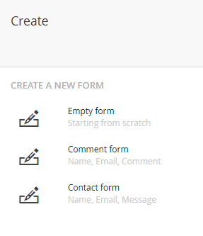

# Creating a form

This will show the basic steps of creating a form and adding them to your Umbraco site.

## Navigate to the Forms section

Managing forms happens in the Forms section of the Umbraco backoffice. You need to have access to the section in order to see it.

If you do not see it, you will need to either log in with an Administrator account or request access from someone with Administrator permissions for your site. An Administrator can give permission to view the Forms section to your individual account or the user group your account belongs to from within the Users section of the backoffice. 

## Click the forms tree

Similar to most create actions in the Umbraco backoffice, you'll have to click the ellipses on the forms tree/folder and that will show you the create option.

## Select if you want to start from scratch
You will see the following dialog

You'll have the option to start from scratch or you can choose to start with a template that will already have some fields defined.

In this walk-through we'll select **Empty form**.

## Design the form

The next screen you will see is the form designer.

There is already a page, a fieldset and a container available. The rest of the form has to be added using the UI.

:::note
In Umbraco Forms version 7 or higher there will be a predefined *dataConsent* field added to all new forms.
See this blog post for more details: [Umbraco version 7.9 and Forms 7.0](https://umbraco.com/blog/umbraco-version-79-and-forms-70-is-out/)
:::

### Setting the form name
First we will need to give our new form a name.

### Setting the page name (optional)

Click the page name in order to change it.

To add more pages by clicking **Add new page** at the bottom of the page forms designer.

### Setting the page group (optional)

As you can give each page a name, you can also name the groups.

To add another group to your form, click **Add new group** which you can find at the bottom of each page in the form designer.

### Adding fields

To add a new field click the Add Question button

This will open the following dialog

From this dialog you need to give the field a **name**. You can also add a **help text** to make it easier for your users to know how to fill in the field.

In the dialog you'll also need to choose which type of field or layout element you wish to add. These are also known as **answer types** because they decide the type of answer that will be displayed to the end user. Find a full list of the available answer types here: [Answer types](Fieldtypes).

Once the type has been selected, there are a number of additional settings that can be applied to the field:

* Mark whether the field stores **sensitive data**
    * This will prevent the data from this field from being downloaded and viewed by users who does not have permission to do so. Only members of the sensitive data user group will see this option.
* You can give the field a **default value**
* Add a **placeholder** to make it easier for the user to fill in the form
* Mark whether the field is **mandatory**, and customize the message
* Add **validation** to the field
    * There are a number of predefined validation, and it is possible to add your own custom validation as well
* Set **Conditions** for the field (read more: [Conditional logic](Conditional-Logic))

Some of the additional settings are dependent on which answer type was chosen. For example when we choose *Short Answer* as our answer type we get two additional settings (Default Value and Placeholder).

Once the type has been selected and you have added the configuration you want, click **Submit** and you will see that the field has been added to the form designer.

To edit a field that has already been added to the form, click the little *cog* icon next to the field to open the dialog. To delete a field or a group, click the *recycle bin* icon.

### Structure your form

Once you've added a few fields to your form, you might want to change the order of questions. This can be done by clicking **Reorder** in the top-right corner of the form designer.

When reordering your form, you can drag and drop the fields to make it look the way you want. Click **I am done reordering** to get back to the form designer.

## Saving the form

Once you are satisfied with the form, you can save the design by clicking the save button in the toolbar

## Adding the form to the Umbraco site

### Select page

Navigate to the Content section of the Umbraco Backoffice and select the content page where you want to insert the form. The page you choose should either have an RTE field, a Grid Editor, or a form picker all of which you can add in the Settings section under Document Types.

### Add Form macro

* Click the *add macro* button in the toolbar of the RTE or the *insert macro* option from the Grid.
* Under 'Choose a Form' click **Add** and select the form you want to insert

    

* (Optional) Click **Add** under 'Theme' to choose which theme the form should use
* Finally you have an option to **exclude scripts**

The form should be inserted on to your page and all that's left to do is click of the *Save and publish* button.

