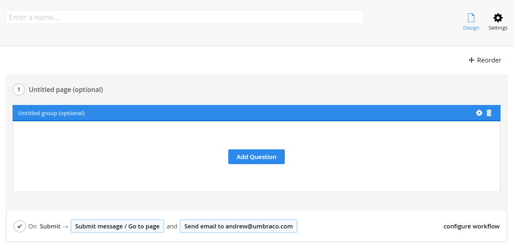
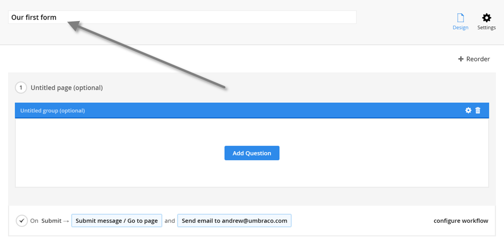
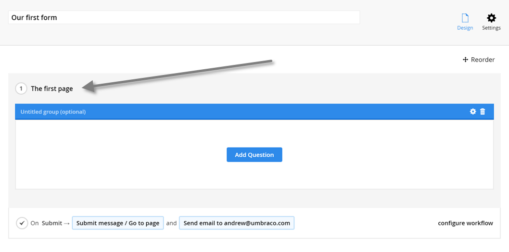
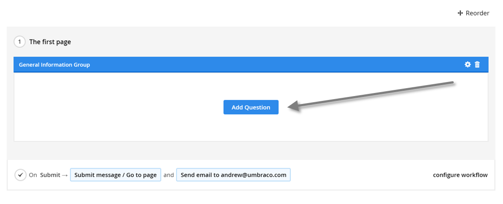
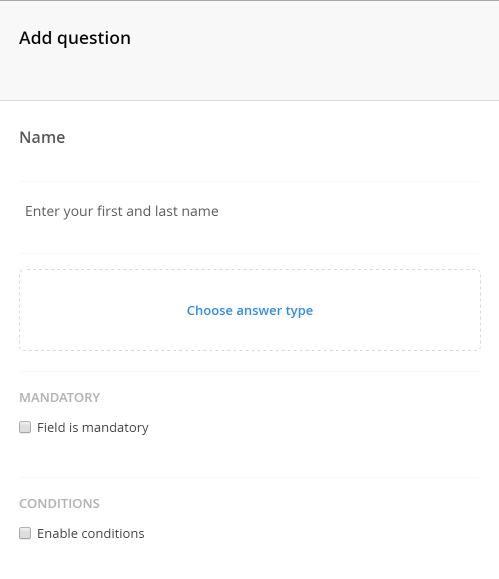
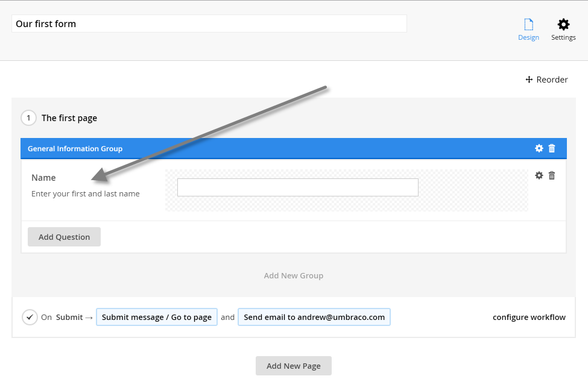
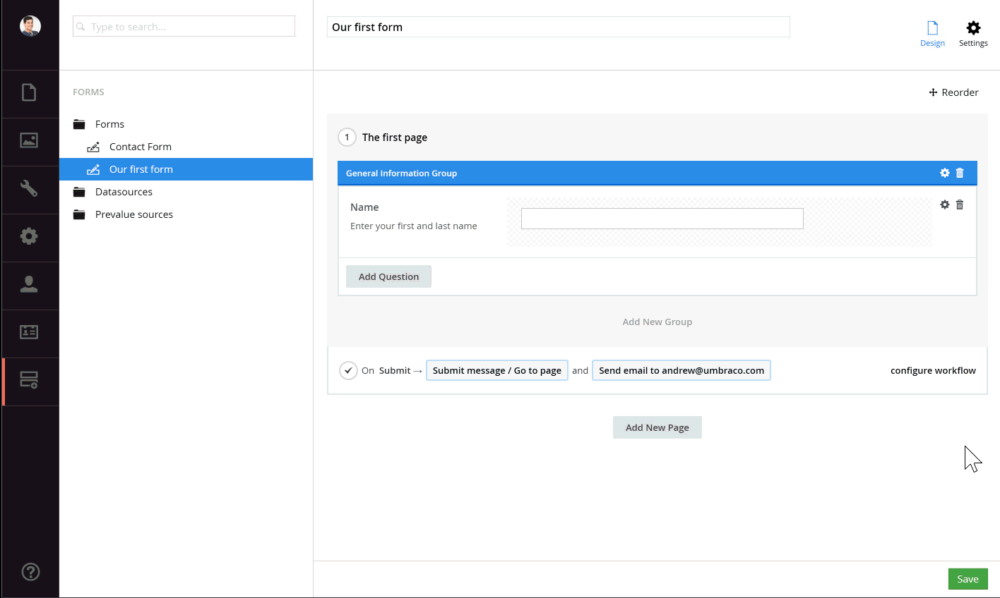
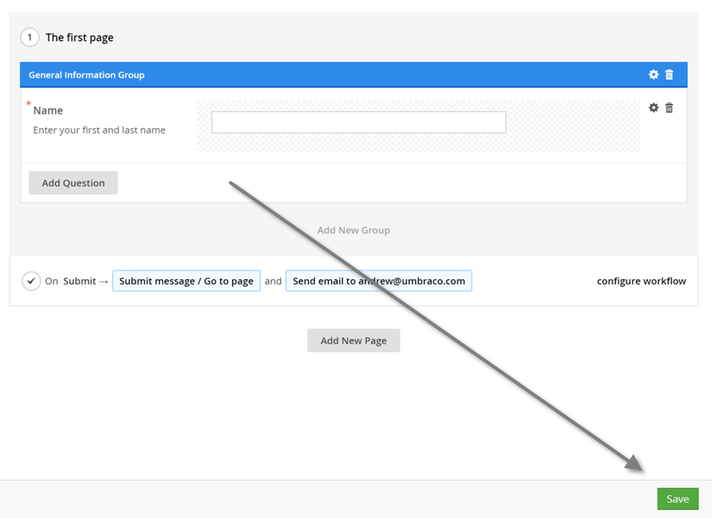
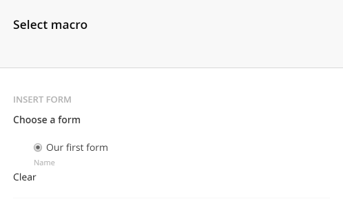

# Creating a form

This will show the basic steps of creating a form and adding them to your Umbraco site.

## Navigate to the Forms section

Managing forms happens in the Forms section of the Umbraco backoffice. You need to have access to the section in order to see it. 

## Click the forms tree

Similar to most create actions in the Umbraco backoffice, you'll have to click the ellipses on the forms tree/folder and that will show you the create option.

## Select if you want to start from scratch
You will see the following dialog

You'll have the option to start from scratch or you can choose to start with a template that will already have some fields defined.

## Design the form

The next screen you should see after selecting the empty or form template is the form designer

There is already a page, a fieldset and a container available. The rest of the form has to be added using the UI (unless you started from a template then you already get some fields).

### Setting the form name
First we'll need to provide a name for our new form, you can do that in the top input.

### Setting the (optional) page name

The page name can be placed in edit mode by simply clicking it.

### Setting the (optional) page group

The same functionality works for the page group. The page group will be placed in edit mode by simply clicking on it.

### Adding fields

To add a new field hit the Add Question button

That should display the following dialog

From the dialog above you'll need to choose which type of field or layout element you wish to add. These are also known as *answer types* because they decide the type of answer that will be displayed to the end user. The available field types/answer types are:

- Short Answer
- Long Answer
- Date
- Checkbox
- File upload
- Password
- Multiple Choice
- Dropdown
- Single Choice
- Title and Description
- Recaptcha
- Hidden

Once the type has been selected a new field should have been added to your form with the appropriate name and help text.

It's also possible to provide additional settings, such as making a field mandatory, or validation options. Some of the additional settings shown below will be dependent on which answer field was chosen. For example when we choose *Short Answer* as our answer type we get two additional settings (Default Value and Placeholder) which will differ depending on answer type selected. To see the specific settings of each answer type click the settings cog.

You can then repeat this step until you end up with the form you desire.

## Saving the form
Once you are satisfied with the form you can save the design by hitting the save button in the toolbar

## Adding the form to the Umbraco site

### Select page

Navigate to the content section and select the content page where you want to insert the form (this page should either have an RTE field or Grid)

### Add Form macro

Hit the *add macro* button in the toolbar of the RTE or the *insert macro* option from the Grid.

Select the insert form from Umbraco Forms macro

Select the form you want to insert and hit select

The form should be inserted now and all that's needed to put it on your site is a save and publish of the content page!

