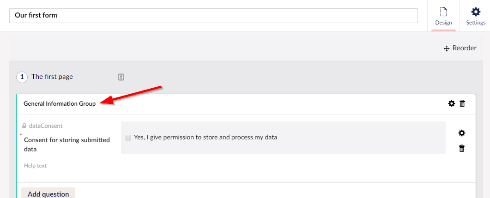
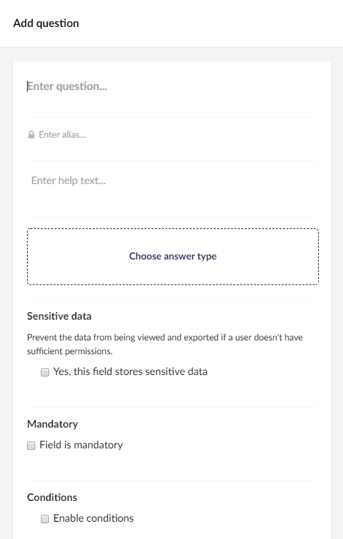
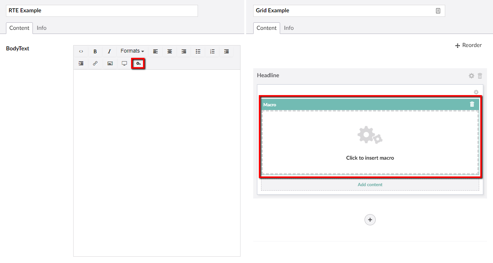
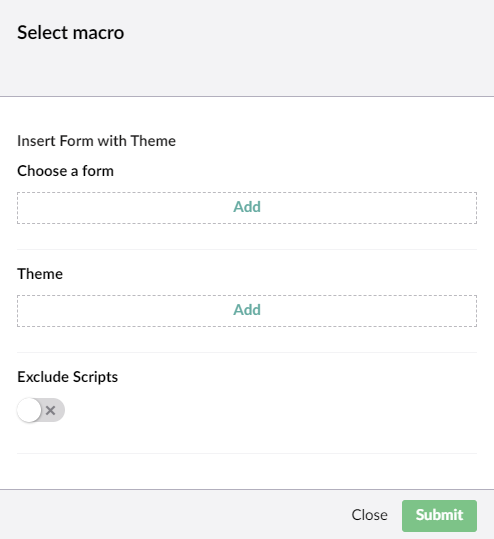
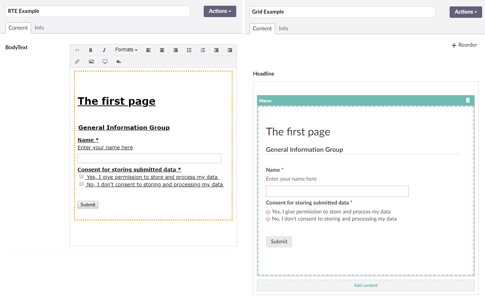

# Creating a Form - The Basics

In this article, we'll take a look at the basic steps of creating a Form and adding the Form to your Umbraco site.

## Accessing the Forms Section

You can manage the Forms in the **Forms** section of the Umbraco backoffice. You need to have access to the section in order to see it.

If you do not see the **Forms** section, you will need to either log in with an Administrator account or request access from someone with Administrator permissions for your site. An Administrator can give permission to view the Forms section to your individual account or the user group your account belongs to from within the Users section of the backoffice.

## Creating a Form

To create a Form, follow these steps:

1. Navigate to the **Forms** section.
2. Click **...** next to the Forms folder.

    
3. The **Create a new Form** dialog opens.

    
4. Select **Empty Form**. The Form Designer opens in the editor.

    
5. By default, there is a page, a fieldset, and a container available. The rest of the Form has to be added using the interface.

    :::note
    In Umbraco Forms version 7 or higher, unless the feature has been disabled via configuration, there will be a predefined *Consent for storing submitted data* field added to all new Forms.
    See this blog post for more details: [Umbraco version 7.9 and Forms 7.0](https://umbraco.com/blog/umbraco-version-79-and-forms-70-is-out/)
    :::

6. Enter the **Name** for the Form. Let's call it _Our first form_.
    
7. **[Optional]** Enter the **Page Name**. We'll call it _The first page_. Click **Add new page** at the bottom of the Forms designer to add more pages.
    
8. **[Optional]** Enter the **Group Name**. Click **Add new group** to add another group.
    
9. Click the **Add Question** button to add a new field.
    
10. The Add Question dialog opens.

    
11. Enter the following details:

    | Field Name | Value |
    |-|-|
    | Enter question | Name |
    | Enter help text | Enter your name here |
    | Choose answer type | Short answer |

12. In the **Sensitive data** field, choose if the field stores sensitive data. Once selected, the data from this field will be prevented from being downloaded and viewed by users who do not have permission to do so. Only members of the sensitive data user group will see this option.
13. Enter a **Default Value** for the field.
14. Add a **Placeholder** to make it easier for the user to fill in the Form.
15. Select if the field is **Mandatory** and customize the message.
16. Add a **Validation** to the field. There are some predefined validation available but it is possible to add your own custom validation as well.
17. Some form fields allow you to show or hide the label that's associated with the field when it is rendered within the form on the website.  The default is always to show the field, but if you prefer to hide it, untick the **Show label** option.
18. Set **Conditions** for the field. For more information on Conditions, see the [Setting-up conditional logic on fields](Conditional-Logic) article.

    Some of the additional settings are dependent on which answer type was chosen. For example, since we selected *Short Answer* as our answer type we got two additional settings (Default Value and Placeholder).
19. Once the configuration is completed, click **Submit**. You will see that the field has been added to the Form designer.
    

To edit a field that has already been added to the Form, click the little **cog** icon next to the field to open the dialog. To delete a field or a group, click the **Recycle Bin** icon.

### Structuring the Form

Once you've added a few fields to your Form, you might want to change the order of questions. To do so, click **Reorder** in the top-right corner of the Form designer.

When reordering your Form, you can drag and drop the fields to make it look the way you want. Click **I am done reordering** to get back to the Form designer.

## Saving the Form

Once you are satisfied with the Form, you can save the design by clicking the **Save** button.

## Organizing Forms in Folders

If you are running Umbraco Forms 8.8.0 or above, and installation of the product is configured for storage of form definitions in the database, you will have the option to store forms within folders.  If you are planning to create a number of them, this may help with organization and locating them once created for modification.

To create a folder, from the same dialog as you use to create a form, you'll have the option to create a folder, for which you need to provide a name.

You can create folders within folders, rename, move and delete them.  You also have the ability to move or copy forms into folders, all via the tree operations available from the **...** menu.

## Adding the Form to the Umbraco site

To add the Form, follow these steps:

1. Navigate to the **Content** section of the Umbraco Backoffice.
2. Select the content page where you want to insert the Form. The page you choose should either have an RTE field, a Grid Editor, or a form picker all of which you can add in the **Settings** section under **Document Types**.

    
3. Click the **Insert macro** button in the toolbar of the RTE or Grid. The **Select Macro** dialog opens.
4. Click **Add** under **Choose a Form** and select the Form you want to insert.

    
5. **[Optional]** Click **Add** under **Theme** to choose which theme the Form should use.
6. Finally you have an option to **Exclude Scripts**.
7. Click **Submit**.
8. The Form is inserted on to your page. Click the **Save and publish** button.

    

---

Prev: [Editor Documentation](../index.md) &emsp; &emsp; &emsp; &emsp; &emsp; &emsp; &emsp; &emsp; &emsp; &emsp; &emsp; Next: [Form Settings](../Creating-a-Form/Form-Settings/index.md)
