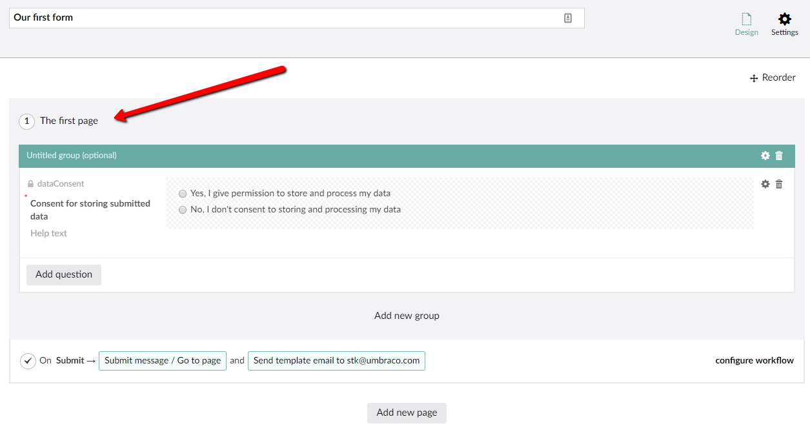
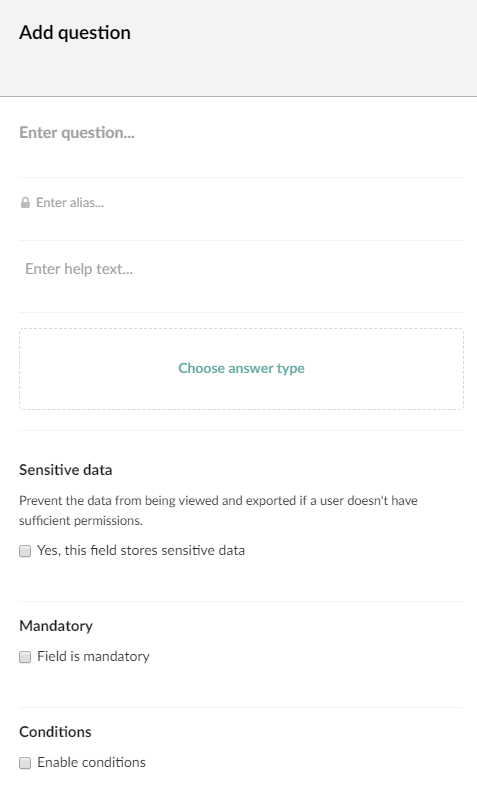

# Creating a form

This will show the basic steps of creating a form and adding them to your Umbraco site.

## Navigate to the Forms section

Managing forms happens in the Forms section of the Umbraco backoffice. You need to have access to the section in order to see it. 

## Click the forms tree

Similar to most create actions in the Umbraco backoffice, you'll have to click the ellipses on the forms tree/folder and that will show you the create option.

## Select if you want to start from scratch
You will see the following dialog

You'll have the option to start from scratch or you can choose to start with a template that will already have some fields defined.

In this walk-through we'll select **Empty form**.

## Design the form

The next screen you will see is the form designer.

There is already a page, a fieldset and a container available. The rest of the form has to be added using the UI..

:::note
In Umbraco Forms version 7 or higher there will be a predefined *dataConsent* field added to all new forms.
See this blog post for more details: [Umbraco version 7.9 and Forms 7.0](https://umbraco.com/blog/umbraco-version-79-and-forms-70-is-out/)
:::

### Setting the form name
First we will need to give our new form a name.

### Setting the page name (optional)

Simply click the page name in order to change it.

To add more pages, simply click **Add new page** at the bottom of the page forms designer.

### Setting the page group (optional)

As you can give each page a name, you can also name the groups.

To add another group to your form, simply click **Add new group** which you can find at the bottom of each page in the form designer.

### Adding fields

To add a new field hit the Add Question button

This will open the following dialog

From this dialog you need to give the field a **name**. You can also add a **help text** to make it easier for your users to know how to fill in the field.

In the dialog you'll also need to choose which type of field or layout element you wish to add. These are also known as **answer types** because they decide the type of answer that will be displayed to the end user. The available field types/answer types are:

- Short Answer
- Long Answer
- Date
- Checkbox
- File upload
- Password
- Multiple Choice
- Data Consent
- Dropdown
- Single Choice
- Title and Description
- Recaptcha
- Hidden
- Recaptcha2

Once the type has been selected, there are a number of additional settings that can be applied to the field:

* Mark whether the field stores *sensitive data*
    * This will prevent the data from this field from being downloaded and viewed by users who does not have permission to do so
* You can give the field a *default value*
* Add a *placeholder* to make it easier for the user to fill in the form
* Mark whether the field is *mandatory*, and customize the message
* Add *validation* to the field
    * There are a number of predefined validation, and it is possible to add your own custom validation as well
* Set *Conditions* for the field

Once the type has been selected, and you have added the configuration you want, click **Submit** and you will see that the field has been added to the form designer.

It's also possible to provide additional settings, such as making a field mandatory, or validation options. Some of the additional settings shown below will be dependent on which answer field was chosen. For example when we choose *Short Answer* as our answer type we get two additional settings (Default Value and Placeholder) which will differ depending on answer type selected. To see the specific settings of each answer type click the settings cog.

You can then repeat this step until you end up with the form you desire.

## Saving the form
Once you are satisfied with the form you can save the design by hitting the save button in the toolbar

## Adding the form to the Umbraco site

### Select page

Navigate to the content section and select the content page where you want to insert the form (this page should either have an RTE field or Grid)

### Add Form macro

Hit the *add macro* button in the toolbar of the RTE or the *insert macro* option from the Grid.

Select the insert form from Umbraco Forms macro

Select the form you want to insert and hit select

The form should be inserted now and all that's needed to put it on your site is a save and publish of the content page!

