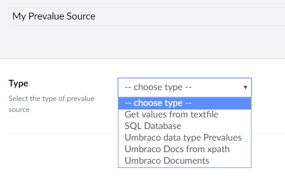

# Defining and Attaching Prevalue Sources

Prevalue sources are a way to pre-define and/or retrieve a list of items from a certain source. They can be added in any field types that include some kind of list like Dropdown and Multiple/Single Choice lists.

## Setting up a Prevalue Source

Prevalue sources can be managed in the **Prevalue sources** folder available in the **Forms** section.

To set a prevalue source:

1. Navigate to the **Forms** section.
2. Right-click the **Prevalue sources** folder and select **Create**.
3. A new page opens in the right-side of the editor where you'll need to setup and configure your prevalue source.
4. Enter a **Name**.
5. Select the type of prevalue source from the **Type** drop-down. For more information on the different default types, see the [Overview of the Prevalue Source Types](Prevalue-source-types) article.

    

### Configuring the Prevalue Source

Depending on the **Type** you choose, you'll need to provide some additional settings:

1. In this walk-through, we will select **Get values from textfile** from the **Type** drop-down.
    
2. Now, provide a file containing the list to use as prevalues. For example: A `.txt` file containing the following values:

        example value 1
        example value 2
        example value 3
        example value 4
        example value 5

3. Select **Pick File** and choose the text file you just created.
4. Once the text file is uploaded, click **Save** to save the prevalue source.
5. If the file is successfully uploaded and validated, you will see an overview of the values in a tabular format.
    

## Attaching a Prevalue Source to a Field

Once a prevalue source has been created, it can be used while building Forms in the Forms designer.

**Example:**
Let's add a Multiple Choice field type in our Form. If there is at least one prevalue source defined in the project, the Prevalues source will contain a dropdown from where you can choose the predefined value.

Once you have selected the prevalue source, the values are rendered in the Forms designer from the attached source.

---

Prev: [Viewing and Exporting Entries](../Viewing-and-Exporting-Entries/index.md) &emsp; &emsp; &emsp; &emsp; &emsp; &emsp; &emsp; &emsp; Next: [Overview of the Prevalue Source Types](../Defining-and-Attaching-Prevaluesources/Prevalue-source-types/index.md)
