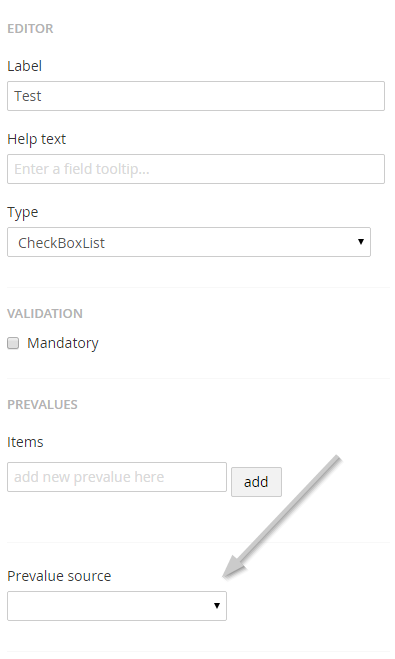
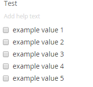

# Defining and attaching prevalue sources

Prevalue sources are a way to pre-define and/or retrieve a list of items from a certain source. They can be used in any fieldtypes that include some kind of list, like Dropdown and Multiple / Single Choice lists.

## Setting up a prevalue source

Prevalue sources can be managed in the corresponding part of the Umbraco Forms section

Right-click the prevalue source tree and select create. You will see a new page where you'll need to setup and configure your prevalue source.

After setting a name, you need to select the type of prevalue source you'll want to use. An overview of the different default types can be found [below](#overview-of-the-default-prevalue-source-types)

### Configure the prevalue source

Depending on the type you choose, you'll need to provide some additional settings.

In this walk-through we will choose `Get values from textfile`:

We need to provide a file containing the list we want to use as prevalues. This could be a `.txt` file containing the following:

	example value 1
	example value 2
	example value 3
	example value 4
	example value 5

Once the settings are populated, save the prevalue source by hitting the Save button. If the settings are successfully validated and they return results, you will be able to see an overview of the values.

## Attaching a prevalue source to a field
Now move to the form where you want to use the prevalue source add or edit a field and go to the additional settings (the fieldtype has to support prevalues so checkboxlist, radiobuttonlist, dropdownlist). When there is at least 1 prevalue source you should now see a new option called prevalue source where we can choose 1 of the available prevalue sources.

Choose the correct type (so the name of the prevalue source), you should now see a render of the field in the designer using the values coming from the attached source

## Overview of the default prevalue source types
There are a couple of default prevalue source types that can be used, here is an overview:

#### Get values from textfile
Upload textfile that contains the prevalues (separated by linebreak)

#### SQL Database
Connects to a OLEDB compatible Database Table and constructs a prevalue source from it, which is editable from the forms UI

#### Umbraco data type Prevalues
Connects to an Umbraco data type and uses its prevalue collection

#### Umbraco Documents
Uses nodes from a specific source as prevalues