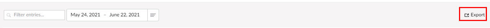
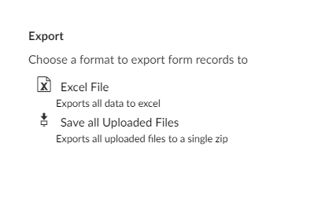
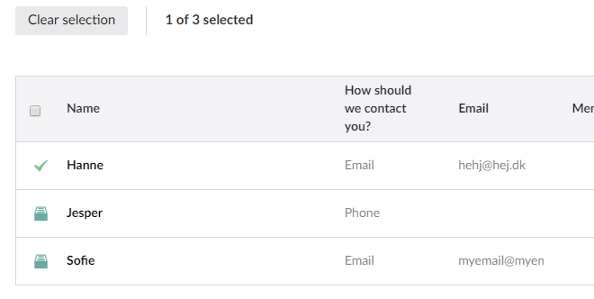

# Viewing and Exporting Entries

Expand the Form in the tree to view the Entries for each Form.

## Entries Overview

When accessing the Entries viewer, you will be able to see all the entries submitted via the Form.

### Viewing the Entries

By default, the list is filtered to show entries only from the past month. If you want to change the date range, pick the appropriate time period from the date picker. You can also filter the entries by specific words using the Search field on the left.

Clicking on the first field for each record in the list will open the full set of information recorded for the form entry.  Next and previous buttons allow you to navigate through the entry list.

### Editing the Entries

If configured via the permissions model and supported by the version of Umbraco Forms you are running (8.11+/9.3+), entries may be editable via the back-office.  If available, click the _Edit_ button to switch the read-only view of an entry to an editable one and _Save_ to record the changes.  An audit trail will show who and when updates on the entry were made.

Validation will operate as is configured for the form in terms of mandatory fields and those that must match a particular pattern.  Conditional display of fields is not supported.

## Exporting Entries

To export all the entries from your Form:

1. Go to the **Forms** section.
2. Navigate to the **Entries** you wish to export.
3. Click **Export** in the top-right corner of the screen.
    
4. The Export dialog opens. Choose a format such as Microsoft Excel to export the Form records to.
    
5. Click **Done**.

If you have fields that allow the user to upload files within your form, you will also have the option to download a zip file containing these files.  You can either download the files in the stucture that they are stored on the web server's disk.  Or you can download them organised by entry, so it's easier to match up the entry listed in the spreadsheet download with the uploaded file(s).

## Record Actions

When selecting entries, it is possible to execute Actions. To select an entry, click anywhere on the entry.

:::note
Clicking on the *Name* opens a view where you can see the entire entry details.
:::

Select at least 1 record to see the available actions in the top-right corner. By default, there are 2 possible actions:

- Approve
- Delete

---

Prev: [Workflow Types](../Attaching-Workflows/Workflow-Types/index.md) &emsp; &emsp; &emsp; &emsp; &emsp; &emsp; &emsp; &emsp; Next: [Defining and Attaching Prevalue Sources](../Defining-and-Attaching-Prevaluesources/index.md)
