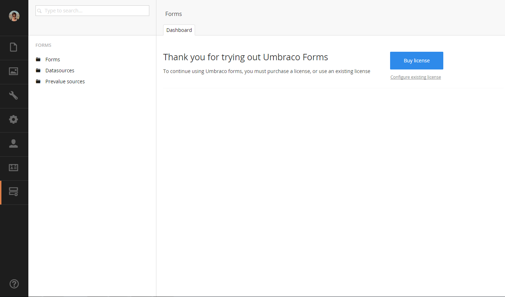

# Buying and configuring a license
Since Umbraco Forms is a commercial product you'll need to have a valid license file in order for it to fully work.

If your Umbraco Forms installation is still in trial you should see the following notification on the Forms dashboard

## Buying a license
Licenses for Umbraco Forms can be purchased on http://umbraco.com. So if you hit the *buy license* button you'll be redirected to the umbraco.com website and are able to buy a license in the webshop. 

## Configuring a license
You can either download your license from the umbraco.com website and place it in the /bin directory of your site manually or you can use the *configure existing license* option on the Forms dashboard (please not that you'll need to have your umbraco.com account details in order to fetch the license)

## Licensing model
Licenses are sold per domain and will also work on all subdomains. You'll also get 2 development domains.
So a full license could like like

- *.mysite.com
- *.mydevdomain.com
- *.myotherdevdomain.com

Only 1 license can exist per Umbraco instance, if you wish to extend a license with additional domains that option is also possible on http://umbraco.com 

### How do I use the .lic license file?
The .lic file must be placed in the /bin directory to be registered by Umbraco Forms, if not, the application will automatically switch to trial mode.

### What does a license cover?
A single license covers a single installation of Umbraco Forms in production environments, as well as two additional development environments.  The license allows for an unlimited number of forms.  It is valid for 1 production domain, and 2 development domains.  Each domain includes all sub-domains `*.domain.tld`, as well as .local extension `domain.tld.local`.  The license also will include `localhost` as a valid domain.

Data collected on non-licensed domains will not be stored, so please validate that all site accessible domains are licensed, or properly redirect to the licensed domain.
Usage of IP addresses is not available, thus host names must be used.

### Can I add additional domains to the license?
Yes, additional domains can be added for EUR59 that can be ordered here.  
  * Please note that this is an add-on domain for existing licenses. Refunds will not be given for this product.

It is however only meant for websites which has several domains. If you wish to use Umbraco Contour on multiple websites you would need a license per site.

Is Umbraco Forms open source?
No, Umbraco Forms has a traditional closed source license, as all our commercial products have.
