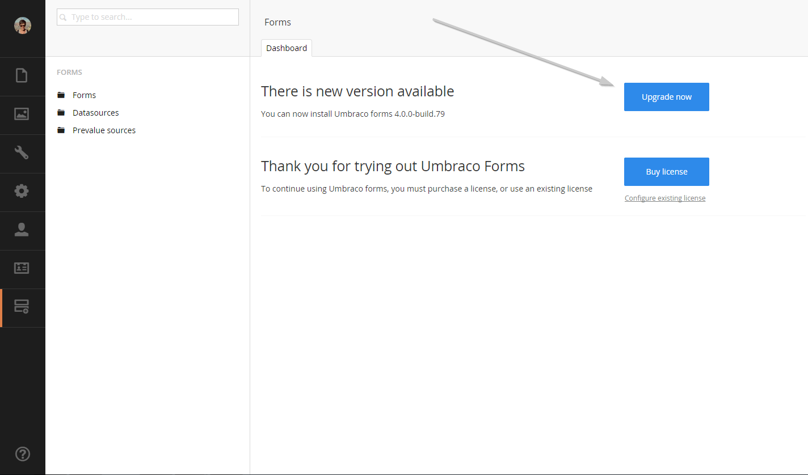

#Keeping Umbraco Forms up to date
Forms makes it easy to stay in sync with the latest releases,so you can take advantage of new features and bug fixes.

##Checking for updates
You won't have to check for updates manually. Umbraco Forms will inform you when a new update is available, just navigate to the forms dashboard and if you see the following then a new version is already available.

##Installing update

To upgrade your installation simply hit the *upgrade now* button.

Umbraco will now fetch and install the upgrade.

Once it's completed the upgrade notification should be gone and you can continue using a newly updated Umbraco Forms.

