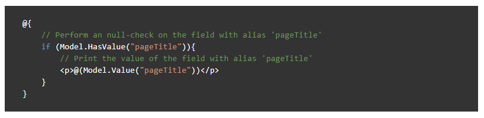

# Code samples

The articles in the Umbraco Documentation can in most cases benefit from relevant code samples to support the written text.

In this article you will find some tips and tricks for adding code samples to articles as well as some best practices which outline how we recommend formatting and using code samples.

## Best practices

* Add a clear description
* Use code-comments
* Use real-life samples
* Add only compilable samples
* Check for syntax errors

## When to use code samples

Code samples are relevant for most types of articles in the Umbraco Documentation. Potentially, any topic covered could benefit from a real-life code sample to support the surrounding contents of the article.

You might want to base an entire article on one code sample, or perhaps you're describing a flow or feature where you might want to add several smaller code snippets to highlight various points.

### Types of samples

As a basis, we're working with 3 types of code samples in the Umbraco Documentation.

#### 1. Inline code

Use inline code when you are referrencing methods, using names of various elements or highlighting a certain value.

Example:

```markdown
Each item is treated as a standard `IPublishedElement entity`, which means you can use all the value converters you are used to using.
```

The markdown above will output the following:

:::center

:::

#### 2. Smaller code snippets

As part of a longer articles or tutorial we recommend using smaller code snippets to highlight the various bits of code that needs to be implemented.

These snippets can be added between sections anywhere in an article without breaking focus from the main topic. Keep in mind that adding too many snippets in quick succession can be confusing to the flow of the article.

Example:

```csharp
@{
    // Perform an null-check on the field with alias 'pageTitle'
    if (Model.HasValue("pageTitle")){
        // Print the value of the field with alias 'pageTitle'
        <p>@(Model.Value("pageTitle"))</p>
    }
}
```

The Razor snippet above will output the following:

:::center

:::

#### 3. Large code samples

As part of tutorials and longer articles explaining a certain workflow, it might make sense to add a full code sample of the topic covered.

An example of this could be the tutorial on [creating a custom Dashboard](../../Tutorials/Creating-a-Custom-Dashboard) for your Umbraco project. This article uses various smaller code snippets mixed in with the steps and text sections. At the bottom of the article, you will notice a full example of the file that has been build on through the tutorial - this is an example of a large code sample.

We recommend creating separate articles for these large code samples and using the as references instead of adding them as part of the actual article. Having long snippets in an article which already contains multiple sections and steps, can make the article confusing.

When adding these large code samples, make sure to link to the sample from the relevant tutorial(s) as well as linking from the article containing to sample, to the tutorial where the sample is referenced.
