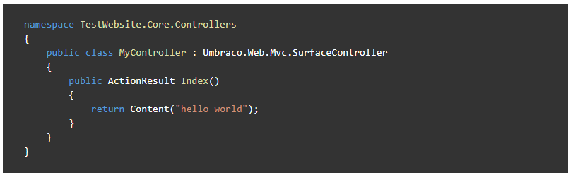

# Code samples

The articles in the Umbraco Documentation can in most cases benefit from relevant code samples to support the written text.

In this article you will find some best practices which outline how we recommend formatting and using code samples, and you will also find definitions and examples of the most used types of code samples in the Umbraco Documentation.

## Best practices

In order to ensure the quality and consistence of all the various code samples in the Umbraco Documentation, we have outlined a set of best practices that we highly recommend that you follow, when adding code snippets to articles.

* Add a clear description
* Use code comments
* Use real-life samples
* Add correct syntax highlighting
* Add only compilable samples
* Check for syntax errors

Each of these best practices are explained in more details below.

### Add a clear description

Having a code sample in an article without explaining what the code does and how it can be used, could leave the reader confused and potentially they could end up running into issues when using the snippet.

Make sure to **always** add a clear description of what the code sample showcases before or after adding the snippet to the article. It should be clear where and when the snippet can be used.

### Use code comments

When you are adding code samples that contain more than a single feature or a single method, it is highly recommended that you add inline-comments directly in the code.

By adding comments directly in the code you can avoid having too much text surrounding the code sample, and you also help readers understand each section or part of the code snippet in detail.

Note that the use of code comments does not eliminate the need for a description of the code sample in the surrounding text.

### Use real-life samples

The documentation often aims to explain complex scenarios and constructs within Umbraco, which means that code samples can be very useful to further the understanding. It is important that these code samples are *real-life* examples, meaning that is should be something that would make sense to add to a production site.

It can be a good idea to use *placeholders* for names, methods and other things, in order to keep the code samples as neutral and general as possible, althought that is not a requirement.

With Umbraco, there are often more than one way to achieve a result, which means that is also makes sense to have more code samples on the same topic.

### Add correct syntax highlighting

When you add code blocks to an Umbraco Docs article make sure that you add the correct syntax highlighting. This will "prettify" the code in the sample, based on which language is used. In the Umbraco Documentation most commonly used languages are supported for syntax highlighting.

To add syntax highlightning, add the name of the language in lower case directly after the first three backticks: "```csharp".

Code sample without syntax highlighting:


The same code sample with syntax highlighting:



### Add only compilable samples

As a reader of the Umbraco Documentation you should be able to grab to code samples in the articles and apply them somewhat directly to your own code base. Of course there might be a need for some minor alterations, but the code in the sample should as a rule of thumb be combilable.

### Check for syntax errors

When reading any piece of text be it documentation or a novel, there is nothing more frustrating that running into spelling and syntax errors. This also applies for code samples.

Any code that is added to articles in the documentation should be double-checked for syntax errors.

## When to use code samples

Code samples are relevant for most types of articles in the Umbraco Documentation. Potentially, any topic covered could benefit from a real-life code sample to support the surrounding contents of the article.

You might want to base an entire article on one code sample, or perhaps you're describing a flow or feature where you might want to add several smaller code snippets to highlight various points.

### Types of samples

As a basis, we're working with 3 types of code samples in the Umbraco Documentation.

#### Inline code

Use inline code when you are referrencing methods, using names of various elements or highlighting a certain value.

Example:

```markdown
Each item is treated as a standard `IPublishedElement entity`, which means you can use all the value converters you are used to using.
```

The markdown above will output the following:

:::center

:::

#### Smaller code snippets

As part of a longer articles or tutorial we recommend using smaller code snippets to highlight the various bits of code that needs to be implemented.

These snippets can be added between sections anywhere in an article without breaking focus from the main topic. Keep in mind that adding too many snippets in quick succession can be confusing to the flow of the article.

Example:

```csharp
@{
    // Perform an null-check on the field with alias 'pageTitle'
    if (Model.HasValue("pageTitle")){
        // Print the value of the field with alias 'pageTitle'
        <p>@(Model.Value("pageTitle"))</p>
    }
}
```

The Razor snippet above will output the following:

:::center

:::

#### Large code samples

As part of tutorials and longer articles explaining a certain workflow, it might make sense to add a full code sample of the topic covered.

An example of this could be the tutorial on [creating a custom Dashboard](../../Tutorials/Creating-a-Custom-Dashboard) for your Umbraco project. This article uses various smaller code snippets mixed in with the steps and text sections. At the bottom of the article, you will notice a full example of the file that has been build on through the tutorial - this is an example of a large code sample.

We recommend creating separate articles for these large code samples and using them as references instead of adding them as part of the actual article. Having long snippets in an article which already contains multiple sections and steps, can make the article confusing.

When adding these large code samples, make sure to link to the sample from the relevant tutorial(s) as well as linking from the article containing to sample, to the tutorial where the sample is referenced.
