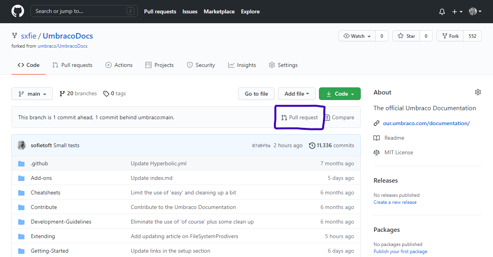

# How to add a new version of an article

This tutorial will guide you throught the steps it takes to add a new version of an existing article in the Umbraco Documentation.

:::tip
The **current major version** on the Umbraco Documentation is currently set to Umbraco 8 (v8). This means that any content that isn't targetting a specific version will be recognized as v8 content.

If you want to help out with **updating our documentation against Umbraco 9** you can find more details about that process in the [Umbraco 9 Documentation](#umbraco-9-documentation) section at the bottom of this article.
:::

## Contents

* [Prerequisites](#prerequisites)
* [Forking and cloning the documentation repository](#forking-and-cloning-the-documentation-repository)
* [Creating the new article](#creating-the-new-article)
* [Adding labels to the article](#adding-labels-to-the-article)
* [Updating the content](#updating-the-content)
* [Creating the PR](#creating-the-pr)
* [Umbraco 9 Documentation](#umbraco-9-documentation)
* [Example: Creating a new version of an article targetting Umbraco 9](#example-creating-a-new-version-of-indexmd-targetting-an-upcoming-version-Umbraco-9)

## Prerequisites

To work with and contribute to the Umbraco Documentation there are a few tools and extensions we recommend that you use. Using these tools will ensure consistency throughout the documentation as well as help you create the best possible version of the article.

* Visual Studio Code (VS Code)
* Markdown linter - Extension for VS Code
* Vale - Extension for VS Code

We also highly recommend that you're familiar with Git and the Markdown syntax.

## Forking and cloning the documentation repository

The very first step to get the documentation files down to your local machine, so you can start working with it. This is done by forking the UmbracoDocs repository and cloning it all down to your local machine.

1. Follow our guide on [how to fork the UmbracoDocs repository](../Pull-Requests/#options-2-creating-a-pr-through-a-fork).
2. Clone your fork to your local machine or open using GitHub Desktop.


Once you have a local clone of the UmbracoDocs repository on your local machine, open the entire `UmbracoDocs/` folder using your favorite editor.

We recommend using Visual Studio Code as it can be extended with a lot of useful tools for writing documentation.

## Creating the new article

Now it's time to create the new article. Dependending on the article and which version of Umbraco you will be targetting, these are the two most common scenarios:

* The article is targetting an older Umbraco version and you want to create a new version of the article that targets the *current major version*, or
* You want to target a version of Umbraco that has not been released yet.

Each scenario involves a different set of steps, which are explained below.

:::tip
Check out the [File Naming Conventions](../File-Naming-Conventions/#target-a-specific-umbraco-version-using-file-naming-conventions) to learn more about how to use file names to target a specific version of Umbraco when creating a new article.
:::

### Target the current major version

1. Create a copy of the existing article, e.g. `index.md`.
2. Rename the *old* article to target the version it was written for, e.g. `index-vX.md` - `X` being the *old* version, e.g. 7.
3. Rename the new article `index.md`.

You will now have (at least) two versions of the same article. One named `index-v7` which is targetting Umbraco 7 and one named `index` which will target the current major version.

:::tip
If you're unsure which Umbraco version to target the *old* article for, check the `versionFrom` label inside the article, at the very top.
:::

### Target an upcoming version

1. Create a copy of the existing article, e.g. `index.md`.
2. Rename the new article based on the Umbraco version that you want to target, e.g. `index-vX.md` - `X` being the next major version, e.g. 9.

You will now have (at least) two versions of the same article. One named `index` which is targetting the current major version, and one named `index-vX` which is targetting the upcoming Umbraco X version.

## Adding labels to the article

You've now created a new version of an article and have use the file naming conventions to target the correct Umbraco version.

The targetted Umbraco version also needs to be added to the **meta data** in the article itself.

1. Open the new article.
2. Locate the `versionFrom` label in the meta data section in the very top of the article.
3. Update the version number to match the version you're targetting.

Example:

```none
---
versionFrom: 9.0.0
meta.Title: "Installing Umbraco"
meta.Description: "Instructions on installing Umbraco: in VS code, via NuGet or on a Mac"
---
```

In some cases you might also want to update the `meta.Title` and `meta.Description` labels.

See the [Umbraco 9 Meta data requirements](#meta-data-requirements) section for more details on which meta data to use when verifying material for Umbraco 9.

## Updating the content

With the meta data in place it is time to start verifying and updating the content in the article.

When updating the content in the article make sure to

* Update any text that is not correct for the new version,
* Verify and update all code samples and code snippets,
* Test and verify that any links in the article is targetting the same version, and
* Update any images and screenshots that are/will be outdated.

:::tip
All images for an article is stored in an `/images` folder located in the same file structure level at the article.

When adding new images, use the same file naming conventions as for the article itself.
:::

## Creating the PR

Now that you've created a new article and verified and updated the contents for the targetted Umbraco version, it is time to hand in the contribution.

This is done, by submitted a Pull Request (PR) on the UmbracoDocs repository.

1. Commit and push the changes you've made to your own fork of the UmbracoDocs repository.
2. Open your UmbracoDocs fork on Github.
3. Select "Pull request".
  
4. Verify that the correct files are part of the PR.
5. Select "Create pull request".
6. Give the PR a descriptive Title.
7. Use the comment section for adding notes to your contribution, asking questions or describing any issues you might have encountered along the way.
8. Select "Create pull request" again to finalize the process and submit the PR.

Once your PR has been created you can expect an answer from one of the UmbracoDocs maintainers within 48 hours (during business hours).

## Umbraco 9 Documentation

To make the process of verifying and updating the documentation for Umbraco 9 as transparent and inclusive as possible, we're maintaining a set of lists of the sections and articles that needs to be worked on.

Following the links below you will find lists for each of the main section in the Umbraco Documentation.

* [Getting Started](https://docs.google.com/spreadsheets/d/1SBMsjreht5rMnHysADmYMcjHFWLcAl9LzFbsSIZNxys/edit?usp=sharing)
* [Implementation](https://docs.google.com/spreadsheets/d/1r5zfT5D5N4kbZjq6YubAZLu7eXjERJh2JsALfXujuQk/edit?usp=sharing)
* [Extending](https://docs.google.com/spreadsheets/d/1g-Zwn_D4I2EQvzDwsC6_ycjkT4ny6KIBdRY40swnuSo/edit?usp=sharing)
* [Reference](https://docs.google.com/spreadsheets/d/1YyARbCbLKhqR12cfbATxyCEZ6fYYxwBXeOw-jNUyWXc/edit?usp=sharing)
* [Tutorials](https://docs.google.com/spreadsheets/d/1ya7-ss1WeqHBfpRm3hICRHyZDLAO7UeP1kMwbTmjvb8/edit?usp=sharing)

Please note that the Add-ons sections as well as the sections related to our Cloud products are not included in the lists above.

Head on over to the [**Issue Tracker on the UmbracoDocs repository on Github**](https://github.com/umbraco/UmbracoDocs/issues/3145) to see how you can get involved and help us get all the documentation verified and updated for Umbraco 9.

### Meta data requirements

As Umbraco 9 it still in development it is subject to change over the coming months. In order to ensure that any documentation written before the official release of the product will be kept up to date, we've implemented a set of meta data to help us identify various parameters for each article.

|Label                    |Input options        |Description         |
|-------------------------|-------------------|----------------------|
|`state`                  |`partial` / `complete` / `outline`|Is that article complete? Is it only partially done, or is it simply an outline as a starting point?|
|`verified-against`       |`alpha-4` / `beta-1` |Define which Umbraco 9 release the article has been verified against.|
|`versionFrom`               |`9.0.0`|Will determine the Umbraco version the article targets.|
|`updated-links`             |`true` / `false`   |As we start to migrate the documentation to Umbraco 9, it will not be possible to convert all links in the articles on the first go. This tag should be used to indicate whether the links in the article have been updated or not.|

:::tip

### Example: Creating a new version of `index.md` targetting an upcoming version, Umbraco 9

In this example, we'll be using the steps above to create a new version of an `index.md` file. The scenario is, that the existing article is already targetting the *current major version* and we want to create a new version that targets an upcoming version, Umbraco 9.

1. Create a copy of the `index.md` file.
2. Rename the new file to `index-v9.md`.
3. Update the `versionFrom` meta data to `9.0.0`
4. Verify and update the contents of the article.
5. Use the `state` meta data to indicate whether or not the article has been fully verified.
6. Use the `verified-against` meta data to indicate which beta release you've verifyed the article against.
7. Use the `updated-links` meta data to tell us whether or not the links have been checked and updated as well.

:::
