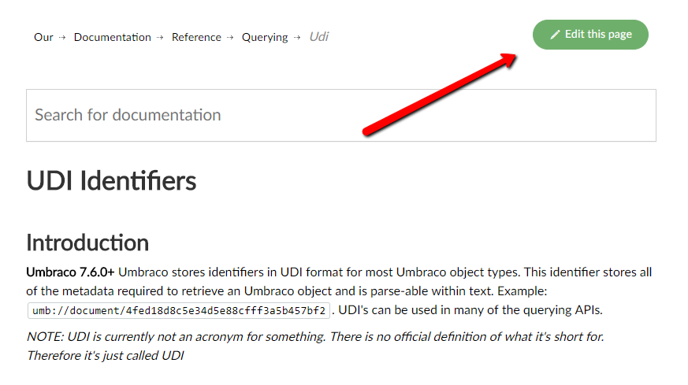
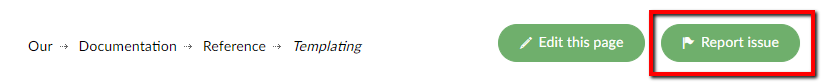
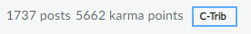

# Contribute to Umbraco Documentation

## What is a pull request

A pull request (PR) is a way of submitting changes to a project that can then be reviewed by the Documentation Curators.

Let’s say you’ve found a typing or syntax error in one of the articles on the documentation, and you want to correct it. You can do that with a pull request.

There are two ways to create a pull request:

1. You can either edit a file directly on GitHub or
2. You can create a fork of the GitHub repository

:::note
It may be helpful for you to read our [Markdown guidelines](Markdown-Conventions) on how to set up Documentation articles before you start writing!
:::

### Option 1. Creating a PR directly on GitHub

GitHub has some great functionality that allows you to submit a PR directly from our [repository](https://github.com/umbraco/UmbracoDocs/), and there is also a button on every single documentation article at the top that links you directly to GitHub in order to edit that specific file:

This is very helpful to fix typing errors or adding small things, but if you are working on a larger update that includes pictures and editing several files in one pull request then it is not the best way to work. You'd be better creating a fork.

### Options 2. Creating a PR through a fork

There are a lot of great tutorials available online on [how to fork a repository (GitHub)](https://help.github.com/articles/fork-a-repo/) and work with one, but we have also created a quick guide on how to do it.

If you do not have Git installed on your computer, you should also follow the [instructions on how to set up Git](https://help.github.com/articles/set-up-git/) before you go any further.

If Git is installed on your computer, follow the [Create a Pull Request using a fork](Pull-Requests) guide.

## Creating an issue

The Umbraco Documentation uses [GitHub issues](https://github.com/umbraco/UmbracoDocs/issues) to manage issues with the documentation.
You can make an issue for any of the following:

- If you feel some documentation is wrong or missing and you do not have time or knowledge to do a PR.
- If the issue will need more than one PR.
- Open a discussion about possible improvements or ways to deal with something in the documentation.

You can also find a button in the top right corner of every page in the documentation itself that looks like this:
  

We compiled a [list of labels](github-issues.md) which we use regularly to tag issues.

## Annotating a document

To add version information and extra keywords, [every document can be annotated using YAML](adding-metadata.md).

## Multi version documentation

With the introduction of every new version of Umbraco, new features are introduced.  This means that not every document will work for your possibly older version.

Therefore we introduced 2 different mechanisms:

1. The [YAML meta data describing](adding-metadata.md) `versionFrom` and `versionTo`.
2. The possibility [to add multiple files about the same topic](file-naming-conventions.md)

## Documentation Curators

All the work of adding labels, going through issues and PR's and managing the Documentation repository is done by the Umbraco Documentation Curators team. If you wish to know more about who they are and how they work there is some information about them here: https://our.umbraco.com/community/the-documentation-curators/

## Contribution badge

If you make a pull request to any Umbraco repository that gets merged in you will get a Contributor badge on your member profile on [Our](https://our.umbraco.com):

The Documentation Curators will search for your profile when merging a PR in and add the badge. 
If it is forgotten just make a comment on the closed PR and we will do it as soon as possible!
