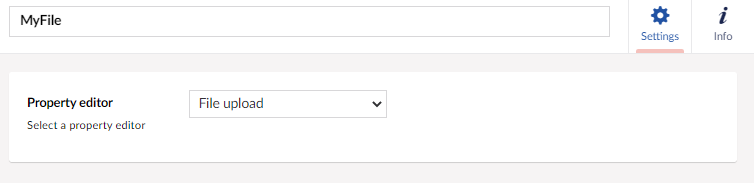

# File upload

`Alias: Umbraco.UploadField`

`Returns: string`

Adds an upload field, which allows documents or images to be uploaded to Umbraco.

## Data Type Definition Example



## Content Example


In code, the property is a string, which references the location of the file.

Example: `"/media/o01axaqu/guidelines-on-remote-working.pdf"`

## MVC View Example

### Without Modelsbuilder

```csharp
@{
    if (Model.HasValue("myFile"))
    {
        var myFile = Model.Value<string>("myFile");

        <a href="@myFile">@Path.GetFileName(myFile)</a>
    }

}
```

### With Modelsbuilder

```csharp
@using ContentModels = Umbraco.Web.PublishedModels;
@if (!Model.HasValue(Model.MyFile))
{
   <a href="@Model.MyFile">@Path.GetFileName(Model.MyFile)</a>
}
```

## Add values programmatically

See the example below to see how a value can be added or changed programmatically. To update a value of this property editor you need the [Content Service](../../../../../Reference/Management/Services/ContentService/index.md) and the [Media Service](../../../../../Reference/Management/Services/MediaService/index.md).

```csharp
@{
    // Get access to ContentService
    var contentService = Services.ContentService;

    // Get access to MediaService 
    var mediaService = Services.MediaService;

    // Create a variable for the GUID of the parent where you want to add a child item
    var guid = Guid.Parse("32e60db4-1283-4caa-9645-f2153f9888ef");

    // Get the page using the GUID you've defined
    var content = contentService.GetById(guid); // ID of your page

    // Create a variable for the file you want to upload, in this case the Our Umbraco logo
    var imageUrl = "https://our.umbraco.com/assets/images/logo.svg";

    // Create a request to get the file
    var request = WebRequest.Create(imageUrl);
    var webResponse = request.GetResponse();
    var responseStream = webResponse.GetResponseStream();

    // Get the file name 
    var lastIndex = imageUrl.LastIndexOf("/", StringComparison.Ordinal) + 1;
    var filename = imageUrl.Substring(lastIndex, imageUrl.Length - lastIndex);

    // Create a media file
    var media = mediaService.CreateMediaWithIdentity("myImage", -1, "File");
    media.SetValue(Services.ContentTypeBaseServices, "umbracoFile", filename, responseStream);

    // Save the created media 
    mediaService.Save(media);

    // Get the published version of the media (IPublishedContent)
    var publishedMedia = Umbraco.Media(media.Id);

    // Set the value of the property with alias 'myFile' 
    content.SetValue("myFile", publishedMedia.Url());

    // Save the child item
    contentService.Save(content);
}
```

Although the use of a GUID is preferable, you can also use the numeric ID to get the page:

```csharp
@{
    // Get the page using it's id
    var content = contentService.GetById(1234); 
}
```

If Modelsbuilder is enabled you can get the alias of the desired property without using a magic string:

```csharp
@{
    // Set the value of the property with alias 'myFile'
    content.SetValue(Home.GetModelPropertyType(x => x.MyFile).Alias, publishedMedia.Url();
}
```
