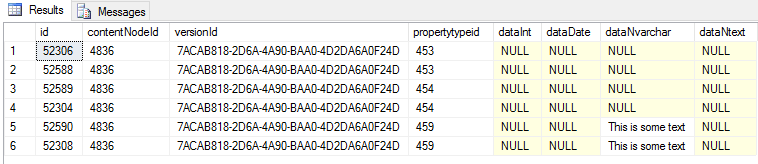

# Courier data integrity fix

We recently discovered a bug introduced in Courier `2.51.0`, which has now been fixed in `2.51.4` and all versions above `2.51.4`.
This bug affects people who use inherited document types or compositions on their document types.

## Symptoms

You will quickly notice if you've been affected by this bug. The first time you transferred content using Courier it all went well and your content updated on the target environment.
However, any updates you make on the source environment and then try to transfer seem to never arrive on the target environment.

## Problem explanation

When you first deploy content with inherited or composed document types, Courier would insert too many rows in the `cmsPropertyData` table, that looks a bit like this:



As you can see the `propertyTypeId` is duplicated here. The next time you do a Courier deploy of updates to your content it will update the first row. So if you updated "This is some text" to "This is updated text" then it would look like this:


The problem here is that when the Umbraco backoffice reads the values for each property from the database it will take the last row and show it to you in the Umbraco interface. So in the backoffice, you'd still see "This is some text".

## Solution

The solution is to delete all of the duplicated rows that shouldn't be there, so for each property only the first row should be left behind.

First of all, you need to update [Courier to at least version 2.51.4](https://our.umbraco.com/projects/umbraco-pro/umbraco-courier-2/)  on all of your environments. This will prevent the problem from re-occurring. We fixed how Courier transfers content the first time and this problem will not occur again after v2.51.4.

**Note:** At this point, you should **back up** your database in both environments (so the source and the target database).

In order to figure out if you are affected by this problem you can run the following (safe) select query on the source and on the target database:

`SELECT contentNodeId FROM cmsPropertyData GROUP BY contentNodeId, versionId, propertyTypeId HAVING COUNT(*) > 1`

If this query gives you any result then you are affected by this problem and you need to run the query to fix this.

You did back up your database, right?

Alright, now that you've got a backup of all of the databases that you're going to run the following delete query on, let's show you what to do:

```
DELETE FROM cmsPropertyData
WHERE id NOT IN (
    SELECT MIN(id)
    FROM cmsPropertyData
    GROUP BY contentNodeId, versionId, propertytypeid
    HAVING MIN(id) IS NOT NULL
)
```

This query will **delete** all of the extraneous rows in the `cmsPropertyData` table that shouldn't have been there in the first place but will leave that first row intact.

You can now transfer your content again and it should update on the destination like it should've done in the first place.

The error you've seen in your backoffice should say something like `Source 0 / Destination: 18` which means that the source has no duplicate property data but your destination does. So to fix this, you only need to run the delete query on the destination, the source is fine.

## Future

Courier version 2.51.4 and higher will detect if your source or target environment were impacted by this problem and will show you a link to this document if the problem is detected.

We opted not to automatically fix this for you because we want to make absolutely sure that we don't delete any data in an unrecoverable way. This is why we keep urging you to make sure to make backups before doing anything.

We'll await your feedback and based on that, we'll be able to include an automatic fix for this issue in a future version of Courier.
