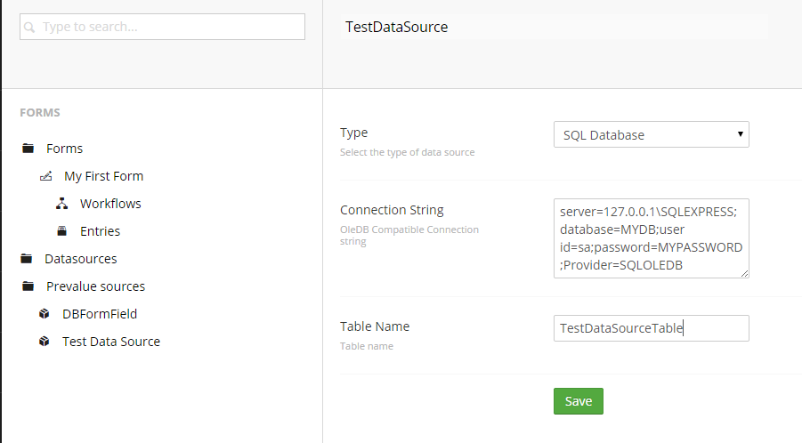
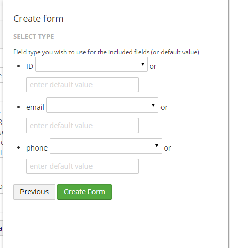

#Creating forms based on datasources
It's possible to automatically create forms based on a data source (like a SQL database table or Umbraco Document Type) that will also post and store the record data to that source. All that's needed is to create a Datasource in the forms section and by clicking a button a form will be auto-generated hooking up to the specified source.

Before starting this process you should create your custom SQL table or Umbraco Document Type as the fields are validated on creation of the datasource and the form. 

##Setting up a datasource
Datasources are managed in the datasource part of the Umbraco Forms section

##Tree
###Create a new datasource. 
Right click the data sources tree and select create, provide a name for the new datasource and select the Type.

Now the edit data source page should load, where you'll have to select a type, overview of the different default types can be found below.

###Select type
In the example we're using a SQL Database. 

###Specify type specific settings

Depending on the chosen type you'll have to supply additional settings. For a SQL Database this is the connection string and your table name (be sure to have already created this as Umbraco checks on Save).. 

Example format: `server=127.0.0.1\SQLEXPRESS;database=MYDB;user id=sa;password=MYPASSWORD;Provider=SQLOLEDB`

##Save datasource

Once the settings are supplied save the datasource by hitting the save button in the toolbar, the settings will be validated.

##Save

###Creating form based on datasource
If the settings are valid you should be able to create a new form based on the datasource (by hitting the new *Create form* button found next to the *Save* button when viewing the datasource)

##Creating a Form Using a Datasource

###Select fields to include

First you'll get an overview of the available fields on the datasource, here you'll be able to chose which ones to include on the form and select which fields type to use for each of the fields. 

Then click the *Create form* button. 

You may need to now refresh the nodes under the Forms node in the tree. Note the warning about having only limited editing possibilities when you load the form. 

##Overview of the default data source types

###Save as node

Saves record data as a umbraco document

###SQL database

Connects to any OLEDB supported Database Table and constructs a datasource from it

###Umbraco site

Connects to an umbraco website and uses a specific node and document type as storage

###Webservice

Sends records to any Webservice with WSDL support