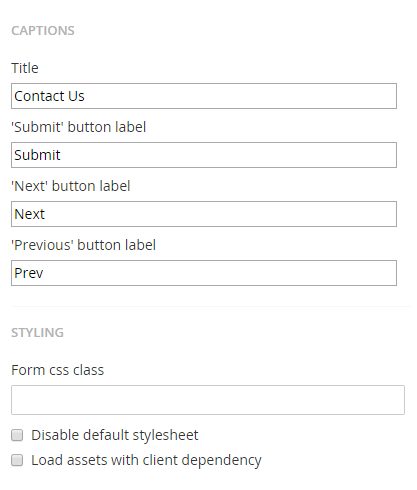

#Form settings
Besides the form design you can also setup some settings to customize how your form will behave.

##Validation
What should be displayed when a field is mandatory and a value isn't supplied or the value isn't valid.

###Mandatory error message
The error message that will be displayed for a field if a field is mandatory but a value isn't provided. This setting can be overwritten on a field level. {0} will be replaced with the field caption.

###Invalid error message
The error message that will be displayed for a field if a field isn't valid (a regular expression has been setup but the input doesn't match). This setting can be overwritten on a field level. {0} will be replaced with the field caption.

###Show validation summary
Enable this option if you wish to display a summary of all error messages on top of the form.

###Hide field validation labels
Enable this option if you wish the hide idividual field error messages from being displayed.

###Field indicators
Should mandatory fields or optional fields be marked with a certain indicator?

###Mark fields
You can choose to not mark any fields or only mark mandatory or optional fields.

###Indicator
The indicator that will be used, a typical indicator is just a *

##Styling

###Disable default stylesheet
More site design orientated (so probably for the developer) but enabling this option will prevent a default stylesheet being added to the pages where the form is placed.

##Submitting the form
What happens when the form has been submitted, there are 2 options that can be setup.

###Message on submit
Display some text (staying on the same page)
###Send to page
Selecting a page where the user will be redirected after submitting the form

###Manual Approval
The option to set a form to manual approval, by default a form record will be placed in the approved state after it has been submitted. If you wish to leave it in the submitted state and manually place it in the approves state then check this option (might be usefull if there are workflows that happen on approval).
