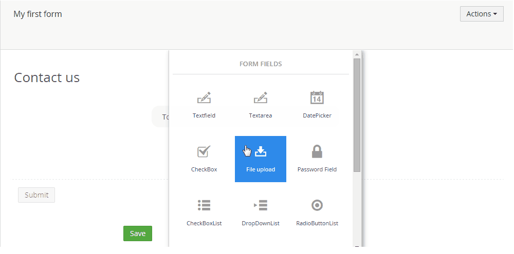

#Creating a form
This will show the basic steps of creating forms and adding them to your Umbraco site.
##Navigate to the Forms section
Managing forms happens in the Forms section of the Umbraco backoffice so first navigate to this section by selecting it (you'll need to have Forms installed and have access to this section in order to see it).

##Click the forms tree
Next similar to most create actions in the Umbraco backoffice you'll have to click the forms tree/folder and that will show you the create option

##Select if you want to start from scratch
You should see the following dialog

Where you'll have the option to start from a template (the template will already have some fields defined so you don't start from a completely empty form).

##Design the form

The next screen you should see after selecting the empty or form template is the form designer

There is already a page, a fieldset and a container available. The rest of the form has to be added using the UI(unless you started from a template then you already get some fields).

###Setting the form name
First we'll need to provide a name for our new form, you can do that in the top input.

###Setting the page caption

The page title can be placed in edit mode by simply clicking it.

###Adding fields

To add a new field hit the add field button (+)

That should display the following dialog

Where you'll need to choose which type of field or layout element you wish to add. The available fieldtypes are

- Checkbox
- Checkboxlist
- Datepicker
- Dropdownlist
- File upload
- Hidden field
- Password field
- Radiobuttonlist
- Recaptcha
- Text
- Textarea
- Textfield

And the layout elements are

- Page
- Row
- Column

Once the type has been selected a new field should have been added to your form.

Now you can set the field caption and additional help text

It's also possible to provide additional settings, like making a field mandatory, validation options (these will be dependant on the chosen fieldtype, to show the extra settings hit the additional settings link.

You can then repeat this step untill you end up with the form you desire.

##Saving the form
Once you are satisfied with the form you can save the design by hitting the save button in the toolbar

##Adding the form to the Umbraco site

###Select page

Navigate to the content section and select the content page where you want to insert the form (this page should have an RTE field)

###Add Form macro

Hit the add macro button in the toolbar

Select the insert form from Umbraco Forms macro

Select the form you want to insert and hit select

The form should be inserted now and all that's needed to put it on your site is a save and publish of the content page!

