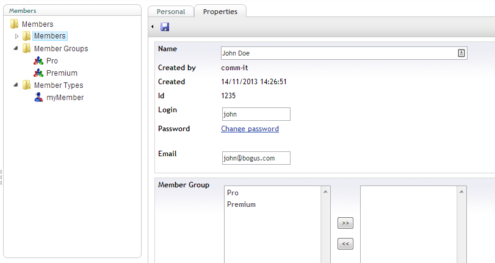

#Members
Members are the users who need to get access to your public website.  Not to be confused with users, who have access to the backoffice the website.

## Using members
*This section explains how to create members for all Umbraco versions pre v7*. 
### First create a member type.
Go to the member section.  Then click right on "member types and choose create new.
It is possible to create multiple member types if you need more advanced membership scenarios.  Remember you can't change the membertype of a member.

Do your back office users a favor if you have a lot of properties. Create one (or more) tab(s) where you put in your properties.  

The screenshot shows a new membertype called "myMember" with 2 extra properties: First name & last name.  You can give permissions to the member to update properties or to show properties on the profile.

### create a member group
Each member can be a member of 0 or more groups.  Create one or more groups.

### create a member
Each time a member is created, the membertype will asked.
Remember you can not change the membertype after creating the member.

After a member is created you can add or remove a member from the groups by selecting the group and clicking the appropriate buttons:

#Technical
As a developer you are able to leverage your website easily when you build on the members section of Umbraco.  

Although the member section is by default in the Umbraco backoffice.  You will have some work to implement it on the front end of your website. 

The members come from a custom Asp.net membership provider.  While the member groups are coming from a custom Roles.  Both are defined in the web.config.

You can find out more about the [membership API](../../../Reference/Management/Members/index.md) methods in the reference section of the documentation.

There are new Membership API's coming in Umbraco v6.2.