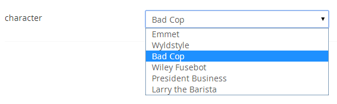

# Dropdown List, Publishing Keys

`Returns: Int`

Displays a list of preset values. The value saved is the prevalue id.

## Settings

### Prevalues
You can add, edit & delete the data prevalues rendered within the dropdown list.

## Data Type Definition Example

## Content Example 

## MVC View Example to output selected value

### Typed:

    @if (Model.Content.HasValue("character"))
    {        
        var preValue = Umbraco.GetPreValueAsString(Model.Content.GetPropertyValue<int>("character"));
        
@preValue

    }

### Dynamic:     
                         
    @if (CurrentPage.HasValue("character"))
    {
        var preValue = Umbraco.GetPreValueAsString(CurrentPage.character);
        
@preValue
        
    }    

## MVC View Example list all nodes which have a certain item selected in the dropdown list

### Typed:

    @{
        var valueToMatch = 31;
        //Get the first node inside the root
        var firstTypedContentAtRoot = Umbraco.TypedContentAtRoot().FirstOrDefault();
        if (firstTypedContentAtRoot != null)
        {
            var articles = firstTypedContentAtRoot.Children.Where(x => x.HasValue("character") && x.GetPropertyValue<int>("character") == valueToMatch);
            if (articles.Any())
            {
                
Pages with @valueToMatch selected:

                <ul>
                    @foreach (var page in articles)
                    {
                        <li><a href="@page.Url"> @page.Name</a></li>
                    }
                </ul>
            }
        }
    }

### Dynamic:                             

    @{
		var valueToMatch = 31;
        //Get the first node inside the root
        var firstContentAtRoot = Umbraco.ContentAtRoot().FirstOrDefault();
        if (firstContentAtRoot != null)
        {
            var articles = firstContentAtRoot.Children.Where("character == @0", valueToMatch);
            if (articles.Any())
            {
                
Pages with @valueToMatch selected:

                <ul>
                    @foreach (var page in articles)
                    {
                        <li><a href="@page.Url"> @page.Name</a></li>
                    }                      
                </ul>
            }
        }
    }

