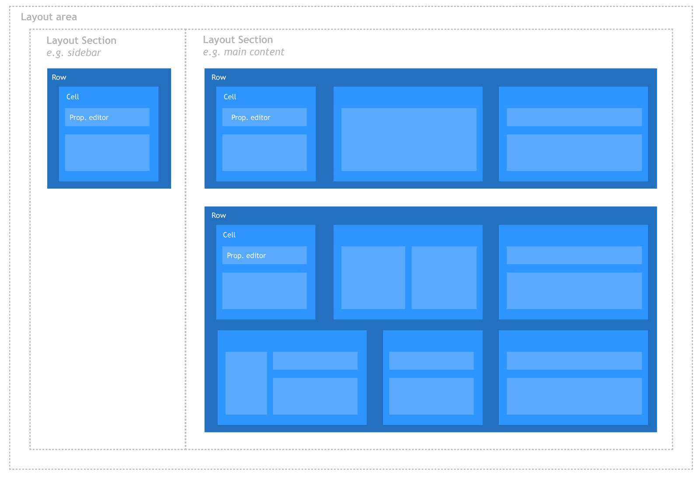
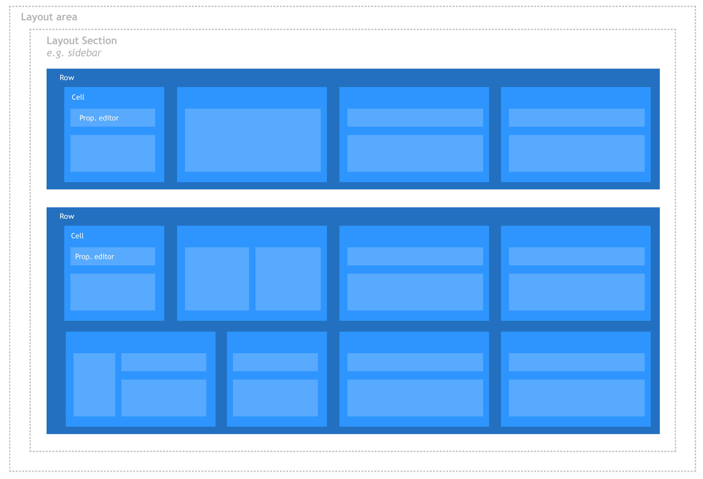
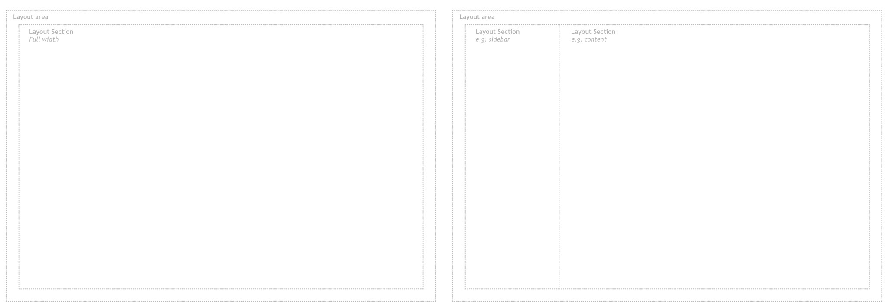

#Grid Layout

`Returns: JSON`

Gives editors a grid layout editor which allows them to insert different types of content in a predefined layout

##What are grid layouts?
To understand how the grid layout editor works, we must first understand the structure of the grid layouts.

Grid layouts consists of two main areas that need to be configured, *grid layout area* and *grid rows*.

####Grid Layout 
The *layout area* is where the overall page layout is defined. 
*Layout areas* are divided in to *layout sections* e.g. a sidebar section and content section. The size of the *layout sections* is defined in columns. For a full-width content area use max number of columns (12 for Bootstrap 3). Each *layout section* contains one or more *rows*.

####Grid Rows
Grid *rows* is where the actual content goes. Each row is divided into *cells* that contain the property editors. The size of the cells is defined in columns. Unlike the *layouts sections* it is possible to add more *cells* than the max number of columns - they will stack as they should in a grid system.

##Configuring the Grid Layout data type
A grid layout contains multiple configuration options to allow developers to tailor the grid to a very specific site design.
The configuration can be divided into 4 overall parts:

###Layouts
A layout is the general grid "container", it contains one or more sections which content editors can use to insert pre-configured **rows**. There are 2 main usage scenarios of layouts:

1. a single column layout which to the content editor will act like a full page canvas to insert elements on
2. a multiple column layout with a main content body, and one or more sidebar columns to insert lists or other sidebar widgets on.

You can however configure as many layouts and layout sections as you wish, each section in the layout must be given a width in columns, so editors gets an accurate preview of their layout.

It is possible to setup configurable attributes(class, rel, href) and inline styling on sections.

###Row configurations
A row in the grid editor contains one or more cells, which divide the row into areas where editors can enter content. So a row is merely a container of areas to insert content into. When you add a new row, you are asked to give it a name, then define cells inside the row by clicking the "+" icon. Each cell has a default width set to 4, but by clicking the inserted cell you can control its width.

It is possible to setup configurable attributes(class, rel, href) and inline styling on rows.

You add as many cells as you like. If they overflow the total width of the row, they will simply be arranged after each other horizontally as you'd expect in a grid system.

Each cell can by default contain any type of editor such as simple textstring editors, imagespicker, embedded media or umbraco macros. To override this behavior, uncheck the **allow all editors** option and you can specify which editors will be available for the row. 

###Settings and styling
A grid layout can also expose custom settings - such as data-attributes or styling options - on each cell or row. This allows editors to use a friendly UI to add configuration values to grid elements. When custom settings and styles are applied, they will by default be included in the grid html as either html attributes or inline styles.

These settings and styles must be configured by developers when setting up the grid layout data type.

###Configuring a custom setting or style
To add a setting, click the edit settings link. This will expand a dialog showing you the raw configuration data. This data is in the JSON format and will only save if its valid JSON.

The settings data could look like this, with an object for each setting:

    [
      {
        "label": "Class",
        "description": "Set a css class",
        "key": "class",
        "view": "textstring",
        "modifier": "col-sm-{0}",
        "applyTo": "row|cell"
      }
    ]

The different values are:

- **label** : Field name displayed in the content editor UI
- **description** : Descriptive text displayed in the content editor UI to guide the user
- **key** : The key the entered setting value will be stored under.
- **view** : The editor used to enter a setting value with.
- **prevalues** is for views that need predefined values, e.g. the radiobuttonlist view.
- **modifier (optional)** : A string formater to modify the output of the editor to prepend or append extra values.
- **applyTo (optional)** : States whether the setting can be used on a cell or a row. If either not present or empty, the setting will be shown both on Rows and Cells.

**Label** and **description** are straight-forward. **key** defines the alias the configuration is stored under and by default the alias of the attribute will also be the attribute on the rendered html element. In the example above any value entered in this settings editor will be rendered in the grid html as:

    

By changing the key of the setting you can modify the `
` element's attributes like `class`, `title`, `id` or custom `data-*` attributes.

**view** the view defines the editor used to enter a value. By default Umbraco comes with a collection of prevalue editors:

- textstring
- textarea
- radiobuttonlist
- mediapicker
- imagepicker
- boolean
- treepicker
- treesource
- number
- multivalues

Alternatively you can also pass in a path to a custom view like "/app_plugins/grid/editors/view.html"

**prevalues** is for views that need predefined values, e.g. the radiobuttonlist view. Prevalues are defined as strings in an array:
    
    "prevalues":[
        "value_1",
        "value_2",
        "value_3"
    ]

and will translate in to three different options where each string will become a radiobutton. The String represents the value of the option.

**modifier** is a basic way to prepend, append or wrap the value from the editor in a simple string. This is especially useful when working with custom styles which often requires additional values to function. For instance if you want to set a background image you can get an image path from the image picker view. But in order for it to work with css it has to be wrapped in `url()`. In that case you set the **modifier** to `url('{0}')` which means that `{0}` is replaced with the editor value.

###Sample settings
There are many ways to combine these, here are some samples:

**Set a background image style**

    {
        "label": "Background image",
        "description": "Choose an image",
        "key": "background-image",
        "view": "imagepicker",
        "modifier": "url('{0}')"
    }

**Set a title setting**

    {
        "label": "Title",
        "description": "Set a title on this element",
        "key": "title",
        "view": "textstring"
    }

**add a data-custom setting**

    {
        "label": "Custom data",
        "description": "Set a title on this element",
        "key": "data-custom",
        "view": "radiobuttonlist",
        "prevalues": [
            "value_1",
            "value_2",
            "value_3"
        ]
    }

###Full-width settings and styles
It is possible to use settings and styles to add full-width background-images, background-colors and so forth. Just make sure the sorrounding *section* is full-width(12 columns by default) and the *rows* inside it will automatically become full-width.

#Render grid in template
To display the grid on a site use:

    @CurrentPage.GetGridHtml("propertyAlias")

This will by default use the view `/views/partials/grid/bootstrap3.cshtml` you can also use the built-in bootstrap2.cshtml view by overloading the method: 

    @CurrentPage.GetGridHtml("propertyAlias", "bootstrap2")

or point it a custom view, which by default looks in `/views/partials/grid/` - or provide the method with a full path 

    @CurrentPage.GetGridHtml("propertyAlias", "mycustomview")
    @CurrentPage.GetGridHtml("propertyAlias", "/views/mycustomfile.cshtml")

###Grid Editors
A grid editor is the component responsible for getting data into the grid - that could be a simple text field or a media picker. They're built in the same way as a property editor thus consists of 3 parts:

- .html view file
- .js controller
- .cshtml serverside renderer

The view is what the editor sees, the controller handles how it acts and the cshtml determines how the entered data is rendered in the template.

####Grid editor configuration
All editors are specified in `config/grid.editors.config.js` file which uses the json format. Foreach editor you have an object like so: 

    {
        "name": "Rich text editor",
        "alias": "rte",
        "view": "rte",
        "icon": "icon-article"
    }

The values are:

- **name**: The name of the editor
- **alias**: Unique alias of the editor
- **icon**: Icon shown to the editor, uses same icon classes as the rest of 
- **view** the view defines the editor used to enter a value. By default Umbraco will look in `umbraco/views/propertyeditors/grid/editors` for a html view to use - but you can pass in your own path

The built-in views you can use are: 

- textstring
- rte
- embed
- macro
- media
- rte

#####Sample textstring config
In most cases you will either use the textstring view, or built your own from scratch.

    {
        "name": "Headline",
        "alias": "headline",
        "view": "textstring",
        "icon": "icon-coin",
        "config": {
            "style": "font-size: 36px; line-height: 45px; font-weight: bold",
            "markup": "<h1>#value#</h1>"
        }
    }

In this sample, the `config.style` value is applied to the editor so users can see an accurate preview in the backoffice, and `config.markup` is the string rendered on the server side.

####Build your own editor
Create a file in `/app_plugins/yourpackage/editor.html` and add the following to the editor.html file: 

    <textarea
        rows="1" ng-model="control.value" ng-style="control.config"></textarea>

Save the file and add an editor to the `grid.editors.config.js` file:

    {
        "name": "Code",
        "alias": "code",
        "view": "/app_plugins/yourpackage/editor.html",
        "icon": "icon-code",
        "config": {
            "color": "red",
            "text-align": "right"
        }
    }

Add a new file: `/app_plugins/yourpackage/editor.cshtml` - this file will handle rendering the entered data  - this path is done by convention so: 

- view: 'editor' => `views/partials/grid/editors/editor.cshtml`
- view: '/app_plugins/path.html' => `/app_plugins/path.cshtml`

If you wish to use something entirely different you can give the editor a seperate `render` value which follow the same conventions
    
    {
        "name": "Code",
        "alias": "code",
        "view": "/app_plugins/yourpackage/editor.html",
        "render": "/app_plugins/yourpackage/custom-render.cshtml"
    }

#####Grid editor controller
If you are building something just slightly more complex then a text area, you will need to add a controller to the grid editor view. So first add a ng-controller attribute to the grid editor html - this works just like building a property editor: 

    

        <textarea>...</textarea>
    

To wire up a controller to this view, create the file `/app_plugins/yourpackage/editor.controller.js` and add a standard angular controller declaration: 

    angular.module("umbraco").controller("my.custom.grideditorcontroller", function($scope){
        $scope.control.value = "my new value";
    });

Finally, we need to tell umbraco load this javascript controller when the umbraco application boots, this is also just like building a property editor, so create a `package.manifest` file in the `/yourpackage` folder, and configure it to load your controller file. 

    {
        javascript:[
            "/app_plugins/yourpackage/editor.controller.js"
        ]
    }

So to summarize, to create a custom grid editor from scratch, you will need to: 

- Create a grid editor view `.html` file
- Create a grid render `.cshtml` file
- Create a grid editor controller `.js` file
- Create a `package.manifest` file to make umbraco load needed files
- Register the editor in the `/config/grid.editors.js` file

This process tries to be as close to building property editors as currently possible.

####Rendering grid editor content 
Next add this c# to the .cshtml file: 

    @inherits Umbraco.Web.Mvc.UmbracoViewPage<dynamic>
    <pre>@Model</pre>

When rendering the .cshtml file will receive a dynamic model with the raw data of the editor:

    {
      "value": "What ever value entered into the textarea",
      "editor": {
        "name": "Code",
        "alias": "code",
        "view": "/app_plugins/yourpackage/editor.html",
        "icon": "icon-code",
        "config": {
          "color": "red",
          "text-align": "right"
        }
      }
    }

So you can now use these value to build your razor output like so:

    
@Model.value

