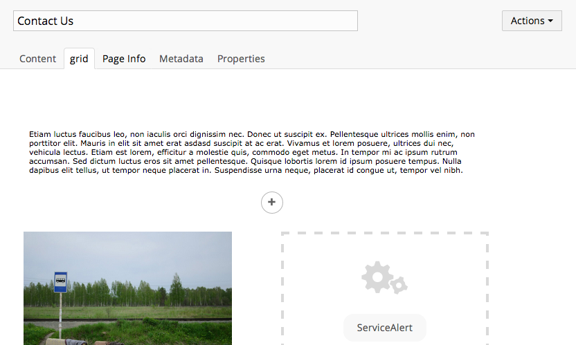
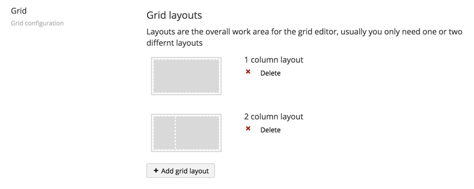
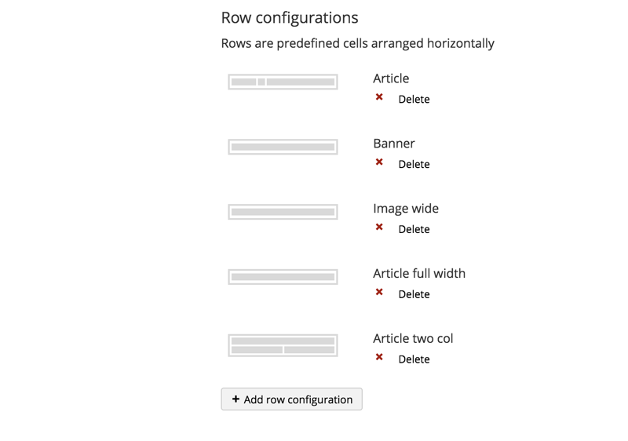
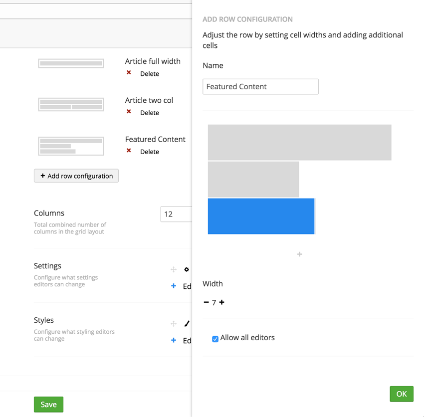

#Grid Layout

`Returns: JSON`

Gives editors a grid layout editor which allows them to insert different types of content in a predefined layout

##What are grid layouts?
To understand how the grid layout editor works, we must first understand the structure of the grid.

The Grid consists of to main areas that need to be configured, *grid layouts* and *grid rows*.

###Grid Layout
The *layout area* is where overall page layout is defined. 
*Layout areas* are divided in to *layout sections* e.g. a sidebar section and content section	. The size of the *layout sections* is defined in columns. For a full-width content area use max number of columns (12 for Bootstrap 3). Each *layout section* contains one or more *rows* 

###Grid Rows
Grid *rows* is where the actual content goes. Each row is divided into *cells* that contain the property editors. The size of the cells is defined in columns. Unlike the *layouts sections* you can add more *cells* than the max number of columns - they will stack as they should in a grid system. The rows can be configured with inline styling and CSS classes to allow specifically tailored content.

##Settings
A grid layout contains multiple configuration options to allow developers to tailor the grid to a very specific site design.
The configuration can be divided into 4 overall parts:

###Layouts
A layout is the general grid "container", it contains one or more columns which content editors can use to insert pre-configured **rows**. There are 2 main usage scenarios of layouts:

1. a single column layout which to the content editor will act like a full page canvas to insert elements on
2. a multiple column layout with a main content body, and one or more sidebar columns to insert lists or other sidebar widgets on.

{{ image of the 2 layout scenarios}}

You can however configure as many layouts and layout columns as you wish, each column in the layout must be given a width in columns, so editors gets an accurate preview of their layout.

###Row configurations
A row in the grid editor contains one or more cells, which devide the row into areas where editors can enter content. So a row is merely a container of areas to insert content into. When you add a new row, you asked to give it a name, and can then define cells inside the row, by clicking the "+" icon, each cell has a default width set to 4, but by clicking the inserted cell, you can control its width.

You add as many cells as you like, if they overflow the total width of the row, they will simply arrange themselves after eachother horizontally-

Each cell can by default contain any type of content, the can be simple text-strings, images, embedded media or umbraco macros, you can however enable specific types of content, to do this, uncheck the **allow all editors** option, to select specific editors.

###Settings and styling
A grid layout can also expose custom settings styling options on each cell or row. This allows editors to use a friendly UI to add configuration values to grid elements. When custom settings and styles are applied, they will by default be included in the grid html as either inline styles or html attributes.

These settings and styles must be configured by developers setting up the grid.

###Configuring a custom setting or style
To add a setting, click the edit settings link. This will expand a dilog showing you the raw configuration data, this data is in the JSON format and will only save if its valid JSON.

The settings data could look like this, with an object for each setting:

    [
      {
        "label": "Class",
        "description": "Set a css class",
        "key": "class",
        "view": "textstring",
        "modifier": "col-sm-{0}"
      }
    ]

The different values are:

- **label** : Simpel field name displayed in the content editor UI
- **description** : Descriptive text displayed in the content editor UI to guide the user
- **key** : The key the entered setting value will be stored under.
- **view** : The editor used to enter a setting value with
- **modifier** : A string formater to modify the output of the editor to append extra values.

**Label** and **description** are straight-forward. **key** defines the alias the configuration is stored under, and by default the alias of the attribute the value is rendered as, so in the above example, any value entered in this class editor will be rendered in the grid html as:

    

So, by changing the key of the setting, you can modify the `
` element's attributes like `class`, `title`, `id` or custom `data-*` attributes.

**view** the view defines the editor used to enter a value. By default, Umbraco comes with a collection of prevalue editors, the build-in ones are:

- textstring
- textarea
- mediapicker
- imagepicker
- boolean
- treepicker
- treesource
- number
- multivalues

Alternatively you can also pass in a path to a custom view like "/app_plugins/packages/view.html"

**modifier** is a basic way to prepend, append or wrap the value from the editor in a simple string. This is especially useful when working with custom styles which often requires additional values to function. For instance if you want to set a background image, you can get an image path from the image picker view, but for it to work with css, it has to be wrapped in `url()` so in that case, you set the **modifier** to `url('{0}')` which means that `{0}` is replace by the editor value

###Sample settings
There are many ways to combine these, here are some samples:

**Set a background image style**

    {
        "label": "Background color",
        "description": "Choose an image",
        "key": "background-image",
        "view": "imagepicker",
        "modifier": "url('{0}')"
    }

**Set a title setting**

    {
        "label": "Title",
        "description": "Set a title on this element",
        "key": "title",
        "view": "textstring"
    }

**add a data-custom setting**

    {
        "label": "Custom data",
        "description": "Set a title on this element",
        "key": "title",
        "view": "textstring"
    }

###Grid Editors
A grid editor is the component responsible for getting data into the grid - that could be a simple text field or a media picker - its built the same way a property editor is, and therefore consists of 3 parts:

- .html view file
- .js controller
- .cshtml serverside renderer

So the view is what the editor sees, the controller handles how it acts, and the cshtml determins how the entered data renders.

WIP ....
