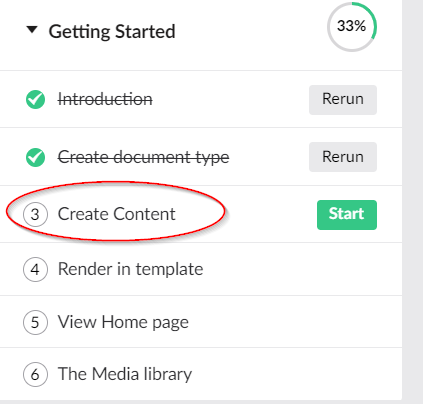
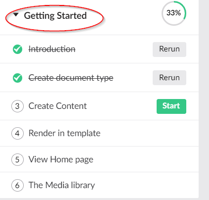
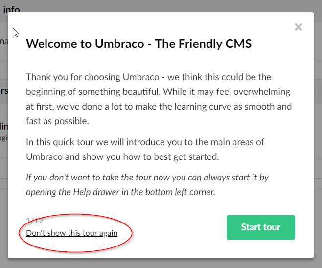
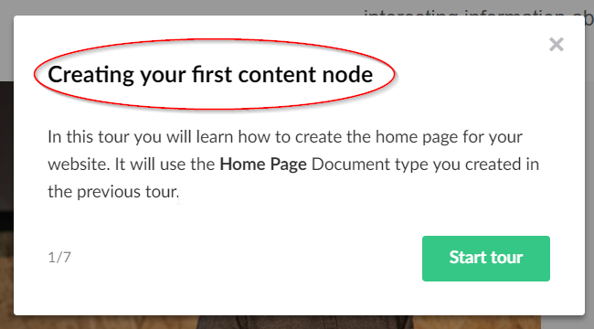
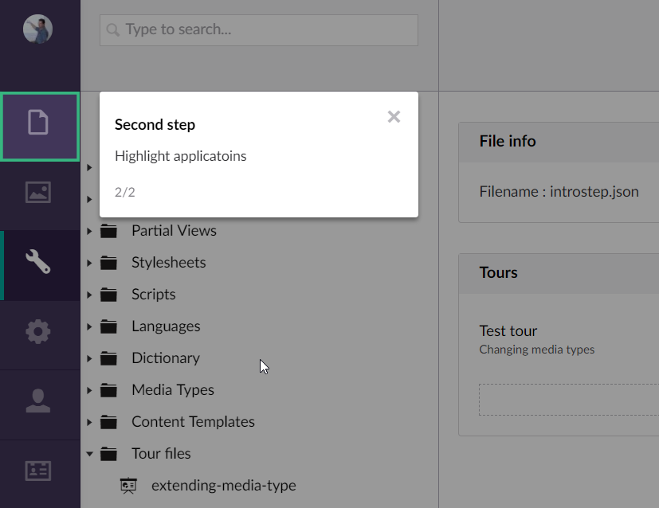
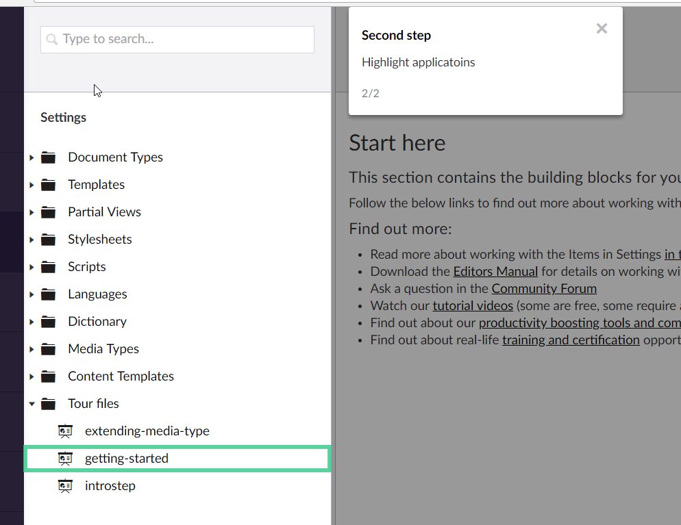

# Backoffice tours

:::note 
This feature has been introduced in Umbraco 7.8.0
:::

Backoffice tours are managed in a JSON format and stored in files on disk. The filenames should end with the `.json` extension.

## Tour file locations

The tour functionality will load information from multiple locations.

### Core tours and custom tours

The tour files that ship with Umbraco are stored in `/Config/BackofficeTours`. This is also the recommended location for storing your own tour files.

### Plugin tours

If you want to include a tour with your custom plugin you can store the tour file in `/App_Plugins/<YourPlugin>/backoffice/tours`. It is recommended that you place the tour files in this location when you are creating a plugin.

## The JSON format

A tour file contains an array of tour configuration JSON objects. So it's possible to have multiple, (un)related tours in one file.

```json
[
	{
		// tour configuration object
	},
	{
		// tour configuration object
	}
]
```

## The tour configuration object

A tour configuration JSON object contains all the data related to a tour.

Example tour configuration object :

```json
{
	"name": "My Awesome tour",
	"alias": "myUniqueAlias",
	"group": "Get things done!!!",
	"groupOrder": 1,
	"allowDisable": true,
	"culture" : "en-US",
	"requiredSections": ["content","media"],
	"steps": []
}
```

Below is an explanation of each of the properties on the tour configuration object

### name 

This is the name that is displayed in the help drawer for the tour.



### alias 

The unique alias of your tour, this is used to track the progress a user has made while taking a tour. The progress information is stored in the TourData column of the UmbracoUsers table in the database.

### group 

The group property is used to group related tours in the help drawer under a common subject (e.g. Getting started). 



### groupOrder 

This is used to control the order of the groups in the help drawer. This must be an integer value.

### allowDisable 

A boolean value that indicates if the "Don't show this tour again" should be shown on the tour steps. If the user clicks this link the tour will no longer be shown in the help drawer.



### culture (introduced in v7.11)

You can set a culture (e.g. nl-NL) and this tour will only be shown to users that have set this culture in their profile. If omitted or left empty the tour will be shown to all users.

### sections

This is an array of section aliases that a user needs to be able to access. If the user does not have access to all the sections the tour will not be shown in the help drawer. e.g. if a tour requires content, media and settings and the logged in user only has access to content and media, the tour will not be shown for this user.

### steps

This is an array of tour step JSON objects that a user needs to take to complete the tour.

## The tour step object

A tour step JSON object contains all the data related to a tour step.

Example tour step object:

```json
{
	"title": "A meaningful title",
	"content": "<p>Some text explaining the step</p>",
	"type": null,
	"element": "#section-avatar",
	"elementPreventClick": false,
	"backdropOpacity": 0.6,
	"event": "click",
	"view": null,
	"eventElement": "#section-avatar .umb-avatar",
	"customProperties": null
},
```

Below is an explanation of each of the properties on the tour step object

### title

This the title shown on the tour step.




### content

This text will be shown on the tour step, it can contain HTML markup


### type

The type of step. Currently, only one type is supported : "intro". This will center the step and show a "Start tour" button

### element

A CSS selector for the element you wish to highlight. The tour step will position itself near the element.

A lot of elements in the Umbraco backoffice have a "data-element" attribute. It's recommended to use that, because "id" and "class" are subject to changes. e.g.

	[data-element='section-content']

TIP: Use the developer tools from your browser to find the id, class and data-attribute.



### elementPreventClick

Setting this to true will prevent JavaScript events from being bound to the highlighted element. A "Next" button will be added to the tour step.

As an example, it is very useful when you would like to highlight a button, but would like to prevent the user clicking it.

### event

The JavaScript event that is bound to the highlighted element that should trigger the next tour step e.g. click, hover,...

If not set or omitted a "Next" button will be added to the tour.

###  eventElement
A CSS selector for the element you wish to attach the JavaScript event. This is useful for when you want to highlight a bigger portion of the backoffice but want to user to click on something inside the highlighted element. If not set, the selector in the element property will be used.

The image below shows the entire tree highlighted, but requires the user to click on a specific tree element.



### backdropOpacity

A decimal value between 0 and 1 to indicate the transparency of the background overlay. 

### view

Here you can enter a path to your own custom angular view that will be used to display the tour step

This is useful if you would like to validate input from the user during the tour step.

### customProperties

A JSON object that is passed to the scope of a custom step view, so you can use this data in your view with $scope.model.currentStep.customProperties
