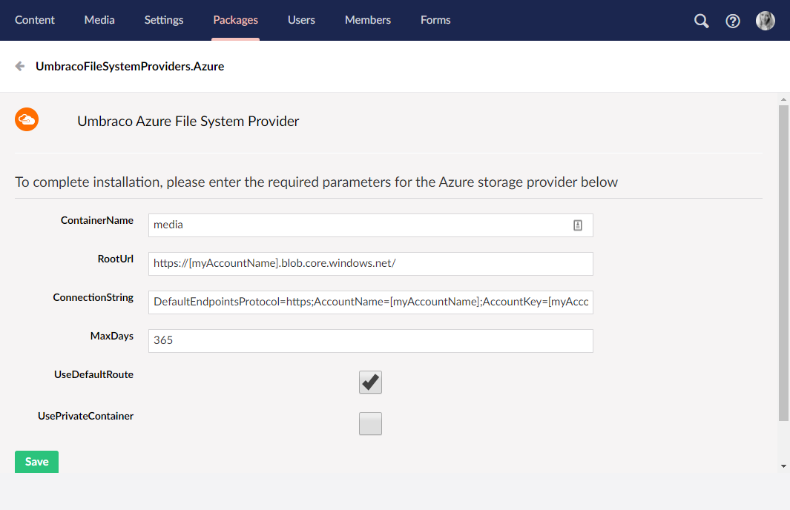

# Setup Your Site to use Azure Blob Storage for Media and Image Processor Cache

For Umbraco sites there are some scenarios when you may want, or need, to consider using Azure Blob Storage for your media.  Particularly if your site contains large amounts of media.  Having your site's media in Azure Blob Storage can also help your deployments complete more quickly and has the potential to positively affect site performance as the Image Processor cache is moved to Azure Blob Storage.  It also allows you to serve your media from the Azure CDN.

Setup consists of adding several packages to your site and setting the correct configuration.  Before you begin you’ll need to create an Azure Storage Account and a container for your media and your ImageProcessor cache as well.  In this example we assume your media container is "media" and your cache is "cache".  You can, optionally, enable an Azure CDN for this storage container and use it in the cache.config below.

## Packages

These packages are only available via NuGet, so ideally you’ll have your site setup to use Visual Studio. You can copy/paste the `PM>` commands into the Package Manager Console. If you don't see the Package Manager Console window, you can open it from the menu View -> Other Windows -> Package Manager Console.

### Umbraco File System Provider

You'll need to install the `UmbracoFileSystemProviders.Azure.Media` provider.  We recommend doing this first and verifying it behaves as expected before proceeding with the ImageProcessor setup.

Find instructions on how to install the package on the projects GitHub page: [UmbracoFileSystemProviders.Azure](https://github.com/umbraco-community/UmbracoFileSystemProviders.Azure/tree/develop-umbraco-version-8). There are detailed instructions available on the project page, also summarized here.

The package is also available on [Our Umbraco](https://our.umbraco.com/projects/collaboration/umbracofilesystemprovidersazure/) - make sure you download the correct version for Umbraco 8, which is also specified on the page.

:::warning
You will currently **not** be able to install the UmbracoFileSystemProviders.Azure package directly from the backoffice of your Umbraco 8 installation.

You should either download the package from [Our](https://our.umbraco.com/projects/collaboration/umbracofilesystemprovidersazure/) and install the `.zip` file, or use NuGet.
:::

The following six keys will have been added to the `<appSettings>` in your `web.config` file.

```xml
<?xml version="1.0"?>
<appSettings>
  <add key="AzureBlobFileSystem.ContainerName:media" value="media" />
  <add key="AzureBlobFileSystem.RootUrl:media" value="https://[myAccountName].blob.core.windows.net/" />
  <add key="AzureBlobFileSystem.ConnectionString:media"
    value="DefaultEndpointsProtocol=https;AccountName=[myAccountName];AccountKey=[myAccountKey]" />
  <add key="AzureBlobFileSystem.MaxDays:media" value="365" />
  <add key="AzureBlobFileSystem.UseDefaultRoute:media" value="true" />
  <add key="AzureBlobFileSystem.UsePrivateContainer:media" value="false" />
</appSettings>
```

Make sure to update this configuration to match your own setup.

When you're installing the package from the **Package** section of the Umbraco Backoffice, you'll be able to fill in the configuration directly from the backoffice:



If you are using IISExpress (as with Visual Studio) you’ll need to add a static file handler mapping to `~web.config` - this should be added automatically, but you should check that it's there!

```xml
<?xml version="1.0"?>
<configuration>
  <location path="Media">
    <system.webServer>
    <handlers>
        <remove name="StaticFileHandler" />
        <add name="StaticFileHandler" path="*" verb="*"
            preCondition="integratedMode" type="System.Web.StaticFileHandler" />
    </handlers>
    </system.webServer>
  </location>
</configuration>
```

### Configuration

Once the packages have been installed you need to set your configuration as below. Some of these may have been set when you installed the ImageProcessor packages.

**Update `~web.config`**

```xml
<configuration>
  <configSections>
    <sectionGroup name="imageProcessor">
    <section name="security" requirePermission="false" type="ImageProcessor.Web.Configuration.ImageSecuritySection, ImageProcessor.Web" />
    <section name="processing" requirePermission="false" type="ImageProcessor.Web.Configuration.ImageProcessingSection, ImageProcessor.Web" />
    <section name="caching" requirePermission="false" type="ImageProcessor.Web.Configuration.ImageCacheSection, ImageProcessor.Web" />
    </sectionGroup>
  </configSections>
  <imageProcessor>
    <security configSource="config\imageprocessor\security.config" />
    <caching configSource="config\imageprocessor\cache.config" />
    <processing configSource="config\imageprocessor\processing.config" />
    </imageProcessor>
</configuration>
```

**Update `~/config/imageprocessor/security.config`**

You have to manually add `prefix="media/"` to the service element, otherwise ImageProcessor will not run and the original image will be served.

```xml
<?xml version="1.0" encoding="utf-8"?>
<security>
  <services>
    <!--<service name="LocalFileImageService" type="ImageProcessor.Web.Services.LocalFileImageService, ImageProcessor.Web" />-->
    <service prefix="media/" name="CloudImageService" type="ImageProcessor.Web.Services.CloudImageService, ImageProcessor.Web">
    <settings>
        <setting key="Container" value="[container name]"/>
        <setting key="MaxBytes" value="8194304"/>
        <setting key="Timeout" value="30000"/>
        <setting key="Host" value="https://[your blob account].blob.core.windows.net/"/>
    </settings>
    </service>
    <service prefix="remote.axd" name="RemoteImageService" type="ImageProcessor.Web.Services.RemoteImageService, ImageProcessor.Web">
    <settings>
        <setting key="MaxBytes" value="4194304" />
        <setting key="Timeout" value="3000" />
        <setting key="Protocol" value="http" />
    </settings>
    <whitelist>
        <add url="https://[your Azure CDN].vo.msecnd.net/" />
        <add url="https://[your blob account].blob.core.windows.net/" />
        <add url="https://[your Umbraco site]" />
        <add url="http://localhost" />
        <add url="http://127.0.0.1" />
    </whitelist>
    </service>
  </services>
</security>
```

You have now successfully setup Azure Blob Storage with your Umbraco site.

## Existing Media files

Any media files you already have on your site will not automatically be added to the Blob Storage. You will need to copy the contents on the `/Media` folder and upload it to the `media` folder on your Blob account. Once you've done that you can safely delete the `/Media` folder locally, as it is no longer needed.

Any new media files you upload to the site, will automatically be added to the Blob Storage.

## Using Azure Blob Cache

In some cases, you might also want to use the Azure Blob Cache to cache your media files. One scenario for this could be a load balancing setup where you have a lot of media files. Using the Azure Blob Cache will make sure that your media files are still cached and can be used effectively as the generated images are stored to blobs and served via a CDN instead of local disk.

More information on can be found on the ImageProcessor website: [Azure Blob Cache](https://imageprocessor.org/imageprocessor-web/plugins/azure-blob-cache/).
