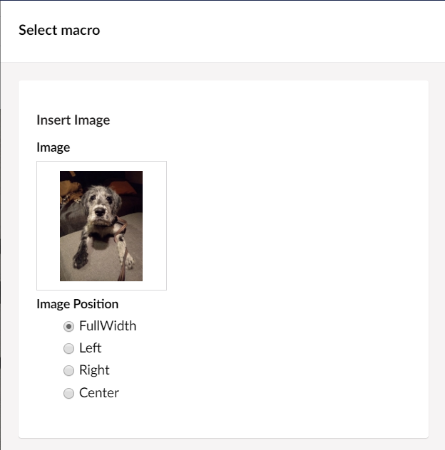

# Macro Parameter Editors

Every macro can contain parameters. Options for the Editor to set when they insert the Macro to customise the output. There are some useful default types.  For example:

* True/False
* TextBox
* TextArea
* Numeric
* Single/Multiple Media Picker
* Single/Multiple Content Picker
* ... and some 'others'

Consult the [Backoffice documentation](../../Getting-Started/Backoffice/index.md) for general information on Macros.

It is possible to create custom macro parameter types.

## Creating a custom Macro Parameter Type

### isParameterEditor

To create a custom Macro Parameter Type, first create a custom 'Property Editor' (or copy one from the core). See [Property Editors documentation](../../Extending/Property-Editors/index.md) and in the corresponding [Package Manifest file](../../Extending/Property-Editors/package-manifest.md) for the editor, set the `isParameterEditor` property to be true.

```json
{
  "propertyEditors": [
      {
          "alias": "My.ParameterEditorAlias",
          "name": "Parameter Editor Name",
          "isParameterEditor": true,
          "editor": {
              "view": "/App_Plugins/My.ParameterEditor/ParameterEditorView.html"
          }
      }
  ]
}
```

### PreValues/Configuration/DefaultValues

However 'Parameter Editors' unlike 'Property Editors' cannot contain 'prevalues', since there is no UI to present configuration options in the Macro Parameter tab when a particular type is chosen. However using the `defaultConfig` option enables the passing of 'one off' default set of configuration for the parameter editor to use:

```json
{
  "propertyEditors": [
    {
      "alias": "My.ParameterEditorAlias",
      ...
      "defaultConfig": {
        "startNode": "1234",
        "minItems": 0,
        "maxItems": 6
      }
    }
  ]
}

```

This is only a problem if you have a macro parameter type, that needs to be used on lots of different macros, but with slightly different configurations in each instance.

### Example

We'll create an 'Image Position' Macro Parameter type providing a Radio Button list of options for positioning an image that has been inserted via an 'Insert Image' Macro into a Rich Text Editor.

#### Package Manifest

```json
{
    "propertyEditors": [
      {
        "alias": "Our.Umbraco.ImagePosition",
        "name": "Image Position",
        "isParameterEditor": true,
        "editor": {
            "view": "/App_Plugins/Our.Umbraco.ImagePosition/ImagePosition.html",
            "valueType": "STRING"
        }
      }
    ],
    "javascript": [
        "/App_Plugins/Our.Umbraco.ImagePosition/ImagePosition.controller.js"
    ]
}
```

#### View

```html
<div ng-controller="Our.Umbraco.ImagePositionController">
    <div class="radio" ng-repeat="position in positions" id="selectstatus-{{position.Name}}">
        <label>
            <input type="radio" name="position" ng-model="model.value" value="{{position.Name}}">{{position.Name}}
        </label>
    </div>
</div>
```

#### Controller

```javascript
angular.module("umbraco").controller("Our.Umbraco.ImagePositionController", function ($scope) {

    if ($scope.model.value == null) {
        $scope.model.value = 'FullWidth';
    }

    // could read positions from defaultConfig
    $scope.positions = [
        {
            Name: 'FullWidth'
        },
        {
            Name: 'Left'
        },
        {
            Name: 'Right'
        },
        {
            Name: 'Center'
        }
    ];
});
```

#### Display

The final custom parameter should look like this:



#### Using defaultConfig

In this example it doesn't really add anything to move the radio button options into configuration, however to illustrate the concept of providing defaultConfig, let's do that:

The package manifest becomes:

```json
{
  "propertyEditors": [
    {
      "alias": "Our.Umbraco.ImagePosition",
      "name": "Image Position",
      "isParameterEditor": true,
      "editor": {
        "view": "/App_Plugins/Our.Umbraco.ImagePosition/ImagePosition.html",
        "valueType": "STRING"
      },
      "prevalues": {
        "fields": [
          {
            "label": "Options",
            "description": "Radio Button Options",
            "key": "options",
            "view": "textarea"
          }
        ]
      },
      "defaultConfig": {
        "options": [
          {
            "Name": "FullWidth"
          },
          {
            "Name": "Lefty"
          },
          {
            "Name": "Righty"
          },
          {
            "Name": "Centerish"
          }
        ]
      }
    }
  ],
  "javascript": [
    "/App_Plugins/Our.Umbraco.ImagePosition/ImagePosition.controller.js"
  ]
}
```

In the `ImagePosition.controller.js` we can now read the 'options' values from the `defaultConfig` in the package.manifest configuration:

```javascript
 $scope.positions = $scope.model.config.options;
```

### Reading the parameter value in the Macro Partial View

```csharp
@using Umbraco.Extensions
@inherits Umbraco.Cms.Web.Common.Macros.PartialViewMacroPage
@{
var imagePosition = Model.MacroParameters["imagePosition"];
//or if for convenience if you are using Umbraco.Extensions namespace there is a GetParameterValue extension method, which allows a default value to be specified if the parameter is not provided:
imagePosition = Model.GetParameterValue<string>("imagePosition","full-width");
}
```
