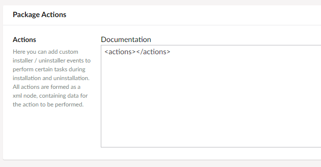

# What are package actions?

Package actions are a way to perform common tasks while installing / uninstalling packages. 
Currently we have 2 actions available. If you need to perform more advanced installation routines, you will have to write your own package action using the `IPackageAction` interface, which will then automatically be picked up by Umbraco.

## Adding actions to a package

In the package section once you try to create a package there is a section at the bottom called `Package Actions`. It looks like this when not configured:



To add an action you need to add it between the `<actions>` elements. Could look like this:

```xml
<actions>
    <Action runat="install" alias="publishRootDocument" documentName="Home" />
</actions>
```

## Standard fields on all actions

- **Undo**, optional, is true by default.
- **Alias**, mandatory, The alias of the package action to be executed.
- **Runat**, mandatory, can either be install or uninstall.

## Standard elements on all actions

All actions are an `<Action>` node element (notice the uppercase A).

### Allow Document Type

Allows a Document Type to be created below another Document Type. Ex: Allow `TextPage` to be allowed under `HomePage`.

Alias: `allowDocumentType`

```xml
<Action 
runat="install"
alias="allowDocumentType"
documentTypeAlias="TextPage"
parentDocumentTypeAlias="HomePage"/>
```

### Publish root document

Publishes a document located in the root of the website. Ex: Your package contains a root node called `Home`, this will publish it.

Alias: `publishRootDocument`

```xml
<Action 
runat="install"
alias="publishRootDocument"
documentName="Home" />
```
