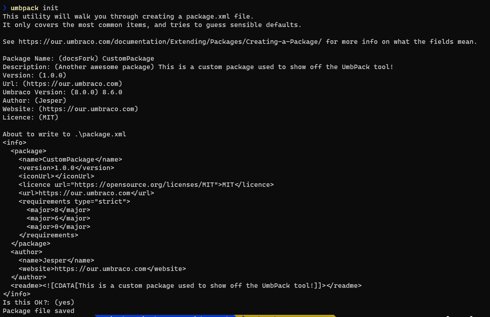

# UmbPack

UmbPack is an open source NuGet tool that can deploy packages to Our, and also help you pack your files into a package. 

## Creating an API key on Our.umbraco.com

Todo

## Installing UmbPack locally

Todo

## Installing UmbPack in CI/CD

Todo

## The Init command

The init command helps you create a package.xml file, which is the file in an Umbraco package that contains all the metadata for a package - things like author info, version compatibility, etc.
The init command can be used by typing:

```
umbpack init
```

It is usually used to scaffold a package.xml file that you can then use with the `pack` command to create an Umbraco package.

Here is an example of what it will look like in the commandline. It will also post back the package.xml for verification at the end:



## The Pack command

The pack command is used to create an Umbraco zip package from some specified files. It is similar to what would happen if you picked the files via the backoffice.

:::warn
The pack command has no way of handling package actions, Umbraco schema and content! If you need any of those you will have to still pick them from the backoffice.
:::

The pack command has a few options, the only mandatory one is to point it at either a package.xml file or a folder containing a package.xml file:

**Example of packing a folder**

```
umbpack pack C:\Umbraco\Customers\test\Test.Web\App_Plugins\CustomPackage
```

In this example I wanted to pack up the ~App_Plugins/CustomPackage folder inside the .Web project. Often that is where you will store package files, the tool will ensure it adds all files to the package.xml inside the folder so if you continue to develop and add things a new pack will update it.

**Example of packing based on a package.xml file**

```
umbpack pack C:\Umbraco\Customers\test\package.xml
```

In this example you can imagine I keep a package.xml file outside of the project folders, inside the `src` folder of a Visual Studio solution. The benefit here is that it would not actually be part of the website, but could still be source controlled. Additionally this is a better approach if you want your package to include files outside of a specific folder. For example if you want to include both:

```
~/App_Plugins/Custompackage
~/bin/CustomPackage.dll
``` 

The package.xml file at the root can be used for both of them by adding some extra xml that is outside of the regular schema but that the tool can handle.

TODO explain the file and folder schema

## The push command
