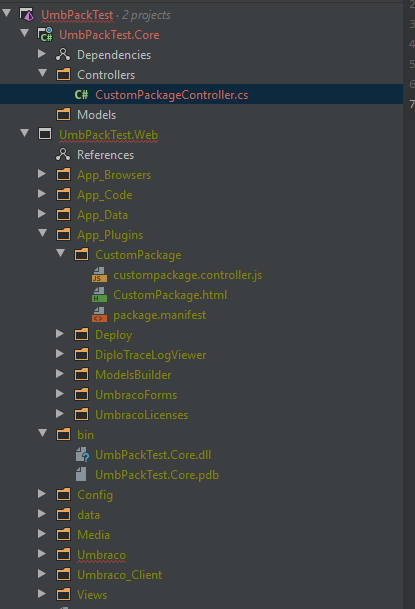
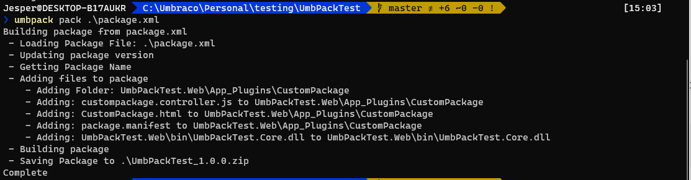

# UmbPack

UmbPack is an open source NuGet tool that can deploy packages to Our, and also help you pack your files into a package. 

## Creating an API key on Our.umbraco.com

Todo

## Installing UmbPack locally

Todo

## Installing UmbPack in CI/CD

Todo

## The Init command

The init command helps you create a package.xml file, which is the file in an Umbraco package that contains all the metadata for a package - things like author info, version compatibility, etc.
The init command can be used by typing:

```
umbpack init
```

It is usually used to scaffold a package.xml file that you can then use with the `pack` command to create an Umbraco package.

Here is an example of what it will look like in the commandline. It will also post back the package.xml for verification at the end:


## The Pack command

The pack command is used to create an Umbraco zip package from some specified files. It is similar to what would happen if you picked the files via the backoffice.

:::warn
The pack command has no way of handling package actions, Umbraco schema and content! If you need any of those you will have to still pick them from the backoffice.
:::

The pack command has a few options, the only mandatory one is to point it at either a package.xml file or a folder containing a package.xml file:

**Example of packing a folder**

```
umbpack pack C:\Umbraco\Customers\test\Test.Web\App_Plugins\CustomPackage
```

In this example I wanted to pack up the ~App_Plugins/CustomPackage folder inside the .Web project. Often that is where you will store package files, the tool will ensure it adds all files to the package.xml inside the folder so if you continue to develop and add things a new pack will update it.

**Example of packing based on a package.xml file**

```
umbpack pack C:\Umbraco\Customers\test\package.xml
```

In this example you can imagine I keep a package.xml file outside of the project folders, inside the `src` folder of a Visual Studio solution. The benefit here is that it would not be part of the website, but could still be source controlled. Additionally this is a better approach if you want your package to include files outside of a specific folder. 

Let's say you have a solution that looks like this:



So there is a .Web project and a .Core project. We have a controller in the .Core project that gets built into a dll in the .Web project, so the package files we would want to include are in the .Web project:

```
~/App_Plugins/CustomPackage
~/bin/UmbPackTest.Core.dll
```

In that case you can add a bit of special xml to the package.xml file that the UmbPack tool can recognize to include it all in the package files:

```xml
<files>
    <folder path="UmbPackTest.Web/App_Plugins/CustomPackage" orgPath="App_Plugins/CustomPackage" /> 
    <file path="UmbPackTest.Web/bin/UmbPackTest.Core.dll" orgPath="bin/UmbPackTest.Core.dll" />
</files>
```

:::note
orgPath is where it will try to install the package files to. So when doing this from outside the website root you should edit the orgPath to be from the root of a new site
:::

So we can specify a folder and a file (or add additional xml elements for additional files), when you then run the command targetting a package.xml file in the root of the solution:



You will have a zipped version of the package in the location you ran the tool (otherwise you can specify an output location `-o`). And it will have rewritten the file info to be valid package file info:

```xml
<files>
    <file>
        <guid>UmbPackTest.Core.dll</guid>
        <orgPath>/bin</orgPath>
        <orgName>UmbPackTest.Core.dll</orgName>
    </file>
    <file>
        <guid>custompackage.controller.js</guid>
        <orgPath>/App_Plugins/CustomPackage</orgPath>
        <orgName>custompackage.controller.js</orgName>
    </file>
    <file>
        <guid>CustomPackage.html</guid>
        <orgPath>/App_Plugins/CustomPackage</orgPath>
        <orgName>CustomPackage.html</orgName>
    </file>
    <file>
        <guid>package.manifest</guid>
        <orgPath>/App_Plugins/CustomPackage</orgPath>
        <orgName>package.manifest</orgName>
    </file>
</files>
```

### Pack options

The pack command has a few options, as described above the mandatory value is a path to a package.xml file or a folder containing a package.xml file. There are 2 other configurations you can set on the pack command as well though:

`-o` - specifies an output folder. It defaults to the current folder, but you could do something like:

```
umbpack pack .\package.xml -o ../MyCustomPackageVersions
```

-v - specifies a version for the package. When packing a package it will name it as {packagename}_{version}.zip. By default it will take the version from the package.xml, but if running in CI/CD for example you may not want to update this value all the time, so you can overwrite it using:

```
umbpack pack .\package.xml -v 1.9.9
```

## The push command
