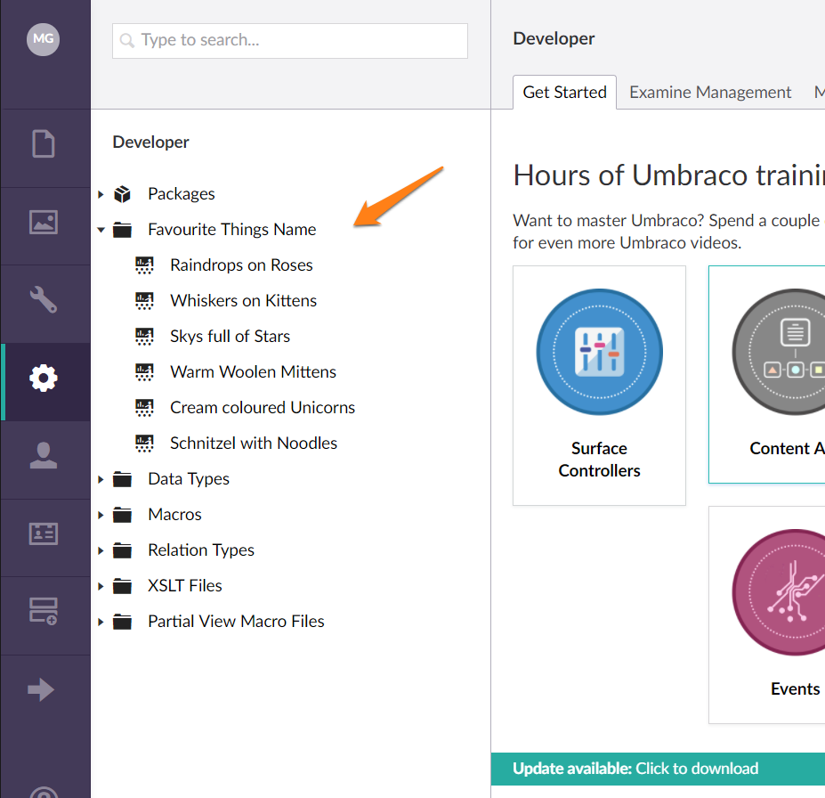

# Trees v7

This section describes how to work with and create trees with the v7 APIs.

*NOTE: trees created with the v6 APIs will still work in v7 but will not have angular view support.*

## Creating trees

To Create a Tree in a section of the Umbraco backoffice, you need to take several steps:

Create a 'TreeController' class in C#. A new mvc controller which inherits from the abstract *Umbraco.Web.Trees.TreeController* class and provides an implementation for two abstract methods: 

* GetTreeNodes (returns a *TreeNodeCollection*) - Responsible for rendering the content of the tree structure
and
* GetMenuForNode (returns a *MenuItemCollection*) - Responsible for returning the menu structure to use for a particular node within a tree.

Decorate your '*TreeController*' with the *Tree* Attribute, which is used to define the name of the section the Tree should be loaded in, and also define an alias and title for your custom tree.

**For example**... 

```csharp
[Tree("developer", "favouriteThingsAlias", "Favourite Things Name")]
public class FavouriteThingsTreeController : TreeController
{  
```

...would register a custom tree with a title 'Favourite Things Name' in the Developer section of Umbraco.

You can also specify the icon to show for the tree, and 'sort order' if more than one tree appears in a section.

```csharp
[Tree("developer", "favouriteThingsAlias", "Favourite Things Name", iconClosed:"icon-folder", iconOpen:"icon-folder",sortOrder:8)]
```

NB: An entry in the ['~/config/trees.config' file.](../../Reference/Config/trees/index.md) will be added for your custom tree.

eg:

```xml
<add initialize="true" sortOrder="0" alias="favouriteThingsAlias" application="developer" title="Favourite Things Name" iconClosed="icon-folder" iconOpen="icon-folder-open" type="Our.Umbraco.Controllers.FavouriteThingsTreeController, Our.Umbraco" />
```

[See Also: How to create your own custom section](../../Extending/Section-Trees/sections.md) 

### Implementing the Tree

```csharp
protected override TreeNodeCollection GetTreeNodes(string id, FormDataCollection queryStrings)
    {
        // check if we're rendering the root node's children
        if (id == Constants.System.Root.ToInvariantString())
        {
            // you can get your custom nodes from anywhere, and they can represent anything... 
            Dictionary<int, string> favouriteThings = new Dictionary<int, string>();
            favouriteThings.Add(1, "Raindrops on Roses");
            favouriteThings.Add(2, "Whiskers on Kittens");
            favouriteThings.Add(3, "Skys full of Stars");
            favouriteThings.Add(4, "Warm Woolen Mittens");
            favouriteThings.Add(5, "Cream coloured Unicorns");
            favouriteThings.Add(6, "Schnitzel with Noodles");
            // create our node collection
            var nodes = new TreeNodeCollection();
        
        // loop through our favourite things and create a tree item for each one
        foreach (var thing in favouriteThings)
        {
            // add each node to the tree collection using the base CreateTreeNode method
            // it has several overloads, using here unique Id of tree item, -1 is the Id of the parent node to create, eg the root of this tree is -1 by convention - the querystring collection passed into this route - the name of the tree node -  css class of icon to display for the node - and whether the item has child nodes
            var node = CreateTreeNode(thing.Key.ToString(), "-1", queryStrings, thing.Value, "icon-presentation", false);
            nodes.Add(node);

        }
        return nodes;
    }

    // this tree doesn't support rendering more than 1 level
    throw new NotSupportedException();
}
    

protected override MenuItemCollection GetMenuForNode(string id, FormDataCollection queryStrings)
{
    // create a Menu Item Collection to return so people can interact with the nodes in your tree
    var menu = new MenuItemCollection();

    if (id == Constants.System.Root.ToInvariantString())
    {
        // root actions, perhaps users can create new items in this tree, or perhaps it's not a content tree, it might be a read only tree, or each node item might represent something entirely different...
        // add your menu items here following the pattern of <Umbraco.Web.Models.Trees.ActionMenuItem,umbraco.interfaces.IAction>
        menu.Items.Add<CreateChildEntity, ActionNew>(ui.Text("actions", ActionNew.Instance.Alias));
        // add refresh menu item            
        menu.Items.Add<RefreshNode, ActionRefresh>(ui.Text("actions", ActionRefresh.Instance.Alias), true);
        return menu;
    }                   
    // add a delete action to each individual item
    menu.Items.Add<ActionDelete>(ui.Text("actions", ActionDelete.Instance.Alias));   

    return menu;
}
```



### Responding to Tree Actions

The actions on items in an Umbraco Tree will trigger 'by convention' a request to load an AngularJS view, with a name corresponding to the name of the action, from a subfolder of the views folder matching the name of the 'customTreeAlias'.

For example, 'Clicking on' one of the 'Favourite Things' in the custom tree example outlined above will 'by convention' trigger the loading of an 'edit.html' view from the folder: */views/favouriteThings/edit.html*
and the 'Delete' menu item would load a view from: */views/favouriteThings/delete.html*

It's recommended, particularly if you're creating a custom tree as part of an Umbraco package/plugin, to change the location of this default folder to the app_plugins folder and you achieve this by decorating you mvc *TreeController* with the *PluginController* attribute.

```csharp
[Tree("developer", "favouriteThingsAlias", "Favourite Things Name")]
[PluginController("favouriteThings")]
public class FavouriteThingsTreeController : TreeController
```

The edit view in the example would now be loaded from the location: */app_plugins/favouriteThings/backoffice/favouriteThingsAlias/edit.html*

#### Providing functionality in your Tree Action Views

You can instruct the Umbraco backoffice to load additional javascript resources (eg. angularJS controllers) to use in conjunction with your 'tree action views' by adding a package.manifest file in the same folder location as your views. 

**For example**...

```json
{
    "javascript": [
    "~/App_Plugins/favouriteThings/favouriteThings.resource.js",
    "~/App_Plugins/favouriteThings/backoffice/favouriteThingsAlias/edit.controller.js",
    "~/App_Plugins/favouriteThings/backoffice/favouriteThingsAlias/delete.controller.js"
    ]
}
```

...this manifest would load files for two controllers to work with the edit and delete views and a general resource file, perhaps containing code to retrieve, create, edit and delete 'favourite things' from some external non-Umbraco API.

Our Tree Action View would then be wired to the loaded controller using the ng-controller attribute, perhaps the delete view would look a little bit like this:

```csharp
<div class="umb-dialog umb-pane" ng-controller="Our.Umbraco.FavouriteThings.DeleteController">
    <div class="umb-dialog-body">
        <p class="umb-abstract">
            Are you sure you want to delete this favourite thing: <strong>{{currentNode.name}}</strong> ?
        </p>
        <umb-confirm on-confirm="performDelete" on-cancel="cancel">
        </umb-confirm>
    </div>
</div>
```

Take a look at the [umbEditor directives in the backoffice API Documentation](https://our.umbraco.com/apidocs/ui/#/api/umbraco.directives.directive:umbEditorHeader), for lots of common interaction directives that can be used to deliver a consistent backoffice editing experience for items in your custom tree.

[see Tree Actions for a list of tree *ActionMenuItems* and *IActions*](tree-actions.md)


## Tree Service API v7

The section API in v7+ is found in the interface `Umbraco.Core.Services.IApplicationTreeService` which is exposed on the ApplicationContext singleton. This API is used to control/query the storage for tree registrations in the ~/Config/trees.config file.


[See the tree service API reference here](../../Reference/Management-v6/Services/TreeService.md)
 
## Tree events v7

In v7 legacy trees will continue to work but the events for legacy trees may no longer work because we are replacing all core trees with the new format. The good news is that the new tree events will always fire for new and legacy trees.

All tree events are defined on the class `Umbraco.Web.Trees.TreeControllerBase`

### RootNodeRendering

The `RootNodeRendering` is raised whenever a tree's root node is created.

**Definition:**

```csharp
public static event TypedEventHandler<TreeControllerBase, TreeNodeRenderingEventArgs> RootNodeRendering;
```

**Usage:**

```csharp
// register the event listener:
TreeControllerBase.RootNodeRendering += TreeControllerBase_RootNodeRendering;

// the event listener method:
void TreeControllerBase_RootNodeRendering(TreeControllerBase sender, TreeNodeRenderingEventArgs e)
{
    // normally you will want to target a specific tree, this can be done by checking the 
    // tree alias of by checking the tree type (casting 'sender')
    if (sender.TreeAlias == "content")
    {
        e.Node.Title = "My new title";
    }
}	
```

### TreeNodesRendering

The `TreeNodesRendering` is raised whenever a list of child nodes are created

**Definition:**

```csharp
public static event TypedEventHandler<TreeControllerBase, TreeNodesRenderingEventArgs> TreeNodesRendering;
```

**Usage:**

```csharp
// register the event listener:
TreeControllerBase.TreeNodesRendering += TreeControllerBase_TreeNodesRendering;

// the event listener method:
void TreeControllerBase_TreeNodesRendering(TreeControllerBase sender, TreeNodesRenderingEventArgs e)
{
    // this example will filter any content tree node whose node name starts with
    // 'Private', for any user that is of the type 'customUser'
    if (sender.TreeAlias == "content"
        && sender.Security.CurrentUser.UserType.Alias == "customUser")
    {
        e.Nodes.RemoveAll(node => node.Title.StartsWith("Private"));
    }
}
```

### MenuRendering

The `MenuRendering` is raised whenever a menu is generated for a tree node

**Definition:**

```csharp
public static event TypedEventHandler<TreeControllerBase, MenuRenderingEventArgs> MenuRendering;
```

**Usage:**

```csharp
// register the event listener:
TreeControllerBase.MenuRendering += TreeControllerBase_MenuRendering;

// the event listener method:
void TreeControllerBase_MenuRendering(TreeControllerBase sender, MenuRenderingEventArgs e)
{
    // this example will add a custom menu item for all admin users
    // for all content tree nodes
    if (sender.TreeAlias == "content"
        && sender.Security.CurrentUser.UserType.Alias == "admin")
    {
        // creates a menu action that will open /umbraco/currentSection/itemAlias.html
        var i = new Umbraco.Web.Models.Trees.MenuItem("itemAlias", "Item name");
        
        // optional, if you want to load a legacy page, otherwise it will just follow convention
        i.AdditionalData.Add("actionUrl", "my/long/url/to/webformshorror.aspx");
        
        // optional, if you don't want to follow the naming conventions, but do want to use a angular view
        // you can also use a direct path "../App_Plugins/my/long/url/to/view.html"
        i.AdditionalData.Add("actionView", "my/long/url/to/view.html");
        
        // sets the icon to icon-wine-glass 
        i.Icon = "wine-glass"

        // insert at index 5
        e.Menu.Items.Insert(5,i);
    }
}
```

## Tree Actions and User Permissions

[See a list of Tree Actions and User Permission Codes](tree-actions.md)


 
