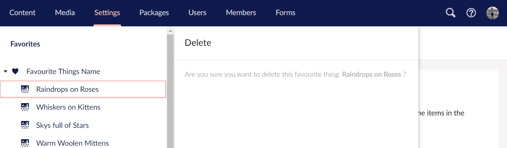

# Trees

This section describes how to work with and create trees with the v8 APIs.

## Creating trees

To Create a Tree in a section of the Umbraco backoffice, you need to take several steps:

Create a 'TreeController' class in C#. A new mvc controller which inherits from the abstract *Umbraco.Web.Trees.TreeController* class and provides an implementation for two abstract methods:

* GetTreeNodes (returns a *TreeNodeCollection*) - Responsible for rendering the content of the tree structure.
* GetMenuForNode (returns a *MenuItemCollection*) - Responsible for returning the menu structure to use for a particular node within a tree.

Decorate your '*TreeController*' with the *Tree* Attribute, which is used to define the name of the section the Tree should be loaded in, which 'Tree Group' it should belong to and also define an alias and title for your custom tree.


**For example**

```csharp
[Tree("settings", "favouriteThingsAlias", TreeTitle = "Favourite Things Name", TreeGroup="favouritesGroup", SortOrder=5)]
public class FavouriteThingsTreeController : TreeController
{
```

...would register a custom tree with a title 'Favourite Things Name' in the Settings section of Umbraco, inside a custom group called 'Favourites'

The SortOrder controls the order of the custom tree within the Tree Group.

### Tree Groups
Tree Groups are a new concept in V8, to enable you to group trees in a section. You provide the alias of the Tree Group name, you wish to add your tree to - see [Constants.Trees.Groups](https://our.umbraco.com/apidocs/v8/csharp/api/Umbraco.Core.Constants.Trees.Groups.html) for a list of existing group alias. An example of tree groups in the backoffice would be the *Settings* tree group and the *Templating* tree group in the *Settings* section.

If you add your own alias, you'll need to add a translation key to `config/lang/en-US.user.xml` to avoid the alias appearing as the header in [square brackets] eg
```xml
<language>
  <area alias="treeHeaders">
    <key alias="favouritesGroup">Favourites</key>
  </area>
</language>
```

### Customising the Root Tree Node

The first node in the tree is referred to as the **Root Node**. You might want to assign a custom icon to the Root Node or specify a custom url route path in the backoffice to use with your custom tree. Perhaps if you had a single page app you customise the Root Node by overriding the abstract *CreateRootNode* method.


:::note
In Umbraco 8 the `/config/trees.config` file has been removed.
:::

[See Also: How to create your own custom section](../../Extending/Section-Trees/sections.md)

### Implementing the Tree

```csharp
 protected override TreeNodeCollection GetTreeNodes(string id, FormDataCollection queryStrings)
{
    // check if we're rendering the root node's children
    if (id == Constants.System.Root.ToInvariantString())
    {
        // you can get your custom nodes from anywhere, and they can represent anything...
        Dictionary<int, string> favouriteThings = new Dictionary<int, string>();
        favouriteThings.Add(1, "Raindrops on Roses");
        favouriteThings.Add(2, "Whiskers on Kittens");
        favouriteThings.Add(3, "Skys full of Stars");
        favouriteThings.Add(4, "Warm Woolen Mittens");
        favouriteThings.Add(5, "Cream coloured Unicorns");
        favouriteThings.Add(6, "Schnitzel with Noodles");
        // create our node collection
        var nodes = new TreeNodeCollection();

        // loop through our favourite things and create a tree item for each one
        foreach (var thing in favouriteThings)
        {
            // add each node to the tree collection using the base CreateTreeNode method
            // it has several overloads, using here unique Id of tree item, -1 is the Id of the parent node to create, eg the root of this tree is -1 by convention - the querystring collection passed into this route - the name of the tree node -  css class of icon to display for the node - and whether the item has child nodes
            var node = CreateTreeNode(thing.Key.ToString(), "-1", queryStrings, thing.Value, "icon-presentation", false);
            nodes.Add(node);
        }
        return nodes;
    }

    // this tree doesn't support rendering more than 1 level
    throw new NotSupportedException();
}

protected override MenuItemCollection GetMenuForNode(string id, FormDataCollection queryStrings)
{
    // create a Menu Item Collection to return so people can interact with the nodes in your tree
    var menu = new MenuItemCollection();

    if (id == Constants.System.Root.ToInvariantString())
    {
        // root actions, perhaps users can create new items in this tree, or perhaps it's not a content tree, it might be a read only tree, or each node item might represent something entirely different...
        // add your menu item actions or custom ActionMenuItems
        menu.Items.Add(new CreateChildEntity(Services.TextService));
        // add refresh menu item (note no dialog)
        menu.Items.Add(new RefreshNode(Services.TextService, true));
        return menu;
    }
    // add a delete action to each individual item
    menu.Items.Add<ActionDelete>(Services.TextService, true, opensDialog: true);

    return menu;
}

protected override TreeNode CreateRootNode(FormDataCollection queryStrings)
{
    var root = base.CreateRootNode(queryStrings);

    // set the icon
    root.Icon = "icon-hearts";
    // could be set to false for a custom tree with a single node.
    root.HasChildren = true;
    //url for menu
    root.MenuUrl = null;

    return root;
}
```


### Responding to Tree Actions

The actions on items in an Umbraco Tree will trigger a request to load an AngularJS view, with a name corresponding to the name of the action, from a subfolder of the views folder matching the name of the 'customTreeAlias'.

For example clicking on one of the 'Favourite Things' in the custom tree example outlined above will trigger the loading of an 'edit.html' view from the folder: */views/favouriteThingsAlias/edit.html*. The 'Delete' menu item would also load a view from: */views/favouriteThingsAlias/delete.html*

If you're creating a custom tree as part of an Umbraco package/plugin, it's recommended to change the location of the default folder to the `App_Plugins` folder. You achieve this by decorating you mvc *TreeController* with the *PluginController* attribute.

```csharp
[Tree("developer", "favouriteThingsAlias", "Favourite Things Name")]
[PluginController("favouriteThings")]
public class FavouriteThingsTreeController : TreeController
```

The edit view in the example would now be loaded from the location: `/App_Plugins/favouriteThings/backoffice/favouriteThingsAlias/edit.html`

#### Providing functionality in your Tree Action Views

You can instruct the Umbraco backoffice to load additional javascript resources (eg. angularJS controllers) to use in conjunction with your 'tree action views' by adding a *package.manifest* file in the same folder location as your views.

**For example**...

```json
{
    "javascript": [
        "~/App_Plugins/favouriteThings/favouriteThings.resource.js",
        "~/App_Plugins/favouriteThings/backoffice/favouriteThingsAlias/edit.controller.js",
        "~/App_Plugins/favouriteThings/backoffice/favouriteThingsAlias/delete.controller.js"
    ]
}
```

...this manifest would load files for two controllers to work with the edit and delete views and a general resource file, perhaps containing code to retrieve, create, edit and delete 'favourite things' from some external non-Umbraco API.

Our Tree Action View would then be wired to the loaded controller using the ng-controller attribute, perhaps the delete view would look a little bit like this:

```csharp
<div class="umb-dialog umb-pane" ng-controller="Our.Umbraco.FavouriteThings.DeleteController">
    <div class="umb-dialog-body">
        <p class="umb-abstract">
            Are you sure you want to delete this favourite thing: <strong>{{currentNode.name}}</strong> ?
        </p>
        <umb-confirm on-confirm="performDelete" on-cancel="cancel">
        </umb-confirm>
    </div>
</div>
```




Take a look at the [umbEditor directives in the backoffice API Documentation](https://our.umbraco.com/apidocs/v8/ui/#/api/umbraco.directives.directive:umbEditorHeader), for lots of common interaction directives that can be used to deliver a consistent backoffice editing experience for items in your custom tree.

[see Tree Actions for a list of tree *ActionMenuItems* and *IActions*](tree-actions.md)

### Single Node Trees / Customising the Root Node Action

It is possible to create 'trees' consisting of only a single node - perhaps to provide an area to control some settings or a placeholder for a single page backoffice app. See the LogViewer in the settings section for a good example.
(or as in the case of the 'settings/content templates' tree, it's possible to have a custom view for the root node as an 'introduction' page to the tree).

In both scenarios you need to override the *CreateRootNode* method for the custom tree.

```csharp
[Tree("settings", "favouritistThingsAlias", TreeTitle = "Favourite Thing", TreeGroup = "favoritesGroup", SortOrder = 5)]
[PluginController("favouriteThing")]
public class FavouritistThingsTreeController : TreeController
```

Overriding the *CreateRootNode* method means it is possible to set the 'RoutePath' to where the single page application will live (or introduction page), setting HasChildren to false will result in a Single Node Tree:

```csharp
protected override TreeNode CreateRootNode(FormDataCollection queryStrings)
{
    var root = base.CreateRootNode(queryStrings);

    //optionally setting a routepath would allow you to load in a custom UI instead of the usual behaviour for a tree
        root.RoutePath = string.Format("{0}/{1}/{2}", Constants.Applications.Settings, "favouritistThingsAlias", "overview");
    // set the icon
    root.Icon = "icon-hearts";
    // set to false for a custom tree with a single node.
    root.HasChildren = false;
    //url for menu
    root.MenuUrl = null;

    return root;
}
```
The RoutePath should be in the format of: **section/treeAlias/method**. As our example controller uses the `PluginController` attribute, clicking the root node would now request `/App_Plugins/favouriteThing/backoffice/favouritistThingsAlias/overview.html`. If you are not using the `PluginController` attribute, then the request would be to `/umbraco/views/favouritistThingsAlias/overview.html`.


#### Full Width App - IsSingleNodeTree

It's possible to make your single node tree app stretch across the full screen of the backoffice (no navigation tree) - see Packages section for an example.
To achieve this add an additional attribute `IsSingleNodeTree`, in the Tree attribute for the custom controller.

```csharp
[Tree("settings", "favouritistThingsAlias", IsSingleNodeTree = true, TreeTitle = "Favourite Thing", TreeGroup = "favoritesGroup", SortOrder = 5)]
[PluginController("favouriteThing")]
public class FavouritistThingsTreeController : TreeController
```

## Tree events

All tree events are defined on the class `Umbraco.Web.Trees.TreeControllerBase`

### RootNodeRendering

The `RootNodeRendering` is raised whenever a tree's root node is created.

**Definition:**

```csharp
public static event TypedEventHandler<TreeControllerBase, TreeNodeRenderingEventArgs> RootNodeRendering;
```

**Usage:**

```csharp
// register the event listener using a component
public void Initialize()
{
    TreeControllerBase.RootNodeRendering += TreeControllerBase_RootNodeRendering;
}

// the event listener method:
void TreeControllerBase_RootNodeRendering(TreeControllerBase sender, TreeNodeRenderingEventArgs e)
{
    // normally you will want to target a specific tree, this can be done by checking the
    // tree alias of by checking the tree type (casting 'sender')
    if (sender.TreeAlias == "content")
    {
        e.Node.Title = "My new title";
    }
}
```

### TreeNodesRendering

The `TreeNodesRendering` is raised whenever a list of child nodes are created

**Definition:**

```csharp
public static event TypedEventHandler<TreeControllerBase, TreeNodesRenderingEventArgs> TreeNodesRendering;
```

**Usage:**

```csharp
// register the event listener with a component:
public void Initialize()
{
    TreeControllerBase.TreeNodesRendering += TreeControllerBase_TreeNodesRendering;
}

// the event listener method:
void TreeControllerBase_TreeNodesRendering(TreeControllerBase sender, TreeNodesRenderingEventArgs e)
{
    // this example will filter any content tree node whose node name starts with

    // 'Private', for any user that is in the customUserGroup
    if (sender.TreeAlias == "content"
        && sender.Security.CurrentUser.Groups.Any(f => f.Alias == "customUserGroupAlias"))
    {
        e.Nodes.RemoveAll(node => node.Name.StartsWith("Private"));
    }
}
```

### MenuRendering

The `MenuRendering` is raised whenever a menu is generated for a tree node

**Definition:**

```csharp
public static event TypedEventHandler<TreeControllerBase, MenuRenderingEventArgs> MenuRendering;
```

**Usage:**

```csharp
// register the event listener with a component:
public void Initialize()
{
    TreeControllerBase.MenuRendering += TreeControllerBase_MenuRendering;
}

// the event listener method:
void TreeControllerBase_MenuRendering(TreeControllerBase sender, MenuRenderingEventArgs e)
{
    // this example will add a custom menu item for all admin users

    // for all content tree nodes
    if (sender.TreeAlias == "content"
        && sender.Security.CurrentUser.Groups.Any(x => x.Alias.InvariantEquals("admin")))
    {
        // creates a menu action that will open /umbraco/currentSection/itemAlias.html
        var i = new Umbraco.Web.Models.Trees.MenuItem("itemAlias", "Item name");

        // optional, if you want to load a legacy page, otherwise it will follow convention
        i.AdditionalData.Add("actionUrl", "my/long/url/to/webformshorror.aspx");

        // optional, if you don't want to follow the naming conventions, but do want to use a angular view
        // you can also use a direct path "../App_Plugins/my/long/url/to/view.html"
        i.AdditionalData.Add("actionView", "my/long/url/to/view.html");

        // sets the icon to icon-wine-glass
        i.Icon = "wine-glass";

        // insert at index 5
        e.Menu.Items.Insert(5, i);
    }
}
```

## Tree Actions and User Permissions

[See a list of Tree Actions and User Permission Codes](tree-actions.md)
