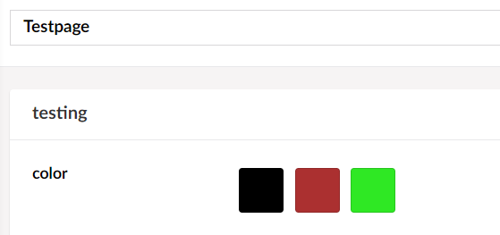

# Color Picker

`Alias: Umbraco.ColorPicker`

`Returns: String (Hexadecimal)`

`Returns: Umbraco.Core.PropertyEditors.ValueConverters.ColorPickerValueConverter.PickedColor (When using labels)`

The Color picker allows you to set some predetermined colors that the editor can choose between.

It's possible to add a label to use with the color.

## Data Type Definition Example


## Content Example



## Example with Modelsbuilder

```csharp
@{
    var hexColor = Model.Color;
    // Define the label if you've included it
    String colorLabel = Model.Color.Label;

    if (hexColor != null)
    {
        <div style="background-color: #@hexColor">@colorLabel</div>
    }
}
```

## Example without Modelsbuilder

```csharp
@using Umbraco.Core.PropertyEditors.ValueConverters
@{
    var hexColor = Model.Value("Color");
    // Define the label if you've included it
    var colorLabel = Model.Value<ColorPickerValueConverter.PickedColor>("Color").Label;

    if (hexColor != null)
    {
        <div style="background-color: #@hexColor">@colorLabel</div>
    }
}
```

## Add values programmatically

See the example below to see how a value can be added or changed programmatically. To update a value of a property editor you need the [Content Service](../../../../../Reference/Management/Services/ContentService/index.md).

```csharp
@{
    // Get access to ContentService
    var contentService = Services.ContentService;

    // Create a variable for the GUID of the page you want to update
    var guid = Guid.Parse("32e60db4-1283-4caa-9645-f2153f9888ef");

    // Get the page using the GUID you've defined
    var content = contentService.GetById(guid); // ID of your page

    // Set the value of the property with alias 'color'. 
    // The value set here, needs to be one of the prevalues on the Color Picker
    content.SetValue("color", "38761d");

    // Save the change
    contentService.Save(content);
}
```

Although the use of a GUID is preferable, you can also use the numeric ID to get the page:

```csharp
@{
    // Get the page using it's id
    var content = contentService.GetById(1234); 
}
```

If Modelsbuilder is enabled you can get the alias of the desired property without using a magic string:

```csharp
@{
    // Set the value of the property with alias 'color'
    content.SetValue(Home.GetModelPropertyType(x => x.Color).Alias, "38761d");
}
```
