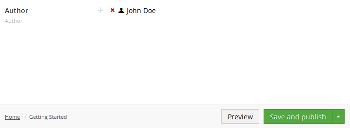

# Member Picker

`Alias: Umbraco.MemberPicker`

`Returns: Member ID`

The member picker opens a panel to pick a specific member from the member section. The value saved is the selected member ID.

## Data Type Definition Example


## Content Example



## MVC View Example

### Typed

```csharp
@{
    if(Model.Content.HasValue("author")){
        var member = Umbraco.TypedMember(Model.Content.GetPropertyValue<int>("author"));
            @member.Name
    }
}
```

### Dynamic (Obsolete)

See [Common pitfalls](https://our.umbraco.com/documentation/reference/Common-Pitfalls/#dynamics) for more information about why the dynamic approach is obsolete.

```csharp
@{
    if(CurrentPage.HasValue("author")){
        var member = Umbraco.TypedMember(CurrentPage.author);
            @member.Name
    }
}
```
