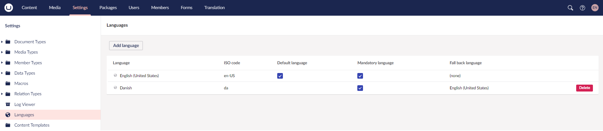
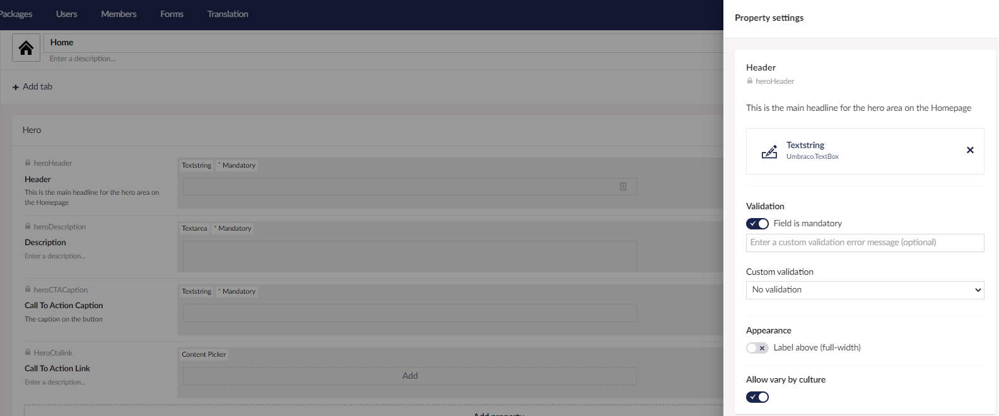

# Language Variants

Language Variants allows you to vary content by culture, so you can allow a content node to exist in several languages.

## Video tutorial

<iframe width="800" height="450" src="https://www.youtube.com/embed/Ik_cYRqnWnk?rel=0" frameborder="0" allow="autoplay; encrypted-media" allowfullscreen></iframe>

## How to enable Language Variants

To work with Language Variants you need to have more than one language enabled. This can be done from the `Settings` section:

:::note
You will always have one default language but each language can be set to mandatory.
:::

## Enabling Language Variants on doctypes

Now that there are two languages to vary the content with, it needs to be enabled on the document types. To do so:

1. Go to the document type in the **Settings** section.
2. In the top-right corner, go to **Permissions** and toggle **Allow vary by culture**.
    

To allow a property on the doctype to be varied it will have to be enabled for the property:

## Working with Language Variants on content

When you return to your content node you will notice two things:

1. At the top of the content tree there will now be a dropdown so you can show the content tree in the language of your choice.
2. To the right of the content name there is now a dropdown where you can select a language. You can also open a split view so you can see two languages at once.

    

Each property editor that does not allow variants will be greyed out and have the content of the default language.

To read about how you render variant content in templates, check out the [rendering content section](../../Design/Rendering-Content/).

## Test your language variants

Culture and hostnames must be added to your language sites before the content can be tested for variants:

1. Right-click the Home node and select **Allow access to assign culture and hostnames...**.

    :::note
    In Umbraco v9, this option is called **Culture and Hostnames**.
    :::
2. Add a specific url per language and save. For eg: An English language variant with English (United States) as the language can be given a specific url *<https://yourwebsite.com/en-us>* and a Danish language variant can be given a specific url *<https://yourwebsite.com/dk>*.
3. The Info content app should now show specific urls for your language variants.

## Read more

- [Umbraco 8: Language Variants (official blog post from Umbraco HQ)](https://umbraco.com/blog/umbraco-8-language-variants/)
